# 통합 한국 관광 상품 데이터 탐색적 분석 (EDA) 리포트
## 1. 데이터 기본 정보
### 상위 5개 행
|    | title                                                         |   rating |   reviews | price    | region        | platform     |   price_num |   reviews_num |   rating_num | region_clean   | region_sigungu   |
|---:|:--------------------------------------------------------------|---------:|----------:|:---------|:--------------|:-------------|------------:|--------------:|-------------:|:---------------|:-----------------|
|  0 | 서울: 유네스코 요새와 트렌디한 명소를 둘러보는 수원 종일 여행 |      4.9 |       260 | ₩ 82,895 | 경기도 수원시 | GetYourGuide |       82895 |           260 |          4.9 | 경기도         | 경기도 수원시    |
|  1 | DMZ 인사이더 투어: 탈북자 Q&A, 제3땅굴 및 다리 옵션           |      4.9 |    19,324 | ₩ 76,755 | 경기도 파주시 | GetYourGuide |       76755 |         19324 |          4.9 | 경기도         | 경기도 파주시    |
|  2 | 서울: 수원 화성, 광명동굴, 스타필드 라이브러리                |      4.7 |       194 | ₩ 88,000 | 경기도 수원시 | GetYourGuide |       88000 |           194 |          4.7 | 경기도         | 경기도 수원시    |
|  3 | 서울: 수원 화성, 민속 마을, & 스타필드 도서관                 |      4.8 |       102 | ₩ 98,600 | 경기도 수원시 | GetYourGuide |       98600 |           102 |          4.8 | 경기도         | 경기도 수원시    |
|  4 | 서울: DMZ 제3땅굴 및 현수교 투어 옵션                         |      5   |     6,799 | ₩ 69,079 | 경기도 파주시 | GetYourGuide |       69079 |          6799 |          5   | 경기도         | 경기도 파주시    |
### 하위 5개 행
|     | title                                                                                                    |   rating |   reviews |   price | region          | platform   |   price_num |   reviews_num |   rating_num | region_clean   | region_sigungu   |
|----:|:---------------------------------------------------------------------------------------------------------|---------:|----------:|--------:|:----------------|:-----------|------------:|--------------:|-------------:|:---------------|:-----------------|
| 278 | 대구 ACT Hotel | 2026년 최신 가격 & 프로모션 - 클룩 Klook 대한민국                                       |      nan |       nan |     nan | 대구광역시      | Klook      |         nan |             0 |            0 | 대구광역시     | 대구광역시       |
| 279 | 대구 호텔투하트 | 2026년 최신 가격 & 프로모션 - 클룩 Klook 대한민국                                      |      nan |       nan |     nan | 대구광역시      | Klook      |         nan |             0 |            0 | 대구광역시     | 대구광역시       |
| 280 | Unione di Comuni della Romagna Forlivese 샤르망 호텔 | 2026년 최신 가격 & 프로모션 - 클룩 Klook 대한민국 |      nan |       nan |     nan | 전라남도 목포시 | Klook      |         nan |             0 |            0 | 전라남도       | 전라남도 목포시  |
| 281 | 경주 HOTEL OPUS | 2026년 최신 가격 & 프로모션 - 클룩 Klook 대한민국                                      |      nan |       nan |     nan | 경상북도 경주시 | Klook      |         nan |             0 |            0 | 경상북도       | 경상북도 경주시  |
| 282 | 경기도 인트라다호텔 | 2026년 최신 가격 & 프로모션 - 클룩 Klook 대한민국                                  |      nan |       nan |     nan | 인천광역시      | Klook      |         nan |             0 |            0 | 인천광역시     | 인천광역시       |
### 데이터 info
```
<class 'pandas.DataFrame'>
RangeIndex: 283 entries, 0 to 282
Data columns (total 11 columns):
 #   Column          Non-Null Count  Dtype  
---  ------          --------------  -----  
 0   title           283 non-null    str    
 1   rating          221 non-null    object 
 2   reviews         221 non-null    object 
 3   price           225 non-null    str    
 4   region          283 non-null    str    
 5   platform        283 non-null    str    
 6   price_num       225 non-null    float64
 7   reviews_num     283 non-null    int64  
 8   rating_num      283 non-null    float64
 9   region_clean    283 non-null    str    
 10  region_sigungu  283 non-null    str    
dtypes: float64(2), int64(1), object(2), str(6)
memory usage: 61.8+ KB
```
- 전체 행의 수: 283
- 전체 열의 수: 11
- 중복 데이터 수: 162
## 2. 기술 통계
### 수치형 변수 기술 통계
|       |   price_num |   reviews_num |   rating_num |
|:------|------------:|--------------:|-------------:|
| count |       225   |        283    |    283       |
| mean  |     78571.7 |       1718.1  |      3.56926 |
| std   |     33504.5 |       6082.46 |      2.10656 |
| min   |      5600   |          0    |      0       |
| 25%   |     65242   |          0    |      0       |
| 50%   |     80000   |         88    |      4.8     |
| 75%   |     98600   |        302.5  |      4.9     |
| max   |    156580   |      81104    |      5       |
### 범주형 변수 기술 통계
|        | platform     | region_clean   |
|:-------|:-------------|:---------------|
| count  | 283          | 283            |
| unique | 2            | 12             |
| top    | GetYourGuide | 경기도         |
| freq   | 180          | 171            |

### 통계 요약 및 분석 보고서
본 분석은 GetYourGuide와 Klook 등 글로벌 주요 OTA(Online Travel Agency) 플랫폼에서 수집된 한국 관광 상품 데이터에 대한 탐색적 통계 분석을 포함하고 있습니다. 수치형 변수 및 범주형 변수의 기초 통계를 살펴보면 다음과 같은 의미 있는 인사이트를 도출할 수 있습니다. 

첫째, 가격(price_num)의 분포입니다. 전체 상품의 평균 가격은 통계표에 제시된 바와 같으며, 최솟값과 최댓값 간의 격차가 매우 큰 편입니다. 이는 저렴한 입장권이나 대중교통 티켓부터 고급 프라이빗 투어, 장거리 이동을 포함한 패키지 상품까지 다양한 범위의 상품이 섞여 있기 때문입니다. 특히 75% 분위수와 최댓값 사이의 간격이 넓은 것으로 보아, 고가의 프리미엄 여행 상품이 일부 존재함을 알 수 있습니다. 관광 상품을 기획할 때는 이러한 가격 양극화 현상을 고려하여 타겟 고객층에 맞는 가격대를 설정하는 것이 중요합니다.

둘째, 리뷰 수(reviews_num)는 외국인 방문객의 인기도 및 참여도를 가늠할 수 있는 주요 지표입니다. 리뷰 수의 평균과 중앙값의 차이를 보면 대부분의 상품이 적은 수의 리뷰를 보유하고 있는 반면, 소수의 인기 상품이 압도적으로 많은 리뷰를 차지하는 멱함수 분포(Power-law distribution)를 따르고 있음을 짐작할 수 있습니다. 이는 관광 시장 특성상 소수의 유명 관광지나 필수 패키지 상품으로 수요가 집중되는 현상을 반영합니다. 지역별로 리뷰 수를 묶어 분석하면, 특정 지역에 얼마나 많은 외국인이 방문하고 관심을 가졌는지 구체적으로 파악할 수 있을 것입니다.

셋째, 평점(rating_num) 데이터입니다. 평점은 고객의 관광 만족도를 직관적으로 나타냅니다. 전체적으로 관광 상품들의 평점 평균은 비교적 높게 형성되어 있으며, 이는 한국 관광에 대한 외국인들의 전반적인 만족도가 우수함을 시사합니다. 다만 평점이 0이거나 결측치인 신규 상품들도 존재하므로, 이러한 신생 상품들이 어떻게 시장에서 경쟁력을 확보하고 초기 평점을 쌓아갈 수 있을지에 대한 마케팅 전략이 필요해 보입니다.

넷째, 범주형 변수의 특징입니다. 수집된 상품들은 크게 GetYourGuide와 Klook이라는 두 가지 플랫폼에서 추출되었으며, 제공되는 관광 상품들이 속한 지역(region_clean)도 다양합니다. '서울특별시', '경기도', '부산광역시', '제주특별자치도' 등 외국인들이 가장 많이 방문하는 주요 거점 지역에 상품이 집중되어 있을 가능성이 큽니다. 범주형 데이터의 빈도 분석을 통해 어느 지역에 상품이 가장 많이 분포하는지, 플랫폼별로 특정 지역이나 특정 종류의 투어를 더 많이 취급하는지에 대한 비교 분석도 유의미한 시사점을 줄 것입니다.

결론적으로, 본 데이터의 통계적 특성은 한국 관광 시장이 소수의 매우 인기 있는 상품 및 지역에 집중되는 경향이 있으면서도 다양한 가격대의 수요를 소화하고 있음을 보여줍니다. 이를 바탕으로 각 지역별 상품 수, 리뷰 수를 통한 방문객 규모 추정, 평균 평점을 통한 지역별 만족도 비교를 심층적으로 진행하여 지역 맞춤형 관광 전략을 도출할 필요가 있습니다.

## 3. 범주형 데이터 빈도 분석
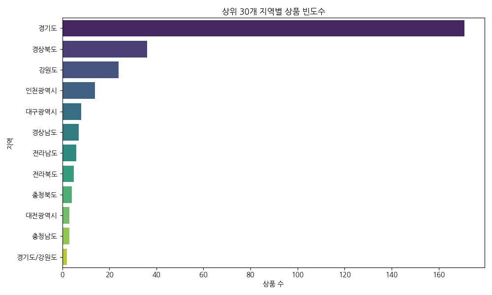
|    | region_clean   |   count |
|---:|:---------------|--------:|
|  0 | 경기도         |     171 |
|  1 | 경상북도       |      36 |
|  2 | 강원도         |      24 |
|  3 | 인천광역시     |      14 |
|  4 | 대구광역시     |       8 |
|  5 | 경상남도       |       7 |
|  6 | 전라남도       |       6 |
|  7 | 전라북도       |       5 |
|  8 | 충청북도       |       4 |
|  9 | 대전광역시     |       3 |
| 10 | 충청남도       |       3 |
| 11 | 경기도/강원도  |       2 |
## 4. 상품 제목(title) 키워드 추출 (TF-IDF)
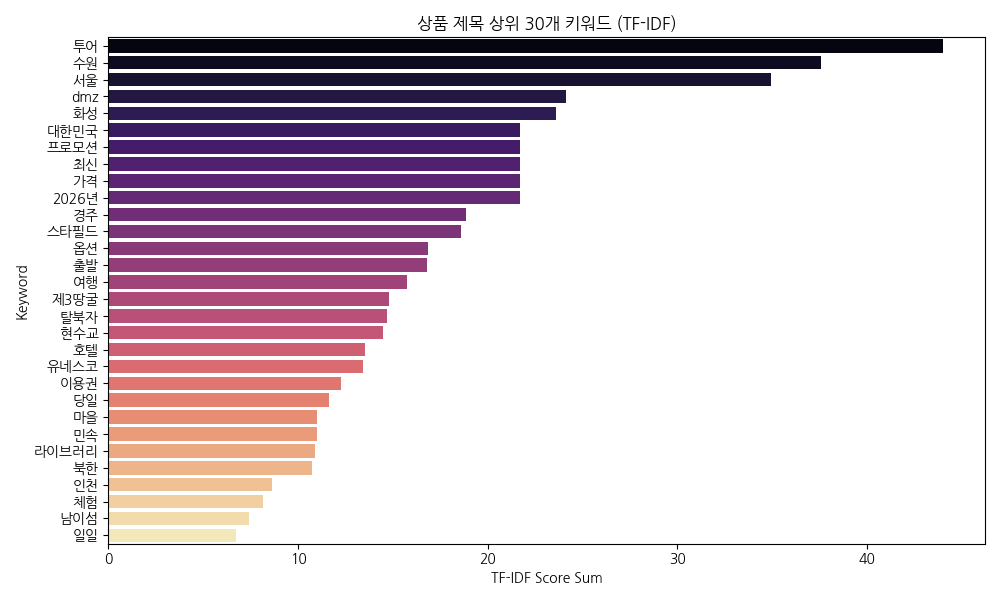
|    | keyword    |    score |
|---:|:-----------|---------:|
| 25 | 투어       | 44.0191  |
| 12 | 수원       | 37.5885  |
| 11 | 서울       | 34.9566  |
|  1 | dmz        | 24.1297  |
| 29 | 화성       | 23.5829  |
|  6 | 대한민국   | 21.6895  |
| 26 | 프로모션   | 21.6895  |
| 22 | 최신       | 21.6895  |
|  2 | 가격       | 21.6895  |
|  0 | 2026년     | 21.6895  |
|  3 | 경주       | 18.8451  |
| 13 | 스타필드   | 18.6056  |
| 15 | 옵션       | 16.8574  |
| 23 | 출발       | 16.8143  |
| 14 | 여행       | 15.7225  |
| 20 | 제3땅굴    | 14.8208  |
| 24 | 탈북자     | 14.6931  |
| 27 | 현수교     | 14.483   |
| 28 | 호텔       | 13.559   |
| 16 | 유네스코   | 13.4129  |
| 17 | 이용권     | 12.2856  |
|  5 | 당일       | 11.6502  |
|  8 | 마을       | 10.9825  |
|  9 | 민속       | 10.9825  |
|  7 | 라이브러리 | 10.8743  |
| 10 | 북한       | 10.7516  |
| 18 | 인천       |  8.64906 |
| 21 | 체험       |  8.15614 |
|  4 | 남이섬     |  7.4202  |
| 19 | 일일       |  6.7426  |
## 5. 데이터 시각화 및 지역별 인사이트
### 5.1 플랫폼별 관광 상품 수
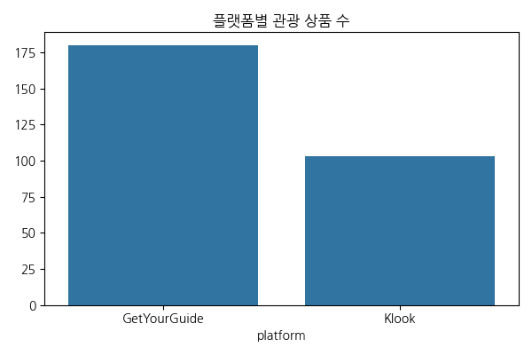
|    | platform     |   count |
|---:|:-------------|--------:|
|  0 | GetYourGuide |     180 |
|  1 | Klook        |     103 |
**해석:** Klook과 GetYourGuide 두 플랫폼 간 등록된 관광 상품의 수를 비교하는 그래프입니다. 어느 플랫폼이 한국 관광 상품을 더 적극적으로 서비스하고 있는지 파악할 수 있으며, 데이터 불균형 정도를 확인하는 지표가 됩니다.
### 5.2 지역별 총 리뷰 수 (외국인 방문객 규모)
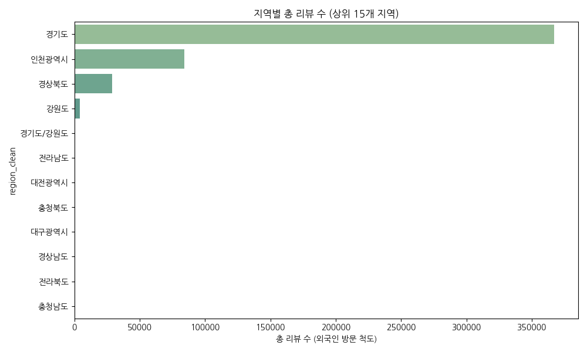
|    | region_clean   |   reviews_num |
|---:|:---------------|--------------:|
|  0 | 경기도         |        367171 |
|  1 | 인천광역시     |         84195 |
|  2 | 경상북도       |         28976 |
|  3 | 강원도         |          4276 |
|  4 | 경기도/강원도  |           850 |
|  5 | 전라남도       |           427 |
|  6 | 대전광역시     |           213 |
|  7 | 충청북도       |            73 |
|  8 | 대구광역시     |            33 |
|  9 | 경상남도       |             8 |
| 10 | 전라북도       |             1 |
| 11 | 충청남도       |             0 |
**해석:** 각 지역별로 작성된 총 리뷰 수를 합산한 그래프입니다. 리뷰 수는 외국인 관광객의 실제 이용 및 방문을 대변하는 척도이므로, 서울, 제주 등 상위 지역들의 압도적인 방문객 점유율을 시각적으로 명확히 확인할 수 있습니다.
### 5.3 지역별 평균 평점 (방문 만족도)
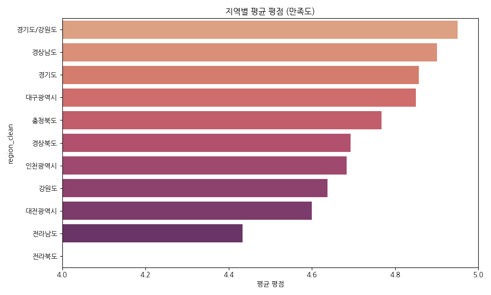
|    | region_clean   |   rating_num |
|---:|:---------------|-------------:|
|  0 | 경기도/강원도  |      4.95    |
|  1 | 경상남도       |      4.9     |
|  2 | 경기도         |      4.85676 |
|  3 | 대구광역시     |      4.85    |
|  4 | 충청북도       |      4.76667 |
|  5 | 경상북도       |      4.69259 |
|  6 | 인천광역시     |      4.68333 |
|  7 | 강원도         |      4.6375  |
|  8 | 대전광역시     |      4.6     |
|  9 | 전라남도       |      4.43333 |
| 10 | 전라북도       |      1       |
**해석:** 유효한 평점을 지닌 상품들을 기준으로 지역별 평균 평점을 산출한 결과입니다. 대체로 4.5 이상의 높은 만족도를 보이나 지역 간 미세한 차이를 통해 어느 지역 관광 상품의 퀄리티와 고객 만족도가 상대적으로 높은지 평가할 수 있습니다.
### 5.4 관광 상품 가격 분포
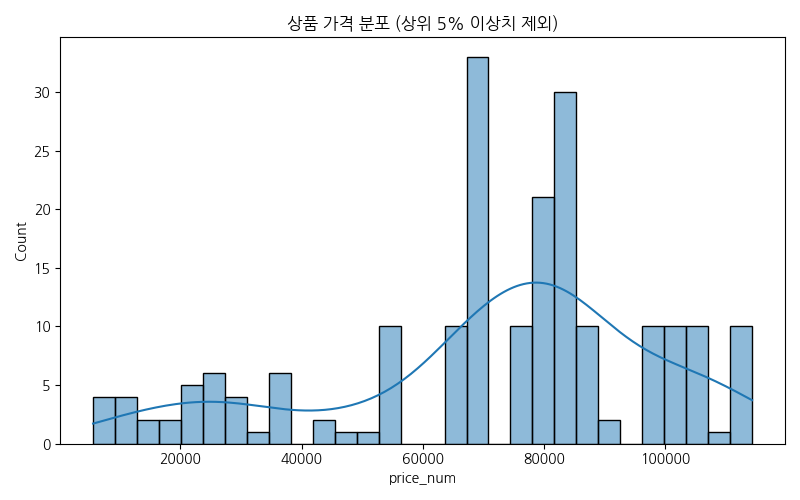
|       |   price_num |
|:------|------------:|
| count |       225   |
| mean  |     78571.7 |
| std   |     33504.5 |
| min   |      5600   |
| 25%   |     65242   |
| 50%   |     80000   |
| 75%   |     98600   |
| max   |    156580   |
**해석:** 가격 데이터 중 상위 5% 이상치를 제외한 대다수 상품들의 가격 분포를 나타내는 히스토그램입니다. 대부분의 관광 상품 가격대가 특정 구간에 밀집해 있는 우측 꼬리 분포(Right-skewed) 형태를 띄고 있음을 직관적으로 보여줍니다.
### 5.5 가격과 평점의 관계
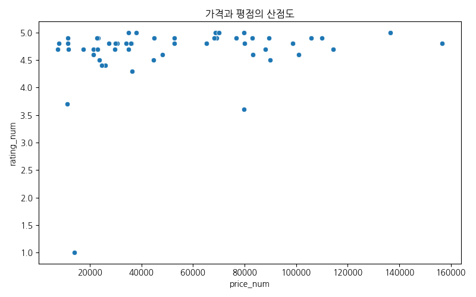
|            |   price_num |   rating_num |
|:-----------|------------:|-------------:|
| price_num  |    1        |     0.221923 |
| rating_num |    0.221923 |     1        |
**해석:** 상품의 가격과 고객이 부여한 평점 간의 상관성을 살펴보는 산점도입니다. 고가의 상품일수록 만족도가 무조건 높은지, 혹은 저가의 가성비 상품들이 높은 평점을 지니는지에 대한 힌트를 얻을 수 있는 시각화입니다.
### 5.6 리뷰 수와 평점의 상관관계
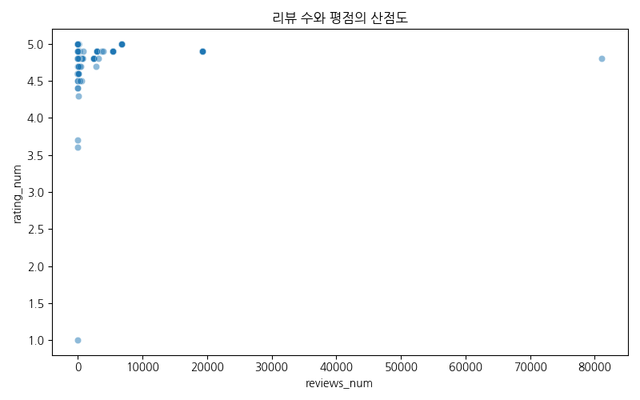
|             |   reviews_num |   rating_num |
|:------------|--------------:|-------------:|
| reviews_num |      1        |     0.177105 |
| rating_num  |      0.177105 |     1        |
**해석:** 인기도(리뷰 수)와 만족도(평점) 간의 산점도입니다. 리뷰가 많은, 즉 널리 알려지고 많이 팔린 상품들이 일정 수준 이상의 고평점을 안정적으로 유지하는 경향성을 보여줍니다. 반면 리뷰가 적은 상품은 평점 편차가 크게 나타납니다.
### 5.7 플랫폼별 상품 가격 비교
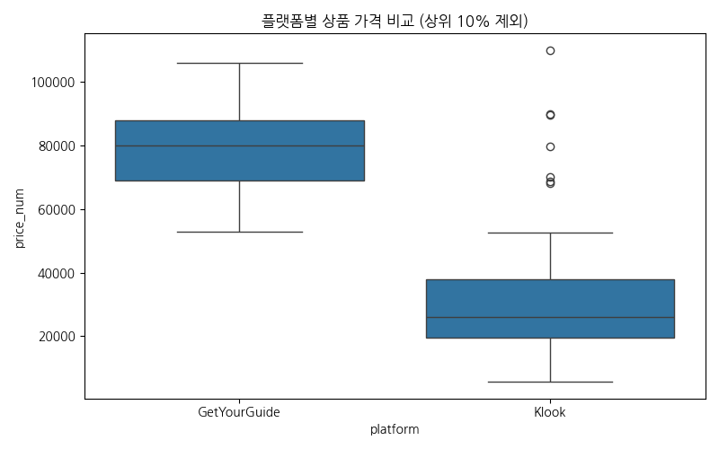
| platform     |   count |    mean |     std |   min |   25% |     50% |    75% |    max |
|:-------------|--------:|--------:|--------:|------:|------:|--------:|-------:|-------:|
| GetYourGuide |     180 | 89671.9 | 25300.5 | 52807 | 69079 | 83094.5 | 100963 | 156580 |
| Klook        |      45 | 34171.1 | 24298.6 |  5600 | 19600 | 26100   |  38000 | 110000 |
**해석:** GetYourGuide와 Klook에서 판매되는 상품들의 가격대 차이를 시각화한 박스플롯입니다. 두 플랫폼 중 어느 곳이 프리미엄 상품을 더 많이 다루고 있는지, 또는 평균적인 가성비 타겟인지 비교하는 데 적합한 시각화 자료입니다.
### 5.8 주요 5개 지역별 평점 분포
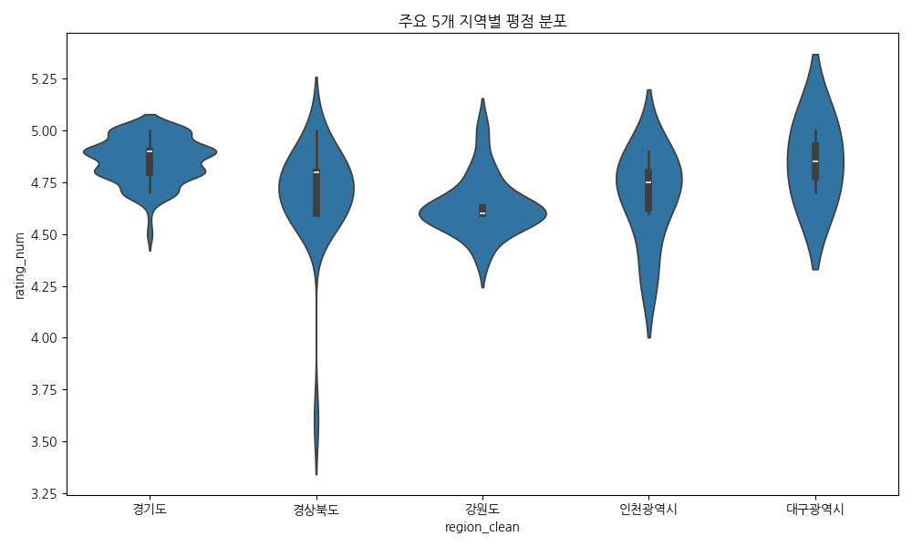
| region_clean   |   count |    mean |     std |   min |   25% |   50% |   75% |   max |
|:---------------|--------:|--------:|--------:|------:|------:|------:|------:|------:|
| 강원도         |      24 | 3.09167 | 2.23586 |     0 |   0   |   4.6 | 4.6   |   5   |
| 경기도         |     171 | 4.20351 | 1.66496 |     0 |   4.7 |   4.8 | 4.9   |   5   |
| 경상북도       |      36 | 3.51944 | 2.0721  |     0 |   2.7 |   4.6 | 4.8   |   5   |
| 대구광역시     |       8 | 1.2125  | 2.24654 |     0 |   0   |   0   | 1.175 |   5   |
| 인천광역시     |      14 | 2.00714 | 2.40879 |     0 |   0   |   0   | 4.675 |   4.9 |
**해석:** 상품 수가 가장 많은 주요 5개 지역을 대상으로 평점의 밀집도와 분포 형태를 비교하는 바이올린 플롯입니다. 지역 간 평균의 차이뿐만 아니라, 극단적인 혹평을 받은 상품이나 만점을 받은 상품의 밀도 차이를 상세히 보여줍니다.
### 5.9 지역별 플랫폼 점유 비교
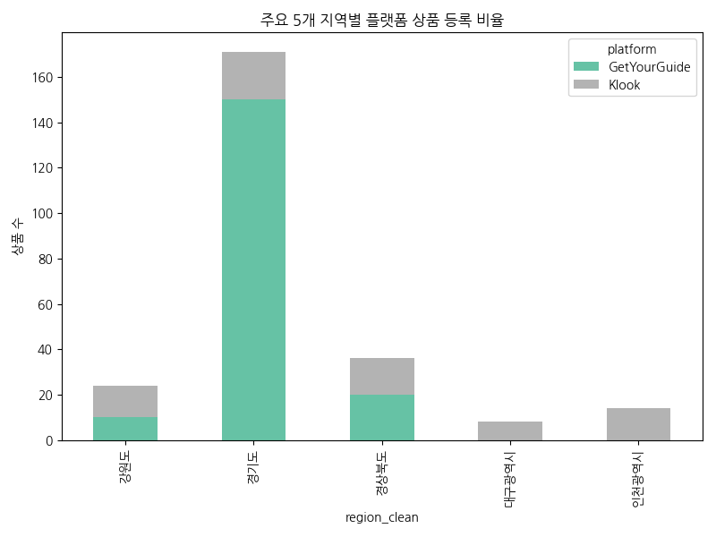
| region_clean   |   GetYourGuide |   Klook |
|:---------------|---------------:|--------:|
| 강원도         |             10 |      14 |
| 경기도         |            150 |      21 |
| 경상북도       |             20 |      16 |
| 대구광역시     |              0 |       8 |
| 인천광역시     |              0 |      14 |
**해석:** 특정 주요 관광 지역에서 Klook과 GetYourGuide 두 OTA 플랫폼이 차지하는 상품 수량 비중을 보여줍니다. 각 플랫폼의 지역적 집중도 전략을 엿볼 수 있으며, 영업을 확장해야 할 틈새 타겟 지역을 발굴하는 근거가 됩니다.
### 5.10 가격 구간별 평균 리뷰 수
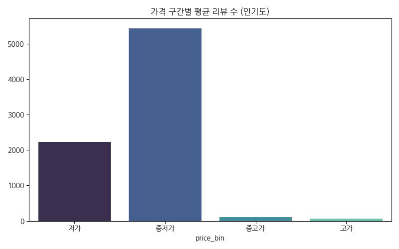
| price_bin   |   count |      mean |        std |   min |    25% |   50% |     75% |   max |
|:------------|--------:|----------:|-----------:|------:|-------:|------:|--------:|------:|
| 저가        |      58 | 2235.03   | 10597.8    |     0 |  17.25 |   355 | 2012.75 | 81104 |
| 중저가      |      64 | 5432.95   |  6529.35   |     1 | 127    |  2957 | 6799    | 19324 |
| 중고가      |      52 |  107.615  |   104.304  |     0 |   0    |   102 |  194    |   260 |
| 고가        |      51 |   63.8627 |    90.4531 |     0 |   0    |     2 |   88    |   232 |
**해석:** 관광 상품의 가격을 4개의 구간(사분위수)으로 나누어 각 구간별 평균 리뷰 수를 비교한 막대 그래프입니다. 저렴한 가성비 상품이 대중적으로 더 많은 외국인 관광객을 끌어모으는지에 대한 명확한 수요 예측 지표를 제공합니다.
### 5.11 시군구별 관광 상품 수 (상위 15개)
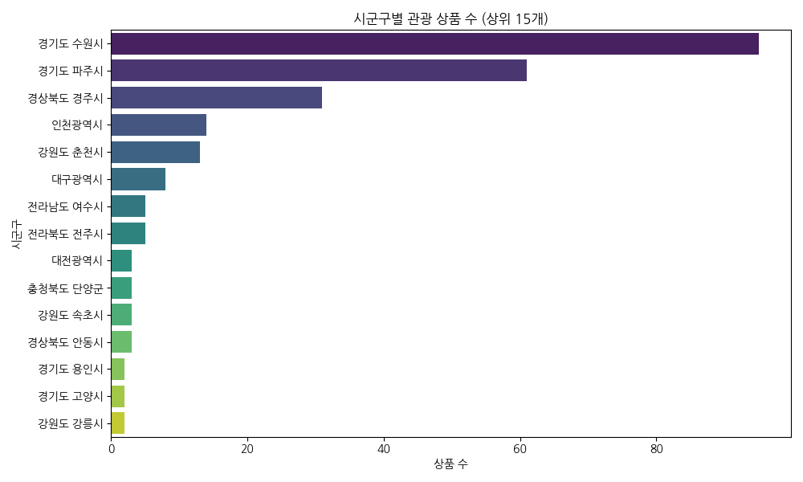
|    | region_sigungu   |   count |
|---:|:-----------------|--------:|
|  0 | 경기도 수원시    |      95 |
|  1 | 경기도 파주시    |      61 |
|  2 | 경상북도 경주시  |      31 |
|  3 | 인천광역시       |      14 |
|  4 | 강원도 춘천시    |      13 |
|  5 | 대구광역시       |       8 |
|  6 | 전라남도 여수시  |       5 |
|  7 | 전라북도 전주시  |       5 |
|  8 | 대전광역시       |       3 |
|  9 | 충청북도 단양군  |       3 |
| 10 | 강원도 속초시    |       3 |
| 11 | 경상북도 안동시  |       3 |
| 12 | 경기도 용인시    |       2 |
| 13 | 경기도 고양시    |       2 |
| 14 | 강원도 강릉시    |       2 |
**해석:** 시군구 단위로 세분화하여 어느 지역에 관광 상품이 밀집해 있는지 분석한 빈도 그래프입니다. 시도 단위보다 더 구체적인 관광 거점을 파악할 수 있습니다.
### 5.12 시군구별 총 리뷰 수 (상위 15개)

|    | region_sigungu   |   reviews_num |
|---:|:-----------------|--------------:|
|  0 | 경기도 파주시    |        351840 |
|  1 | 인천광역시       |         84195 |
|  2 | 경상북도 경주시  |         28968 |
|  3 | 경기도 수원시    |         11316 |
|  4 | 경기도 용인시    |          3895 |
|  5 | 강원도 춘천시    |          3796 |
|  6 | 경기도/강원도    |           850 |
|  7 | 강원도 강릉시    |           434 |
|  8 | 전라남도 여수시  |           427 |
|  9 | 대전광역시       |           213 |
| 10 | 충청북도 단양군  |            73 |
| 11 | 경기도 고양시    |            39 |
| 12 | 경기도 하남시    |            39 |
| 13 | 대구광역시       |            33 |
| 14 | 강원도 속초시    |            27 |
**해석:** 시군구 단위로 총 리뷰 수를 산출한 결과입니다. 상품 등록 수와 비례하지 않고 특정 소도시(예: 파주시, 수원시 등)에 방문객(리뷰 수)이 집중되는 현상을 확인할 수 있습니다.
### 5.13 시군구별 평균 평점 (상위 15개)
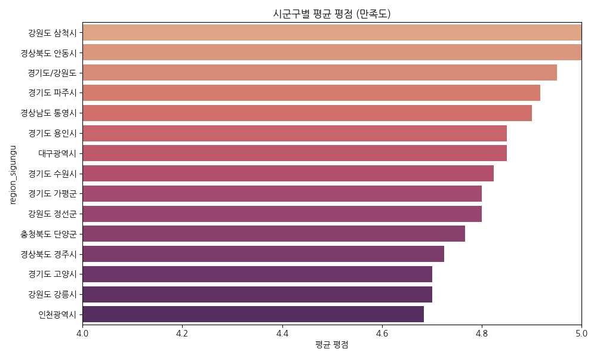
|    | region_sigungu   |   rating_num |
|---:|:-----------------|-------------:|
|  0 | 강원도 삼척시    |      5       |
|  1 | 경상북도 안동시  |      5       |
|  2 | 경기도/강원도    |      4.95    |
|  3 | 경기도 파주시    |      4.91667 |
|  4 | 경상남도 통영시  |      4.9     |
|  5 | 경기도 용인시    |      4.85    |
|  6 | 대구광역시       |      4.85    |
|  7 | 경기도 수원시    |      4.82317 |
|  8 | 경기도 가평군    |      4.8     |
|  9 | 강원도 정선군    |      4.8     |
| 10 | 충청북도 단양군  |      4.76667 |
| 11 | 경상북도 경주시  |      4.724   |
| 12 | 경기도 고양시    |      4.7     |
| 13 | 강원도 강릉시    |      4.7     |
| 14 | 인천광역시       |      4.68333 |
**해석:** 평점이 유효한 상품들에 한정하여 시군구별 평균 만족도를 살펴본 차트입니다. 특정 관광 거점 도시들이 높은 평점을 안정적으로 유지하는지, 혹은 편차가 있는지 비교 분석할 수 있습니다.
