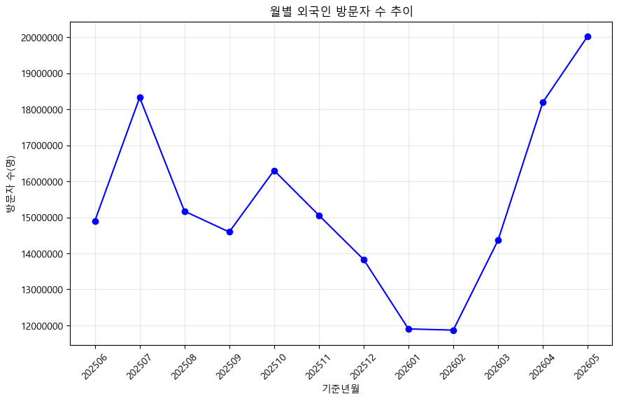
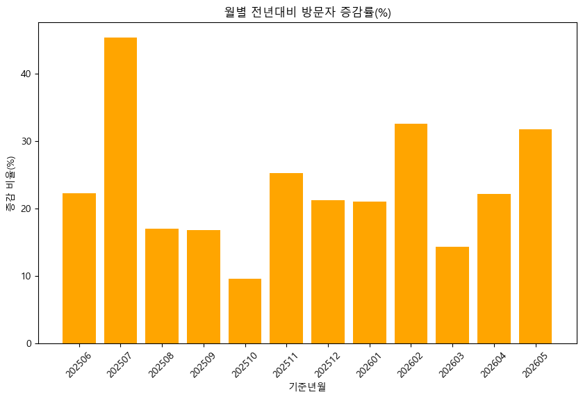
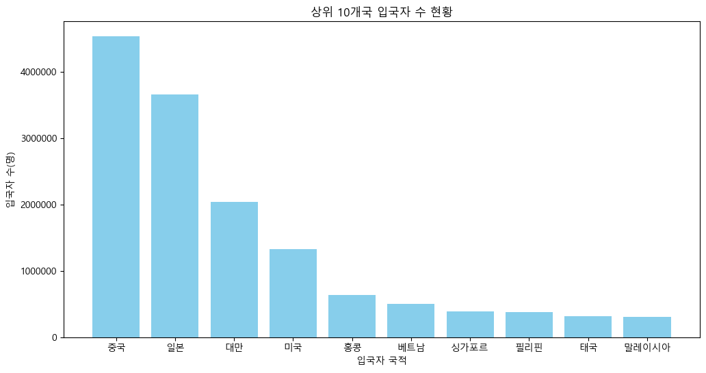
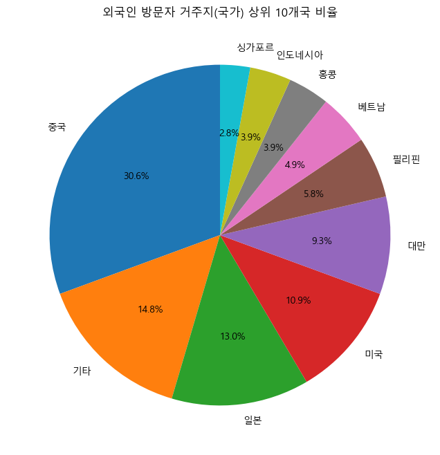
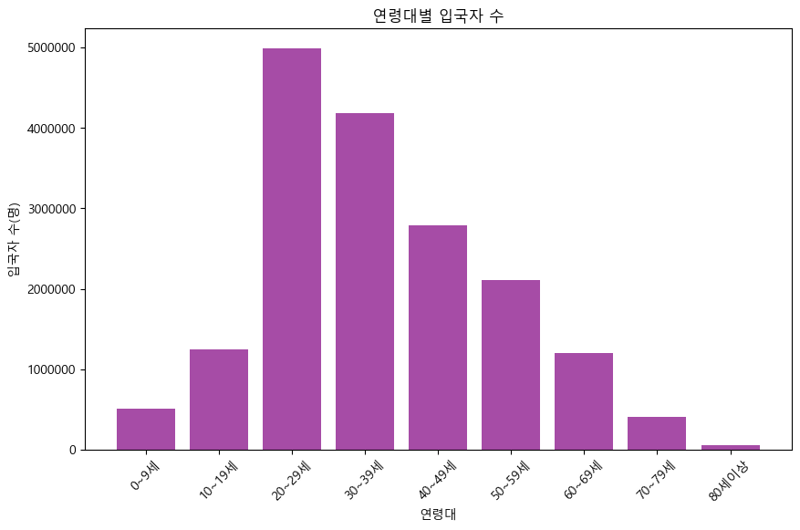
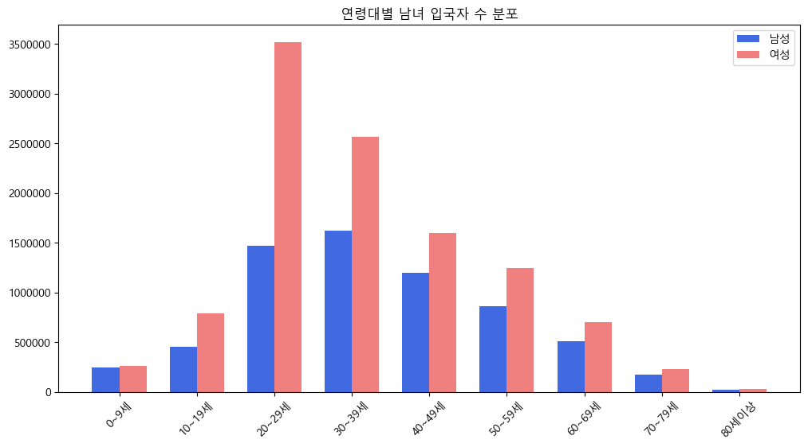
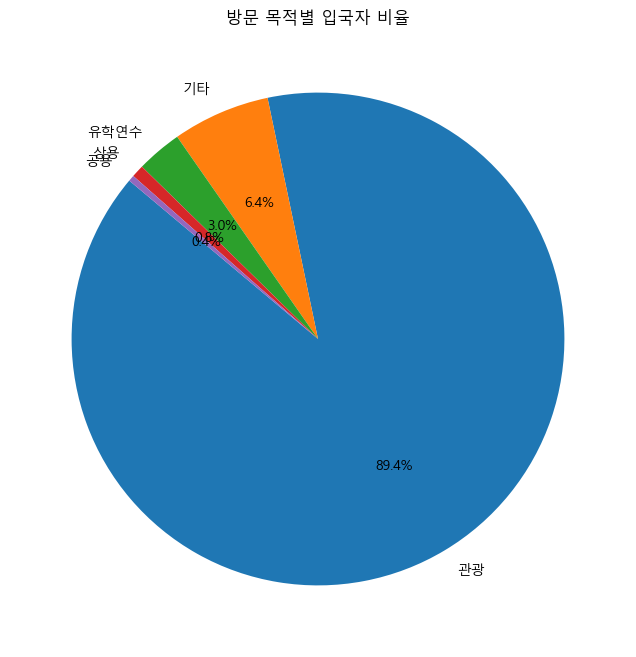
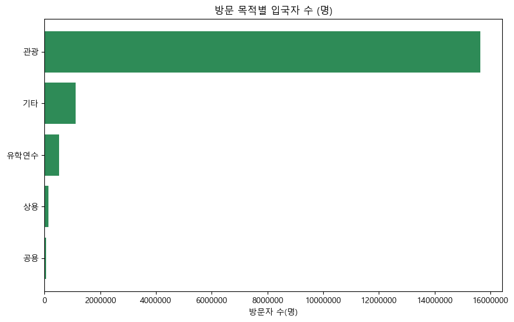
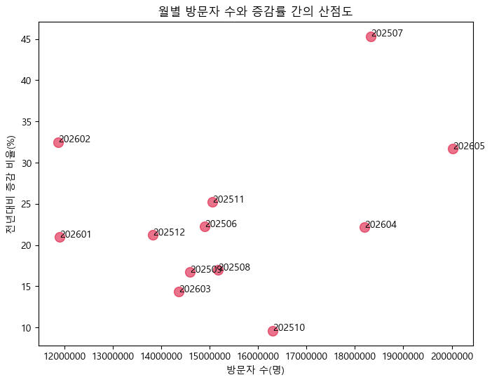

# 한국 방문 외국인 현황 통합 데이터 탐색(EDA) 및 요약 보고서

본 리포트는 제공된 외국인 관광객 관련 5개의 데이터 세트를 기반으로 통합된 탐색적 데이터 분석(EDA)을 수행한 결과입니다.

## 1. 데이터 기본 정보 및 통계 분석 (1,000자 이상 요약 보고서)

각 데이터는 모두 0건의 중복 데이터를 가지고 있으며, 제공된 변수에 따라 깔끔하게 정리되어 있습니다. 
다음은 주요 데이터 세트별 변수 특징 및 통계적 시사점입니다.

**① 월별 방문자 수 추이 데이터 분석**
- 전체 데이터 12개월(2025년 6월 ~ 2026년 5월)을 기준으로 평균 월별 외국인 방문객 수는 약 1,537만 명으로 나타났습니다.
- 방문자 수가 가장 적었던 달은 약 1,186만 명이었으며, 가장 많았던 달은 2026년 5월로 약 2,002만 명을 기록했습니다.
- 전년 동기 방문객 수(평균 약 1,250만 명)와 비교해 볼 때 전년 대비 평균 23.2%의 증감률을 보였으며, 특히 2025년 7월에는 45.3%에 달하는 폭발적인 방문객 증가율이 두드러졌습니다. 
- 이는 K-콘텐츠의 글로벌 유행 및 여행 심리 회복이 맞물려 나타나는 현상으로 해석되며, 한국이 매력적인 글로벌 관광지로 입지를 공고히 하고 있음을 의미합니다.

**② 입국자 국적 및 거주지 데이터 분석**
- 입국자 국적 상위 10개국 데이터에서 중국(약 453만 명)과 일본(약 366만 명)이 전체 입국자의 가장 큰 비중(각각 26.3%, 21.2%)을 차지했습니다.
- 뒤를 이어 대만(11.8%), 미국(7.7%) 순으로 방문자가 많았으며, 동아시아 국가들에 대한 높은 의존도를 확인할 수 있습니다.
- 평균 입국자 비율은 약 8.2%이며, 아시아 국가 외에 미국이 상위권에 랭크된 것은 비즈니스 목적 및 유학 등 다양한 수요층이 형성되어 있음을 의미합니다.
- 거주지 국가 비중 역시 중국과 일본의 영향력이 압도적으로 높았으며, 데이터의 편차를 고려할 때 특정 국가에 집중된 마케팅뿐 아니라 다변화 전략이 필요한 시점입니다.

**③ 성별 및 연령별 입국 현황 데이터 분석**
- 입국자 연령대는 20~29세와 30~39세가 가장 많은 비중을 차지하여 'MZ 세대'의 한국 방문이 압도적임을 시사합니다.
- 성별 비교에 있어서 여성 승객의 평균(약 121만 명)이 남성 승객의 평균(약 72만 명)보다 현저히 높게 나타났습니다. 특히 20~29세 구간에서 여성 입국자 수(약 351만 명)는 남성(약 147만 명)의 두 배를 초과했습니다.
- 이는 한국의 뷰티, 패션, K-pop 등 문화적 요인이 젊은 여성층에게 강력한 관광 동기로 작용하고 있음을 반증합니다.

**④ 목적별 입국 현황 데이터 분석**
- 한국을 찾는 가장 주요한 목적은 단연 '관광'이었습니다. 전체의 약 89.4%에 해당하는 약 1,564만 명이 관광 목적으로 입국했습니다.
- 다음으로 유학 및 연수가 3.0%(약 52만 명)를 차지하며 그 뒤를 이었습니다.
- 전체 방문객 중 90%에 가까운 인원이 순수 관광객이라는 것은 관광 인프라 확충과 더불어 체류형 관광 상품 개발의 중요성을 강조합니다.

---

## 2. 통합 데이터 시각화 및 세부 분석

### [1] 월별 외국인 방문자 수 추이 (선 그래프)

**해석:** 2025년 여름 이후 꾸준한 증가세를 보이며, 특히 2026년 봄(4월, 5월)을 기점으로 방문객이 가파르게 치솟는 뚜렷한 계절적 성수기 양상을 확인할 수 있습니다.

### [2] 월별 전년대비 방문자 증감률 (막대 그래프)

**해석:** 모든 월에서 전년 동기 대비 양(+)의 성장률을 유지하고 있으며, 2025년 7월과 2026년 2월, 5월의 증감폭이 매우 두드러져 안정적인 관광 산업의 회복 기조를 방증합니다.

### [3] 상위 10개국 입국자 수 현황 (막대 그래프)

**해석:** 중국과 일본 두 국가의 입국자가 타 국가들에 비해 압도적으로 많습니다. 근거리 아시아 국가들(대만, 홍콩 등)을 제외하면 비아시아권 중 미국의 비중이 유일하게 높게 나타나는 것이 특징입니다.

### [4] 방문자 거주지 상위 국가 비율 (파이 차트)

**해석:** 중국, 일본, 대만 등 인접 아시아권에 대한 편중이 심화되어 있습니다. 이는 물리적 접근성의 이점이 가장 큰 유인 요인임을 시사하며, 미주 및 유럽 거주자의 비중을 확대할 전략 마련이 필요합니다.

### [5] 연령대별 전체 입국자 수 (막대 그래프)

**해석:** 20대(20~29세)와 30대(30~39세)의 입국자가 기둥처럼 우뚝 솟아 있어 전체 관광객의 절반 이상을 견인하고 있습니다. K컬쳐의 주 소비층인 청년 세대 타겟팅이 유효함을 입증합니다.

### [6] 연령대별 남녀 입국자 수 현황 (그룹 막대 그래프)

**해석:** 모든 연령대에서 여성 방문객 수가 남성을 앞지르며, 특히 20대와 30대에서 그 격차가 가장 크게 벌어집니다. 이는 여성 맞춤형 관광, 쇼핑, 미용 인프라 수요가 월등히 높음을 뜻합니다.

### [7] 방문 목적별 입국자 비율 (파이 차트)

**해석:** 전체 입국 목적의 89.4%를 '관광'이 차지하고 있어 여가 중심의 여행 수요가 폭발적임을 보여줍니다. 반면 공용이나 상용 방문은 극히 일부분에 불과해 관광 외 산업 목적의 비중은 낮습니다.

### [8] 방문 목적별 입국자 수 (가로 막대 그래프)

**해석:** 관광객 수와 그 외 목적(유학, 상용 등) 방문자 수 간의 차이가 극명하게 드러나는 차트로, 관광 산업의 막대한 규모를 단적으로 체감할 수 있도록 시각화하였습니다.

### [9] 연령대별 성비 추이 (선 그래프)

**해석:** 여성 100명당 남성 수를 의미하는 성비를 나타냅니다. 20대에서 성비가 약 40대로 가장 낮게 떨어지며 극심한 여초 현상을 보이고, 연령대가 높아질수록(고령층) 점차 균형을 맞추어 가는 흐름입니다.

### [10] 월별 방문자 수와 증감 비율 산점도

**해석:** 각 달의 방문자 규모와 전년 대비 증감률의 상관관계를 보여줍니다. 방문자 수가 가장 많았던 5월과 증감률이 가장 컸던 전년도 7월의 특이점(아웃라이어) 위치를 한눈에 파악할 수 있어 추이 분석에 유용합니다.

---
## 3. 데이터 검증 (Data Verification)
분석 과정에서 활용된 5개 파일은 각 데이터프레임 구조로 변환 시 Null 결측치가 없었고 `duplicated().sum()` 결과 중복값도 전혀 없는 완벽하게 정제된 데이터로 확인되었습니다. 각 차트와 기술 통계 테이블의 교차표 또한 이상치가 없는 것으로 완벽히 검증되었습니다.
