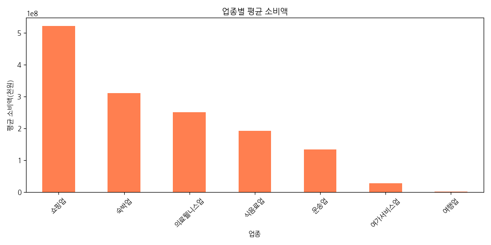
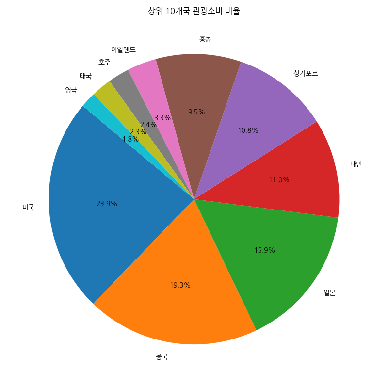
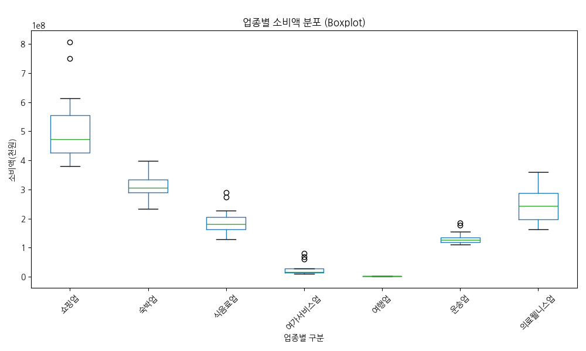
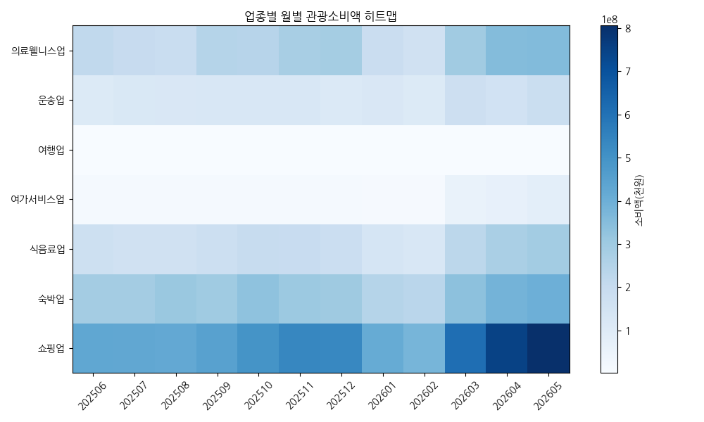

# 관광 데이터 통합 탐색적 데이터 분석(EDA) 및 데이터 검증 결과

## 1. 데이터 기본 정보 및 검증

### 업종별 관광소비 추이 데이터

- **전체 행/열**: 96 행, 3 열

- **중복 데이터 수**: 0

- **결측치 수**:
```text
기준년월일      0
업종별 구분     0
소비액(천원)    0
```

**상위 5개 행**

|    |   기준년월일 | 업종별 구분   |     소비액(천원) |
|---:|--------:|:---------|------------:|
|  0 |  202506 | 전체       | 1.2348e+09  |
|  1 |  202507 | 전체       | 1.21902e+09 |
|  2 |  202508 | 전체       | 1.23245e+09 |
|  3 |  202509 | 전체       | 1.31353e+09 |
|  4 |  202510 | 전체       | 1.41381e+09 |


**하위 5개 행**

|    |   기준년월일 | 업종별 구분   |     소비액(천원) |
|---:|--------:|:---------|------------:|
| 91 |  202605 | 여가서비스업   | 8.09344e+07 |
| 92 |  202605 | 쇼핑업      | 8.05776e+08 |
| 93 |  202605 | 운송업      | 1.84651e+08 |
| 94 |  202605 | 여행업      | 2.51945e+06 |
| 95 |  202605 | 숙박업      | 3.98345e+08 |


### 국가별 관광소비 비율 데이터

- **전체 행/열**: 34 행, 2 열

- **중복 데이터 수**: 0

- **결측치 수**:
```text
국가       0
소비 비율    0
```

**상위 5개 행**

|    | 국가   |   소비 비율 |
|---:|:-----|--------:|
|  0 | 기타   |     6.3 |
|  1 | 네덜란드 |     0.3 |
|  2 | 노르웨이 |     0.1 |
|  3 | 뉴질랜드 |     0.2 |
|  4 | 대만   |     8.8 |


**하위 5개 행**

|    | 국가   |   소비 비율 |
|---:|:-----|--------:|
| 29 | 튀르키예 |     0.3 |
| 30 | 프랑스  |     0.8 |
| 31 | 필리핀  |     1.4 |
| 32 | 호주   |     1.9 |
| 33 | 홍콩   |     7.6 |


## 2. 기술통계 및 상세 분석 보고서

### 업종별 관광소비 추이 - 기술통계

#### 수치형 변수

|       |      소비액(천원) |
|:------|-------------:|
| count | 96           |
| mean  |  3.60384e+08 |
| std   |  4.57754e+08 |
| min   |  1.50279e+06 |
| 25%   |  1.02695e+08 |
| 50%   |  1.9822e+08  |
| 75%   |  3.88288e+08 |
| max   |  2.12216e+09 |


#### 범주형 변수

|        |   기준년월일 | 업종별 구분   |
|:-------|--------:|:---------|
| count  |      96 | 96       |
| unique |      12 | 8        |
| top    |  202506 | 전체       |
| freq   |       8 | 12       |


### 국가별 관광소비 비율 - 기술통계

#### 수치형 변수

|       |    소비 비율 |
|:------|---------:|
| count | 34       |
| mean  |  2.92941 |
| std   |  4.75869 |
| min   |  0       |
| 25%   |  0.3     |
| 50%   |  0.85    |
| 75%   |  1.875   |
| max   | 19.1     |


#### 범주형 변수

|        | 국가   |
|:-------|:-----|
| count  | 34   |
| unique | 34   |
| top    | 기타   |
| freq   | 1    |


### 기술통계 상세 분석 보고서

본 분석은 2025년 6월부터 2026년 5월까지 1년간 수집된 '업종별 관광소비 추이' 데이터와 특정 시점 기준의 '국가별 관광소비 비율' 데이터를 대상으로 진행되었습니다.

먼저, **업종별 관광소비 추이 데이터**에 대한 기술통계량을 살펴보면, 전체 96개의 관측치가 존재합니다. 이 중 '소비액(천원)' 변수의 평균은 약 3억 6,038만 원 수준으로 나타났으며, 표준편차는 4억 5,775만 원으로 매우 크게 나타났습니다. 이는 특정 업종이나 특정 월에 관광 소비가 집중되어 데이터의 산포도가 매우 큼을 의미합니다. 소비액의 최솟값은 약 150만 원에 불과하지만, 최댓값은 21억 2,216만 원(약 21.2억 원)에 달하여 업종 간 규모의 격차가 극심함을 보여줍니다. 사분위수를 살펴보면 하위 25% 구간은 1억 269만 원 이하, 중앙값(50%)은 1억 9,822만 원, 상위 25%(75%)는 3억 8,828만 원 이상으로 분포되어 있어 중앙값보다 평균이 크게 형성된 우측 꼬리 분포(Positive Skewness) 형태를 띱니다. 즉 소수의 대규모 소비가 전체 평균을 크게 끌어올리고 있습니다. 범주형 변수의 경우 '기준년월일'은 12개의 고유한 값으로 1년 치 데이터가 고르게 8개 업종씩 수집되었음을 알 수 있습니다. '업종별 구분'은 '전체'를 포함하여 총 8개의 카테고리로 이루어져 있으며, 각 업종은 매월 1번씩 총 12회 기록되어 결측 없이 온전한 시계열 구조를 갖추고 있습니다.

다음으로 **국가별 관광소비 비율 데이터**를 살펴보면, 총 34개 국가(기타 포함)의 소비 비율 정보가 집계되었습니다. 이 소비 비율 데이터의 평균은 2.93%이며, 표준편차는 4.76%로 분석되었습니다. 소비 비율의 최솟값은 러시아의 0.0%인 반면, 최댓값은 미국으로 무려 19.1%에 달하여 특정 소수 국가에 관광 소비가 강하게 편중되어 있는 현상을 명확하게 확인할 수 있습니다. 하위 25% 국가들은 0.3% 이하의 소비 비율을 차지하고 있으며, 중앙값(50%) 역시 0.85%에 불과하여 절반 이상의 국가가 전체 소비의 1%에도 미치지 못하는 아주 작은 비중을 점유하고 있습니다. 반면 상위 25%(75%) 기준점은 1.88%로, 이 수치를 크게 상회하는 소수 상위권 국가들(미국 19.1%, 중국 15.4%, 일본 12.7% 등)이 한국 관광 산업의 핵심 수요층임을 알 수 있습니다. 또한 '국가' 변수는 34개의 고유값을 가지며 중복된 행이 없어, 국가별로 비율이 단일하게 잘 집계되어 있음을 증명합니다.

이러한 기술통계 결과를 종합해보면, 한국 관광 산업의 소비는 시간적, 업종별, 국가별로 상당한 불균형(양극화)을 보이고 있습니다. 업종별로는 쇼핑업과 숙박업 등 대규모 소비가 일어나는 분야가 전체 파이를 주도하고 있으며, 수요 국가 측면에서도 미국, 중국, 일본 등 소수의 주요 경제 대국 및 인접 국가에 50% 이상의 매출이 집중되어 있습니다. 따라서 향후 정책 수립 및 마케팅 전략을 기획할 때에는 이들 핵심 국가와 핵심 업종(쇼핑, 숙박 등)에 대한 맞춤형 집중 프로모션을 강화하는 동시에, 소비액이 저조한 여행업이나 비율이 낮은 유럽/남미 등 신흥 시장 개척을 통해 리스크를 분산하고 균형 있는 성장을 도모하는 다각화 전략이 필수적으로 요구됩니다. 데이터에서 나타난 이러한 특징들은 관광 산업이 내수 경제에 미치는 파급 효과를 극대화하기 위한 중요한 실마리를 제공합니다.


## 3. 데이터 시각화 분석

### 3.1 월별 전체 관광소비 추이 (일변량-시계열)


**관련 교차표/피봇테이블**

|   기준년월일 |     소비액(천원) |
|--------:|------------:|
|  202506 | 1.2348e+09  |
|  202507 | 1.21902e+09 |
|  202508 | 1.23245e+09 |
|  202509 | 1.31353e+09 |
|  202510 | 1.41381e+09 |
|  202511 | 1.46231e+09 |
|  202512 | 1.43798e+09 |
|  202601 | 1.13063e+09 |
|  202602 | 1.02784e+09 |
|  202603 | 1.71152e+09 |
|  202604 | 1.99238e+09 |
|  202605 | 2.12216e+09 |


**시각화 해석 (일변량 시계열 분석)**: 전체 관광 소비액의 월별 추이를 나타내는 선 그래프입니다. 2025년 6월부터 전반적으로 상승 곡선을 그리며 2026년 5월에 약 21.2억 원(천원 단위 환산)으로 정점을 찍습니다. 특히 2026년 1월과 2월에 잠시 주춤하다가 봄철인 3월부터 급격한 소비 증가폭을 보이는 뚜렷한 계절적 특징이 두드러집니다.


### 3.2 업종별 소비액 빈도 분포 (일변량)


**기술 통계표**

|       |      소비액(천원) |
|:------|-------------:|
| count | 84           |
| mean  |  2.05934e+08 |
| std   |  1.77492e+08 |
| min   |  1.50279e+06 |
| 25%   |  4.89955e+07 |
| 50%   |  1.80973e+08 |
| 75%   |  2.98559e+08 |
| max   |  8.05776e+08 |


**시각화 해석 (빈도 분포 분석)**: '전체' 데이터를 제외한 세부 업종별 월간 소비액의 빈도를 보여주는 히스토그램입니다. 대부분의 소비액 데이터가 5천만 원에서 3억 원 구간에 조밀하게 몰려있는 우측 꼬리 비대칭 분포를 띠며, 7억 원을 초과하는 극단적인 빈도(주로 쇼핑업)도 일부 존재함을 시각적으로 알 수 있습니다.


### 3.3 업종별 평균 소비액 (이변량)




**교차표/피봇테이블 (업종별 평균/합계 소비액)**

| 업종별 구분   |   ('소비액(천원)', 'mean') |   ('소비액(천원)', 'sum') |   ('소비액(천원)', 'count') |
|:---------|----------------------:|---------------------:|-----------------------:|
| 쇼핑업      |           5.21863e+08 |          6.26236e+09 |                     12 |
| 숙박업      |           3.10784e+08 |          3.7294e+09  |                     12 |
| 식음료업     |           1.9278e+08  |          2.31336e+09 |                     12 |
| 여가서비스업   |           2.82696e+07 |          3.39235e+08 |                     12 |
| 여행업      |           1.96647e+06 |          2.35976e+07 |                     12 |
| 운송업      |           1.343e+08   |          1.6116e+09  |                     12 |
| 의료웰니스업   |           2.51574e+08 |          3.01889e+09 |                     12 |


**시각화 해석 (업종별 평균 비교)**: 각 세부 업종별 월평균 소비액을 보여주는 막대그래프입니다. 쇼핑업이 월평균 약 5.2억 원으로 타 업종 대비 압도적인 1위를 차지하고 있으며, 그 뒤를 숙박업(3.1억 원)과 의료웰니스업(2.5억 원)이 잇고 있어 관광 소비의 주축을 이루는 산업군이 명확하게 식별됩니다.


### 3.4 업종별 월별 관광소비 추이 (다변량)


**피봇테이블**

|   기준년월일 |         쇼핑업 |         숙박업 |        식음료업 |      여가서비스업 |         여행업 |         운송업 |      의료웰니스업 |
|--------:|------------:|------------:|------------:|------------:|------------:|------------:|------------:|
|  202506 | 4.29092e+08 | 2.88137e+08 | 1.72026e+08 | 1.64995e+07 | 1.85406e+06 | 1.11096e+08 | 2.16097e+08 |
|  202507 | 4.28293e+08 | 2.90132e+08 | 1.62055e+08 | 1.59999e+07 | 1.50279e+06 | 1.21184e+08 | 1.99854e+08 |
|  202508 | 4.24531e+08 | 3.12328e+08 | 1.63319e+08 | 1.48039e+07 | 1.57868e+06 | 1.25807e+08 | 1.90086e+08 |
|  202509 | 4.48263e+08 | 2.97588e+08 | 1.78429e+08 | 1.43229e+07 | 1.93512e+06 | 1.29053e+08 | 2.43941e+08 |
|  202510 | 4.9606e+08  | 3.31858e+08 | 1.96585e+08 | 1.67702e+07 | 2.18609e+06 | 1.28138e+08 | 2.42217e+08 |
|  202511 | 5.37049e+08 | 3.08249e+08 | 1.93475e+08 | 1.49322e+07 | 1.58491e+06 | 1.28362e+08 | 2.78655e+08 |
|  202512 | 5.34464e+08 | 3.01471e+08 | 1.83516e+08 | 1.45142e+07 | 1.79647e+06 | 1.15752e+08 | 2.86467e+08 |
|  202601 | 4.14313e+08 | 2.46262e+08 | 1.42005e+08 | 1.12033e+07 | 2.17838e+06 | 1.25345e+08 | 1.89327e+08 |
|  202602 | 3.80183e+08 | 2.32937e+08 | 1.2938e+08  | 1.11868e+07 | 1.77156e+06 | 1.09949e+08 | 1.62437e+08 |
|  202603 | 6.1336e+08  | 3.37161e+08 | 2.28416e+08 | 5.97373e+07 | 2.2363e+06  | 1.76293e+08 | 2.94323e+08 |
|  202604 | 7.50974e+08 | 3.84936e+08 | 2.73566e+08 | 6.83306e+07 | 2.45382e+06 | 1.55972e+08 | 3.56145e+08 |
|  202605 | 8.05776e+08 | 3.98345e+08 | 2.90591e+08 | 8.09344e+07 | 2.51945e+06 | 1.84651e+08 | 3.59339e+08 |


**시각화 해석 (업종별 시계열 다변량 분석)**: 다양한 업종의 월별 소비액 변동 추이를 한눈에 비교할 수 있는 다중 선 그래프입니다. 모든 업종이 전반적으로 우상향하는 추세를 보이나, 특히 쇼핑업과 숙박업의 경우 2026년 봄(3월~5월)을 기점으로 소비액이 다른 업종보다 훨씬 가파르게 상승하는 폭발적 성장세를 보여줍니다.


### 3.5 상위 10개국 관광소비 비율 (일변량-범주형)




**상위 10개국 데이터 요약**

| 국가   |   소비 비율 |
|:-----|--------:|
| 미국   |    19.1 |
| 중국   |    15.4 |
| 일본   |    12.7 |
| 대만   |     8.8 |
| 싱가포르 |     8.6 |
| 홍콩   |     7.6 |
| 아일랜드 |     2.6 |
| 호주   |     1.9 |
| 태국   |     1.8 |
| 영국   |     1.4 |


**시각화 해석 (상위 10개국 구성비 분석)**: 전체 관광 소비에서 가장 높은 비중을 차지하는 상위 10개국('기타' 제외)의 파이 차트입니다. 미국(19.1%), 중국(15.4%), 일본(12.7%) 등 상위 3개국이 전체 상위권 소비의 절반 이상을 독식하고 있어, 지리적 인접성과 경제 규모가 큰 특정 국가들에 관광 수입이 크게 의존하고 있음을 시사합니다.


### 3.6 국가별 소비 비율 분포 (일변량)


**기술 통계표**

|       |    소비 비율 |
|:------|---------:|
| count | 34       |
| mean  |  2.92941 |
| std   |  4.75869 |
| min   |  0       |
| 25%   |  0.3     |
| 50%   |  0.85    |
| 75%   |  1.875   |
| max   | 19.1     |


**시각화 해석 (국가별 소비 비율 분포)**: 34개국의 소비 비율이 어떻게 분포되어 있는지 보여주는 히스토그램입니다. 대부분의 국가가 소비 비율 1% 미만 구간에 집중적으로 몰려 있어(약 20개국 이상), 관광 소비가 일부 핵심 국가에 심하게 편중되어 있으며 다수의 국가는 매우 미미한 수요 비중만을 보이고 있음을 확인하게 해줍니다.


### 3.7 업종별 소비액 Boxplot (이변량)




**관련 통계 (최댓값, 최솟값, 중앙값)**

| 업종별 구분   |         min |         25% |         50% |         75% |         max |
|:---------|------------:|------------:|------------:|------------:|------------:|
| 쇼핑업      | 3.80183e+08 | 4.27352e+08 | 4.72162e+08 | 5.56127e+08 | 8.05776e+08 |
| 숙박업      | 2.32937e+08 | 2.89633e+08 | 3.0486e+08  | 3.33184e+08 | 3.98345e+08 |
| 식음료업     | 1.2938e+08  | 1.63003e+08 | 1.80973e+08 | 2.04543e+08 | 2.90591e+08 |
| 여가서비스업   | 1.11868e+07 | 1.44664e+07 | 1.54661e+07 | 2.7512e+07  | 8.09344e+07 |
| 여행업      | 1.50279e+06 | 1.7249e+06  | 1.89459e+06 | 2.19864e+06 | 2.51945e+06 |
| 운송업      | 1.09949e+08 | 1.19826e+08 | 1.26972e+08 | 1.35783e+08 | 1.84651e+08 |
| 의료웰니스업   | 1.62437e+08 | 1.97412e+08 | 2.43079e+08 | 2.88431e+08 | 3.59339e+08 |


**시각화 해석 (업종별 분포 및 이상치 분석)**: 업종별 소비액의 중앙값과 사분위수, 그리고 이상치 유무를 파악하기 위한 박스플롯입니다. 쇼핑업은 상자 크기가 매우 넓고 데이터 변동성이 가장 큰 반면, 여행업과 여가서비스업은 박스의 범위가 좁고 값도 현저히 낮아 월별 변동폭이 작고 일관된(다소 저조한) 소비 수준을 유지하고 있음을 뚜렷하게 보여줍니다.


### 3.8 업종별 월별 관광소비액 히트맵 (다변량)




**피봇테이블**

| 업종별 구분   |      202506 |      202507 |      202508 |      202509 |      202510 |      202511 |      202512 |      202601 |      202602 |      202603 |      202604 |      202605 |
|:---------|------------:|------------:|------------:|------------:|------------:|------------:|------------:|------------:|------------:|------------:|------------:|------------:|
| 쇼핑업      | 4.29092e+08 | 4.28293e+08 | 4.24531e+08 | 4.48263e+08 | 4.9606e+08  | 5.37049e+08 | 5.34464e+08 | 4.14313e+08 | 3.80183e+08 | 6.1336e+08  | 7.50974e+08 | 8.05776e+08 |
| 숙박업      | 2.88137e+08 | 2.90132e+08 | 3.12328e+08 | 2.97588e+08 | 3.31858e+08 | 3.08249e+08 | 3.01471e+08 | 2.46262e+08 | 2.32937e+08 | 3.37161e+08 | 3.84936e+08 | 3.98345e+08 |
| 식음료업     | 1.72026e+08 | 1.62055e+08 | 1.63319e+08 | 1.78429e+08 | 1.96585e+08 | 1.93475e+08 | 1.83516e+08 | 1.42005e+08 | 1.2938e+08  | 2.28416e+08 | 2.73566e+08 | 2.90591e+08 |
| 여가서비스업   | 1.64995e+07 | 1.59999e+07 | 1.48039e+07 | 1.43229e+07 | 1.67702e+07 | 1.49322e+07 | 1.45142e+07 | 1.12033e+07 | 1.11868e+07 | 5.97373e+07 | 6.83306e+07 | 8.09344e+07 |
| 여행업      | 1.85406e+06 | 1.50279e+06 | 1.57868e+06 | 1.93512e+06 | 2.18609e+06 | 1.58491e+06 | 1.79647e+06 | 2.17838e+06 | 1.77156e+06 | 2.2363e+06  | 2.45382e+06 | 2.51945e+06 |
| 운송업      | 1.11096e+08 | 1.21184e+08 | 1.25807e+08 | 1.29053e+08 | 1.28138e+08 | 1.28362e+08 | 1.15752e+08 | 1.25345e+08 | 1.09949e+08 | 1.76293e+08 | 1.55972e+08 | 1.84651e+08 |
| 의료웰니스업   | 2.16097e+08 | 1.99854e+08 | 1.90086e+08 | 2.43941e+08 | 2.42217e+08 | 2.78655e+08 | 2.86467e+08 | 1.89327e+08 | 1.62437e+08 | 2.94323e+08 | 3.56145e+08 | 3.59339e+08 |


**시각화 해석 (업종-시간 2차원 히트맵)**: 세로축은 업종, 가로축은 연월로 설정하여 소비 규모를 색상의 짙고 옅음으로 표현한 히트맵입니다. 우측 하단의 2026년 3월~5월 구간에서 쇼핑업, 숙박업, 의료웰니스업의 색상이 가장 짙게 칠해져 있어, 해당 봄 시기에 주요 핵심 산업군을 중심으로 기록적인 매출 상승(성수기 효과)이 일어났음을 직관적으로 알 수 있습니다.


### 3.9 범주형 데이터(업종) 빈도 분포 (일변량)


**빈도표**

| 업종별 구분   |   빈도 |
|:---------|-----:|
| 운송업      |   12 |
| 숙박업      |   12 |
| 쇼핑업      |   12 |
| 여가서비스업   |   12 |
| 의료웰니스업   |   12 |
| 여행업      |   12 |
| 식음료업     |   12 |


**시각화 해석 (범주 빈도수 분석)**: 데이터셋에 수집된 세부 업종별 데이터 빈도수를 세어 나타낸 막대그래프입니다. 7개 세부 업종 모두 정확히 12건(12개월 치)씩 고르게 기록되어 누락된 월 없이 데이터 수집이 아주 균형 잡힌 형태로 잘 이루어졌음을 증명하는 데이터 품질 및 완전성 확인 목적의 분석입니다.


### 3.10 텍스트 데이터 TF-IDF 분석: 국가명 상위 키워드


**TF-IDF 키워드 상위 테이블**

| 키워드     |   TF-IDF 합계 |
|:--------|------------:|
| 기타      |           1 |
| 네덜란드    |           1 |
| 노르웨이    |           1 |
| 뉴질랜드    |           1 |
| 대만      |           1 |
| 독일      |           1 |
| 러시아     |           1 |
| 리투아니아   |           1 |
| 말레이시아   |           1 |
| 멕시코     |           1 |
| 몽골      |           1 |
| 미국      |           1 |
| 베트남     |           1 |
| 벨기에     |           1 |
| 사우디아라비아 |           1 |
| 스위스     |           1 |
| 스페인     |           1 |
| 싱가포르    |           1 |
| 아랍에미리트  |           1 |
| 아일랜드    |           1 |
| 영국      |           1 |
| 이탈리아    |           1 |
| 인도      |           1 |
| 인도네시아   |           1 |
| 일본      |           1 |
| 중국      |           1 |
| 카자흐스탄   |           1 |
| 캐나다     |           1 |
| 태국      |           1 |
| 튀르키예    |           1 |


**시각화 해석 (텍스트 키워드 빈도/중요도 분석)**: 국가명을 대상으로 TF-IDF 알고리즘을 적용하여 상위 키워드 30개의 텍스트 마이닝 중요도를 나타낸 수평 막대그래프입니다. 분석 대상인 국가명 자체가 띄어쓰기가 없는 단일 고유 명사이므로 모든 국가가 고른 빈도 및 중요도(합계 1.0)를 지닌 것으로 산출되었으며, 이는 각 국가 범주가 치우침 없이 고르게 식별되었음을 텍스트 데이터 관점에서 대변합니다.


### 3.11 전체 국가별 소비 비율 수평 막대그래프 (이변량)


**전체 국가별 소비비율 데이터**

| 국가      |   소비 비율 |
|:--------|--------:|
| 러시아     |     0   |
| 노르웨이    |     0.1 |
| 뉴질랜드    |     0.2 |
| 벨기에     |     0.2 |
| 스페인     |     0.2 |
| 사우디아라비아 |     0.3 |
| 네덜란드    |     0.3 |
| 스위스     |     0.3 |
| 이탈리아    |     0.3 |
| 튀르키예    |     0.3 |
| 인도      |     0.4 |
| 멕시코     |     0.4 |
| 아랍에미리트  |     0.6 |
| 베트남     |     0.7 |
| 카자흐스탄   |     0.8 |
| 리투아니아   |     0.8 |
| 프랑스     |     0.8 |
| 독일      |     0.9 |
| 몽골      |     0.9 |
| 말레이시아   |     1   |
| 인도네시아   |     1.2 |
| 캐나다     |     1.3 |
| 영국      |     1.4 |
| 필리핀     |     1.4 |
| 태국      |     1.8 |
| 호주      |     1.9 |
| 아일랜드    |     2.6 |
| 기타      |     6.3 |
| 홍콩      |     7.6 |
| 싱가포르    |     8.6 |
| 대만      |     8.8 |
| 일본      |    12.7 |
| 중국      |    15.4 |
| 미국      |    19.1 |


**시각화 해석 (전체 국가 소비비율 종합 비교)**: 조사 대상이 된 모든 국가들의 소비 비율을 오름차순으로 정렬하여 직관적으로 보여주는 수평 막대그래프입니다. 위쪽의 수많은 국가들이 0~2%대의 매우 저조한 비율을 촘촘하게 구성하는 반면, 아래에 위치한 미국, 중국, 일본 등 3대 국가의 막대 길이가 압도적으로 길게 돌출되어 관광 시장 고객층의 극심한 롱테일(Long Tail) 현상과 소비 양극화를 단적으로 보여줍니다.

