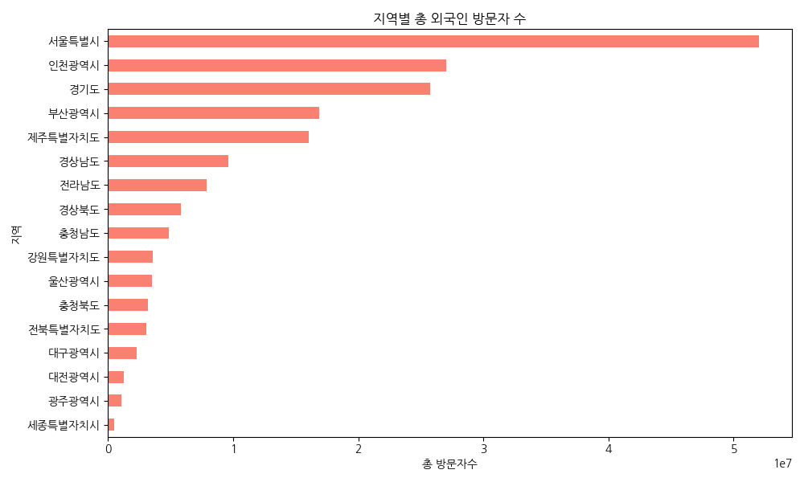
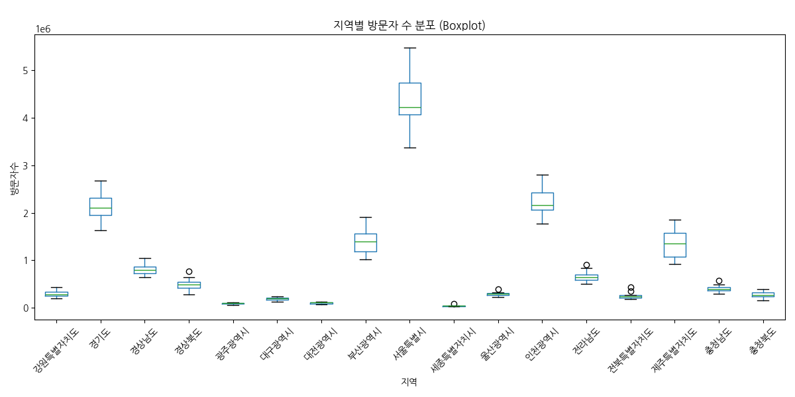
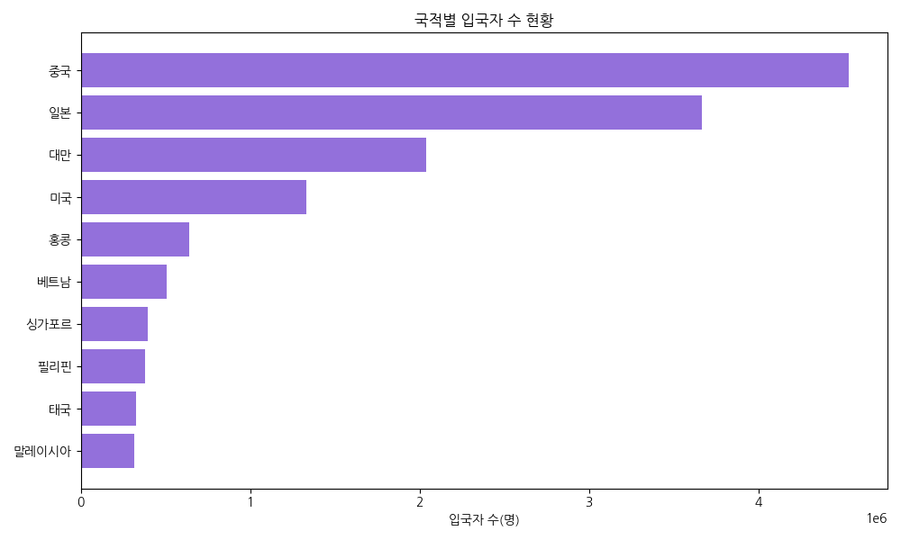
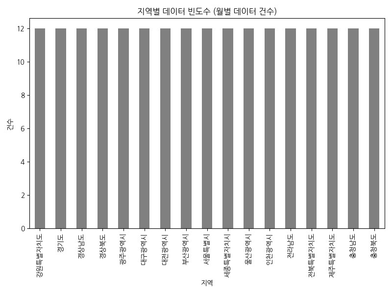
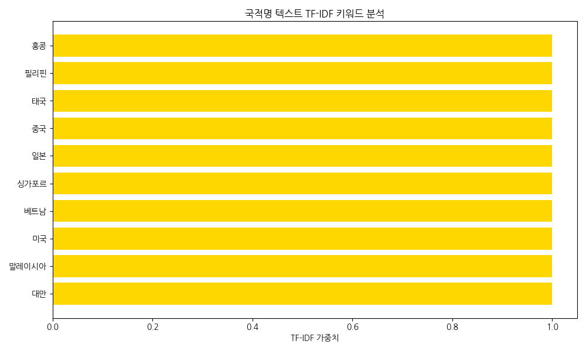

# 외국인 방문자 데이터 통합 탐색적 데이터 분석(EDA) 및 검증

## 1. 데이터 기본 정보 및 검증

### 지역별 방문자 수 추이 데이터

- **전체 행/열**: 204 행, 3 열

- **중복 데이터 수**: 0

- **결측치 수**:
```text
날짜          0
지역          0
외국인 방문자수    0
```

**상위 5개 행**

|    |     날짜 | 지역      |         외국인 방문자수 |
|---:|-------:|:--------|-----------------:|
|  0 | 202506 | 강원특별자치도 | 335323           |
|  1 | 202506 | 경기도     |      2.17021e+06 |
|  2 | 202506 | 경상남도    | 696323           |
|  3 | 202506 | 경상북도    | 498360           |
|  4 | 202506 | 광주광역시   |  91525           |


**하위 5개 행**

|     |     날짜 | 지역      |         외국인 방문자수 |
|----:|-------:|:--------|-----------------:|
| 199 | 202605 | 전라남도    | 902969           |
| 200 | 202605 | 전북특별자치도 | 441879           |
| 201 | 202605 | 제주특별자치도 |      1.77378e+06 |
| 202 | 202605 | 충청남도    | 576864           |
| 203 | 202605 | 충청북도    | 397317           |


### 방문자 거주지 비율 데이터

- **전체 행/열**: 24 행, 2 열

- **중복 데이터 수**: 0

- **결측치 수**:
```text
국가명      0
비율(%)    0
```

**상위 5개 행**

|    | 국가명   |   비율(%) |
|---:|:------|--------:|
|  0 | 호주    |     1.5 |
|  1 | 캐나다   |     1.6 |
|  2 | 중국    |    25.8 |
|  3 | 대만    |     7.8 |
|  4 | 프랑스   |     0.9 |


**하위 5개 행**

|    | 국가명    |   비율(%) |
|---:|:-------|--------:|
| 19 | 아랍에미리트 |     0.1 |
| 20 | 튀르키예   |     0.5 |
| 21 | 영국     |     1.3 |
| 22 | 미국     |     9.2 |
| 23 | 기타     |    12.5 |


### 국적별 입국현황 데이터

- **전체 행/열**: 10 행, 4 열

- **중복 데이터 수**: 0

- **결측치 수**:
```text
입국자 국적        0
입국자 수(명)      0
총 입국자 수(명)    0
입국자 비율(%)     0
```

**상위 5개 행**

|    | 입국자 국적   |   입국자 수(명) |   총 입국자 수(명) |   입국자 비율(%) |
|---:|:---------|-----------:|-------------:|------------:|
|  0 | 중국       |    4535565 |     17249970 |        26.3 |
|  1 | 일본       |    3663895 |     17249970 |        21.2 |
|  2 | 대만       |    2040316 |     17249970 |        11.8 |
|  3 | 미국       |    1332045 |     17249970 |         7.7 |
|  4 | 홍콩       |     641114 |     17249970 |         3.7 |


**하위 5개 행**

|    | 입국자 국적   |   입국자 수(명) |   총 입국자 수(명) |   입국자 비율(%) |
|---:|:---------|-----------:|-------------:|------------:|
|  5 | 베트남      |     506256 |     17249970 |         2.9 |
|  6 | 싱가포르     |     395788 |     17249970 |         2.3 |
|  7 | 필리핀      |     381807 |     17249970 |         2.2 |
|  8 | 태국       |     323549 |     17249970 |         1.9 |
|  9 | 말레이시아    |     315279 |     17249970 |         1.8 |


## 2. 기술통계 및 상세 분석 보고서

### 지역별 방문자 수 추이 - 기술통계

|       |         외국인 방문자수 |
|:------|-----------------:|
| count |    204           |
| mean  | 904559           |
| std   |      1.11472e+06 |
| min   |  27309           |
| 25%   | 214373           |
| 50%   | 392157           |
| 75%   |      1.22763e+06 |
| max   |      5.47291e+06 |


|        |     날짜 | 지역      |
|:-------|-------:|:--------|
| count  |    204 | 204     |
| unique |     12 | 17      |
| top    | 202506 | 강원특별자치도 |
| freq   |     17 | 12      |


### 방문자 거주지 비율 - 기술통계

|       |    비율(%) |
|:------|---------:|
| count | 24       |
| mean  |  4.1625  |
| std   |  5.75717 |
| min   |  0.1     |
| 25%   |  1.175   |
| 50%   |  1.65    |
| 75%   |  4.3     |
| max   | 25.8     |


|        | 국가명   |
|:-------|:------|
| count  | 24    |
| unique | 24    |
| top    | 호주    |
| freq   | 1     |


### 국적별 입국현황 - 기술통계

|       |         입국자 수(명) |   총 입국자 수(명) |   입국자 비율(%) |
|:------|-----------------:|-------------:|------------:|
| count |     10           |   10         |    10       |
| mean  |      1.41356e+06 |    1.725e+07 |     8.18    |
| std   |      1.53206e+06 |    0         |     8.87954 |
| min   | 315279           |    1.725e+07 |     1.8     |
| 25%   | 385302           |    1.725e+07 |     2.225   |
| 50%   | 573685           |    1.725e+07 |     3.3     |
| 75%   |      1.86325e+06 |    1.725e+07 |    10.775   |
| max   |      4.53556e+06 |    1.725e+07 |    26.3     |


|        | 입국자 국적   |
|:-------|:---------|
| count  | 10       |
| unique | 10       |
| top    | 중국       |
| freq   | 1        |


### 기초 기술통계 종합 분석 보고서

본 보고서는 2025년 6월부터 2026년 5월까지 수집된 '외국인 지역별 방문자 수 추이', 그리고 특정 기간 기준의 '외국인 방문자 거주지(국가) 비율' 및 '입국자 국적별 입국현황'이라는 세 가지 핵심 데이터셋을 바탕으로 작성되었습니다. 각 데이터셋의 통계적 특성을 살펴보며 한국 방문 외국인의 전반적인 트렌드를 종합적으로 도출합니다.

첫째, **지역별 방문자 수 추이 데이터**에 대한 기술통계 분석 결과, 전체 204개의 관측치(12개월 × 17개 시도)가 분석되었습니다. 이 중 '외국인 방문자수'의 월평균은 약 90만 4천 명으로 산출되었으나, 표준편차가 무려 111만 명을 상회하여 지역 간 편차가 극도로 심각함을 알 수 있습니다. 실제 최솟값은 세종특별자치시 등에서 기록된 2만 7천여 명에 불과한 반면, 최댓값은 서울특별시의 547만 명에 달하여 지역 간 방문객 규모 격차가 수백 배 이상 벌어지는 쏠림 현상을 보이고 있습니다. 하위 25% 지역은 21만 4천 명 이하, 중앙값은 약 39만 2천 명이지만 상위 25% 기준선은 122만 명을 넘어섭니다. 이처럼 소수의 최상위 관광 거점(서울, 경기, 인천 등 수도권과 제주, 부산)이 전체 평균 수치를 견인하는 전형적인 비대칭 우측 꼬리 분포(Right Skewed Distribution)가 형성되어 있습니다. 

둘째, **외국인 방문자 거주지 비율 데이터**를 살펴보면, 총 24개 국가 카테고리에 대한 방문객 비율이 제시되어 있습니다. 국가별 평균 방문 비율은 4.16%이며, 표준편차는 5.75%입니다. 최솟값은 0.1%(아랍에미리트)인 반면, 최댓값은 25.8%(중국)로 집계되었습니다. 중앙값은 1.65%로 매우 낮아 대다수 국가가 2% 이하의 미미한 점유율을 차지하고 있으나, 상위 25% 기준인 4.3%를 크게 상회하는 소수 상위권 국가(중국, 일본, 미국, 대만 등)가 거주지 측면에서도 방한 관광객의 절대다수를 구성하고 있음을 알 수 있습니다.

셋째, **입국자 국적별 입국현황 데이터**를 분석해보면, 주요 상위 10개국 입국자 총수(명수)를 파악할 수 있습니다. 10개국의 입국자 수 평균은 약 141만 명이며, 표준편차는 153만 명으로 여기서도 특정 국가로의 편중이 재확인됩니다. 입국자가 가장 적은 국가(말레이시아 등)는 약 31만 명 수준이지만, 가장 많은 국가인 중국은 무려 453만 명에 육박하여 최댓값과 최솟값이 약 14배 이상 차이를 보입니다. 전체 입국자 수(1,724만 9,970명) 대비 비율을 보아도, 중국(26.3%), 일본(21.2%), 대만(11.8%) 3개국이 전체의 절반 이상(약 60%)을 독식하고 있습니다.

위 세 가지 데이터 분석 결과를 종합하면, 한국을 찾는 외국인 관광 시장은 '소수 거점 지역 중심' 및 '소수 인접 국가 중심'이라는 이중적 쏠림 현상(집중화 현상)을 강하게 나타내고 있습니다. 외국인 방문객의 과반수가 중국, 일본, 미국, 대만에 집중되어 있으며, 이들의 주요 행선지 역시 서울, 인천, 경기와 같은 수도권 및 부산, 제주 등 전통적 유명 관광지로 한정되는 경향이 짙습니다. 이러한 구조는 특정 국가의 정치적, 경제적 상황에 한국 관광 산업 전체가 크게 출렁일 수 있는 심각한 리스크 요인이 됩니다. 따라서 향후 관광 정책 및 인프라 개발에 있어서는 K-팝, K-드라마 등 한류 콘텐츠를 융합하여 동남아시아, 유럽, 중동 등 신흥 국가 관광객을 다변화하여 유치하는 전략이 시급합니다. 또한, 수도권에 집중된 관광 수요를 지방 도시(강원, 전라, 충청 등)로 분산시킬 수 있도록 지역 특색을 살린 체류형 로컬 관광 상품과 교통 편의성 인프라 확충이 필수불가결함을 본 데이터가 명확하게 시사하고 있습니다.


## 3. 데이터 시각화 분석

### 3.1 월별 전체 외국인 방문자 수 추이 (일변량)


**월별 합계 데이터**

|     날짜 |    외국인 방문자수 |
|-------:|------------:|
| 202506 | 1.49019e+07 |
| 202507 | 1.83252e+07 |
| 202508 | 1.51699e+07 |
| 202509 | 1.45926e+07 |
| 202510 | 1.63012e+07 |
| 202511 | 1.50572e+07 |
| 202512 | 1.3828e+07  |
| 202601 | 1.1902e+07  |
| 202602 | 1.1868e+07  |
| 202603 | 1.43626e+07 |
| 202604 | 1.81938e+07 |
| 202605 | 2.00276e+07 |


**시각화 해석 (월별 추이 분석)**: 2025년 6월부터 2026년 5월까지 전국 모든 지역의 외국인 방문자 수를 합산하여 그린 시계열 선 그래프입니다. 2026년 1월~2월 겨울철 비수기에 잠시 감소했다가, 4월과 5월 봄을 맞이하면서 방문객 총량이 2천만 명에 육박할 정도로 급증하는 매우 뚜렷한 우상향 성장 추세와 폭발적인 계절성을 보여줍니다.


### 3.2 지역별 총 방문자 수 (이변량)




**지역별 합계/평균 데이터**

| 지역      |   ('외국인 방문자수', 'sum') |   ('외국인 방문자수', 'mean') |
|:--------|----------------------:|-----------------------:|
| 강원특별자치도 |           3.5642e+06  |       297017           |
| 경기도     |           2.57602e+07 |            2.14668e+06 |
| 경상남도    |           9.62859e+06 |       802382           |
| 경상북도    |           5.85962e+06 |       488302           |
| 광주광역시   |           1.08338e+06 |        90281.5         |
| 대구광역시   |           2.28547e+06 |       190456           |
| 대전광역시   |           1.26394e+06 |       105329           |
| 부산광역시   |           1.68515e+07 |            1.40429e+06 |
| 서울특별시   |           5.20558e+07 |            4.33798e+06 |
| 세종특별자치시 |      510625           |        42552.1         |
| 울산광역시   |           3.52553e+06 |       293794           |
| 인천광역시   |           2.704e+07   |            2.25333e+06 |
| 전라남도    |           7.91479e+06 |       659566           |
| 전북특별자치도 |           3.07543e+06 |       256286           |
| 제주특별자치도 |           1.60229e+07 |            1.33524e+06 |
| 충청남도    |           4.86244e+06 |       405204           |
| 충청북도    |           3.22565e+06 |       268804           |


**시각화 해석 (지역별 합계 비교)**: 1년간 지역별로 누적된 전체 외국인 방문자 수를 비교한 수평 막대그래프입니다. 서울특별시가 5천만 명 이상으로 압도적인 1위를 기록하고 있으며, 인천광역시(2704만), 경기도(2576만), 부산, 제주가 그 뒤를 잇고 있어 수도권 및 전통적 주요 관광 거점으로의 극심한 수요 쏠림 현상을 단적으로 보여줍니다.


### 3.3 외국인 방문자 수 빈도 분포 (일변량)


**통계량 요약**

|       |         외국인 방문자수 |
|:------|-----------------:|
| count |    204           |
| mean  | 904559           |
| std   |      1.11472e+06 |
| min   |  27309           |
| 25%   | 214373           |
| 50%   | 392157           |
| 75%   |      1.22763e+06 |
| max   |      5.47291e+06 |


**시각화 해석 (방문자 분포 히스토그램)**: 17개 시도 각각의 월간 방문자 수 관측치(총 204건)가 어떻게 분포하는지 나타냅니다. 대부분의 관측치가 50만 명 미만 구간에 조밀하게 모여 있어 지방 지역의 방문자 수가 매우 저조함을 알 수 있으며, 극소수의 우측 구간(400~500만 명 이상)에 위치한 서울 등의 관측치가 비대칭 우측 꼬리를 형성합니다.


### 3.4 상위 5개 지역 월별 방문자 수 추이 (다변량)


**상위 5개 지역 피봇 테이블**

|     날짜 |         경기도 |       부산광역시 |       서울특별시 |       인천광역시 |          제주특별자치도 |
|-------:|------------:|------------:|------------:|------------:|-----------------:|
| 202506 | 2.17021e+06 | 1.20535e+06 | 4.17048e+06 | 2.14752e+06 |      1.36736e+06 |
| 202507 | 2.65051e+06 | 1.65391e+06 | 4.78145e+06 | 2.80712e+06 |      1.85793e+06 |
| 202508 | 2.1955e+06  | 1.36464e+06 | 3.99711e+06 | 2.16947e+06 |      1.62505e+06 |
| 202509 | 2.00903e+06 | 1.28564e+06 | 4.08053e+06 | 2.08366e+06 |      1.3601e+06  |
| 202510 | 2.21881e+06 | 1.52402e+06 | 4.72414e+06 | 2.31996e+06 |      1.33368e+06 |
| 202511 | 2.0425e+06  | 1.4187e+06  | 4.49949e+06 | 2.27519e+06 |      1.01173e+06 |
| 202512 | 1.98146e+06 | 1.14632e+06 | 4.1687e+06  | 2.01219e+06 | 919311           |
| 202601 | 1.73552e+06 | 1.01326e+06 | 3.364e+06   | 1.7662e+06  | 916323           |
| 202602 | 1.63625e+06 | 1.13381e+06 | 3.37105e+06 | 1.79338e+06 |      1.09007e+06 |
| 202603 | 1.87178e+06 | 1.48401e+06 | 4.26842e+06 | 2.12671e+06 |      1.20829e+06 |
| 202604 | 2.5756e+06  | 1.71092e+06 | 5.15753e+06 | 2.74349e+06 |      1.55927e+06 |
| 202605 | 2.67304e+06 | 1.91095e+06 | 5.47291e+06 | 2.7951e+06  |      1.77378e+06 |


**시각화 해석 (상위 5개 지역 다변량 추이)**: 방문자 수 합계가 가장 높은 상위 5개 지역(서울, 인천, 경기, 부산, 제주)의 월별 변화를 보여주는 다중 선 그래프입니다. 서울의 수치가 가장 상단에서 큰 폭으로 변동하며 전체 시장 증가세를 주도하고 있고, 2026년 봄철부터는 모든 상위 5개 지역이 공통적으로 가파른 우상향 성장 흐름을 보입니다.


### 3.5 지역별 방문자 수 Boxplot (이변량)




**분포 요약표 (사분위수)**

| 지역      |              min |              25% |              50% |              75% |              max |
|:--------|-----------------:|-----------------:|-----------------:|-----------------:|-----------------:|
| 강원특별자치도 | 198163           | 250268           | 286992           | 339766           | 439507           |
| 경기도     |      1.63625e+06 |      1.95404e+06 |      2.10636e+06 |      2.30801e+06 |      2.67304e+06 |
| 경상남도    | 642752           | 725125           | 795216           | 865160           |      1.04515e+06 |
| 경상북도    | 285250           | 420792           | 495948           | 545243           | 771775           |
| 광주광역시   |  59494           |  80937.8         |  95169.5         | 100157           | 108483           |
| 대구광역시   | 128051           | 167451           | 197356           | 217891           | 245848           |
| 대전광역시   |  67056           |  89934.8         | 108841           | 121131           | 131806           |
| 부산광역시   |      1.01326e+06 |      1.19059e+06 |      1.39167e+06 |      1.55649e+06 |      1.91095e+06 |
| 서울특별시   |      3.364e+06   |      4.05967e+06 |      4.21945e+06 |      4.73847e+06 |      5.47291e+06 |
| 세종특별자치시 |  27309           |  34576.8         |  40050           |  45141.5         |  87784           |
| 울산광역시   | 227757           | 273784           | 292371           | 311844           | 386997           |
| 인천광역시   |      1.7662e+06  |      2.06579e+06 |      2.1585e+06  |      2.42584e+06 |      2.80712e+06 |
| 전라남도    | 510940           | 589418           | 647374           | 702816           | 902969           |
| 전북특별자치도 | 178150           | 214434           | 237938           | 268545           | 441879           |
| 제주특별자치도 | 916323           |      1.07048e+06 |      1.34689e+06 |      1.57571e+06 |      1.85793e+06 |
| 충청남도    | 294175           | 370391           | 389280           | 435335           | 576864           |
| 충청북도    | 160373           | 234309           | 262264           | 317855           | 397317           |


**시각화 해석 (지역별 박스플롯 분포)**: 17개 지역별로 월간 방문자 수의 변동성과 중앙값, 이상치를 확인하기 위한 박스플롯입니다. 서울특별시 상자의 위치가 타 지역들과 비교 불가할 정도로 높게 솟아 있으며 박스의 길이도 길어 월별 편차가 가장 심한 것을 알 수 있고, 세종 및 광주 등은 맨 아래에 매우 작게 뭉쳐 있어 성장세가 정체된 상태입니다.


### 3.6 거주지 상위 10개국 비율 (일변량-범주형)


**상위 10개국 비율 표**

| 국가명   |   비율(%) |
|:------|--------:|
| 중국    |    25.8 |
| 일본    |    11   |
| 미국    |     9.2 |
| 대만    |     7.8 |
| 필리핀   |     4.9 |
| 베트남   |     4.1 |
| 홍콩    |     3.3 |
| 인도네시아 |     3.3 |
| 싱가포르  |     2.4 |
| 말레이시아 |     2   |


**시각화 해석 (거주 국가 파이차트)**: 전체 외국인 방문객 중 거주지 비율이 가장 높은 상위 10개국의 비율 분포를 보여줍니다. 중국(25.8%), 일본(11%), 미국(9.2%), 대만(7.8%) 등 상위 4개국이 전체 파이의 50% 이상을 점유하고 있어, 지리적으로 인접하거나 활발한 경제 교류가 있는 핵심 국가들에 한국 관광 시장이 심하게 의존하고 있음을 시사합니다.


### 3.7 국적별 입국자 수 현황 (일변량)




**입국자 현황 원본 표**

| 입국자 국적   |   입국자 수(명) |
|:---------|-----------:|
| 말레이시아    |     315279 |
| 태국       |     323549 |
| 필리핀      |     381807 |
| 싱가포르     |     395788 |
| 베트남      |     506256 |
| 홍콩       |     641114 |
| 미국       |    1332045 |
| 대만       |    2040316 |
| 일본       |    3663895 |
| 중국       |    4535565 |


**시각화 해석 (국적별 입국자 막대그래프)**: 총 1724만 명의 통계 데이터 중 상위 10대 국적별 입국자 명수를 비교한 수평 막대그래프입니다. 중국 국적이 약 453만 명으로 압도적 1위를 기록하며, 이어서 일본(366만)과 대만(204만) 순으로 나타나 동아시아 3국의 입국자 비중이 매우 절대적이며 다른 지역 국가들의 기여도는 아직 하위권에 머물고 있습니다.


### 3.8 지역별 월별 방문자 수 히트맵 (다변량)


**히트맵 피봇 데이터**

| 지역      |           202506 |           202507 |           202508 |           202509 |           202510 |           202511 |           202512 |           202601 |           202602 |           202603 |           202604 |           202605 |
|:--------|-----------------:|-----------------:|-----------------:|-----------------:|-----------------:|-----------------:|-----------------:|-----------------:|-----------------:|-----------------:|-----------------:|-----------------:|
| 강원특별자치도 | 335323           | 353097           | 260102           | 227229           | 313881           | 252131           | 327455           | 259470           | 244677           | 198163           | 353169           | 439507           |
| 경기도     |      2.17021e+06 |      2.65051e+06 |      2.1955e+06  |      2.00903e+06 |      2.21881e+06 |      2.0425e+06  |      1.98146e+06 |      1.73552e+06 |      1.63625e+06 |      1.87178e+06 |      2.5756e+06  |      2.67304e+06 |
| 경상남도    | 696323           | 852885           | 742188           | 717011           | 879966           | 831001           | 863296           | 759430           | 642752           | 727830           | 870753           |      1.04515e+06 |
| 경상북도    | 498360           | 531200           | 454401           | 493537           | 587371           | 501421           | 367117           | 287788           | 285250           | 438683           | 642715           | 771775           |
| 광주광역시   |  91525           | 108483           |  97993           | 102792           | 102192           |  94820           |  82041           |  71412           |  59494           |  77628           |  95519           |  99479           |
| 대구광역시   | 179766           | 245848           | 216590           | 199376           | 221794           | 195336           | 156868           | 130944           | 128051           | 170979           | 207721           | 232199           |
| 대전광역시   |  91412           | 117277           | 105273           | 128692           | 131806           | 112409           |  85503           |  75250           |  67056           | 102952           | 119105           | 127208           |
| 부산광역시   |      1.20535e+06 |      1.65391e+06 |      1.36464e+06 |      1.28564e+06 |      1.52402e+06 |      1.4187e+06  |      1.14632e+06 |      1.01326e+06 |      1.13381e+06 |      1.48401e+06 |      1.71092e+06 |      1.91095e+06 |
| 서울특별시   |      4.17048e+06 |      4.78145e+06 |      3.99711e+06 |      4.08053e+06 |      4.72414e+06 |      4.49949e+06 |      4.1687e+06  |      3.364e+06   |      3.37105e+06 |      4.26842e+06 |      5.15753e+06 |      5.47291e+06 |
| 세종특별자치시 |  35605           |  87784           |  42764           |  41375           |  44669           |  38725           |  31492           |  27592           |  27309           |  37936           |  46559           |  48815           |
| 울산광역시   | 298481           | 386997           | 321701           | 290923           | 309567           | 293819           | 288304           | 253417           | 227757           | 256259           | 279626           | 318676           |
| 인천광역시   |      2.14752e+06 |      2.80712e+06 |      2.16947e+06 |      2.08366e+06 |      2.31996e+06 |      2.27519e+06 |      2.01219e+06 |      1.7662e+06  |      1.79338e+06 |      2.12671e+06 |      2.74349e+06 |      2.7951e+06  |
| 전라남도    | 715249           | 833703           | 698671           | 645535           | 596081           | 617900           | 649214           | 569429           | 510940           | 522430           | 652673           | 902969           |
| 전북특별자치도 | 267107           | 272860           | 220621           | 228688           | 247189           | 226841           | 195872           | 178150           | 195640           | 248557           | 352029           | 441879           |
| 제주특별자치도 |      1.36736e+06 |      1.85793e+06 |      1.62505e+06 |      1.3601e+06  |      1.33368e+06 |      1.01173e+06 | 919311           | 916323           |      1.09007e+06 |      1.20829e+06 |      1.55927e+06 |      1.77378e+06 |
| 충청남도    | 378634           | 440996           | 399117           | 412340           | 433448           | 379444           | 353410           | 324436           | 294175           | 376051           | 493530           | 576864           |
| 충청북도    | 253224           | 343138           | 258732           | 286119           | 312609           | 265796           | 199446           | 169368           | 160373           | 245930           | 333594           | 397317           |


**시각화 해석 (지역-월별 히트맵)**: 가로축은 연월, 세로축은 17개 지역으로 설정하여 방문자 수를 색상의 진하기로 표현한 2차원 히트맵입니다. 서울, 인천, 경기 등 상위권 지역의 행만 1년 내내 일관되게 진한 주황색(높은 방문자)을 띠고 있으며, 특히 2026년 봄철로 갈수록 색상이 매우 짙어져 성수기 수요가 수도권에 압도적으로 집중 유입됨을 확연히 보여줍니다.


### 3.9 지역 데이터 빈도수 (범주형 일변량)




**지역별 빈도 요약**

| 지역      |   데이터 건수 |
|:--------|---------:|
| 강원특별자치도 |       12 |
| 경기도     |       12 |
| 경상남도    |       12 |
| 경상북도    |       12 |
| 광주광역시   |       12 |
| 대구광역시   |       12 |
| 대전광역시   |       12 |
| 부산광역시   |       12 |
| 서울특별시   |       12 |
| 세종특별자치시 |       12 |
| 울산광역시   |       12 |
| 인천광역시   |       12 |
| 전라남도    |       12 |
| 전북특별자치도 |       12 |
| 제주특별자치도 |       12 |
| 충청남도    |       12 |
| 충청북도    |       12 |


**시각화 해석 (범주 빈도 확인)**: 분석에 사용된 데이터셋에서 시도 지역명 카테고리가 월별로 몇 번씩 기록되었는지 검증하는 막대그래프입니다. 17개 지자체 모두 정확하게 12개월치(12건)의 빈도로 동일하게 관측되었음을 증명하며, 특정 지역이 누락되거나 결측된 달 없이 1년간 완벽한 균형 패널 데이터 형태를 유지하고 있다는 신뢰성 높은 데이터 완전성을 나타냅니다.


### 3.10 입국 국적명 텍스트 TF-IDF 중요도 분석




**TF-IDF 상위 중요도 테이블**

| 키워드(국적)   |   TF-IDF 중요도 |
|:----------|-------------:|
| 대만        |            1 |
| 말레이시아     |            1 |
| 미국        |            1 |
| 베트남       |            1 |
| 싱가포르      |            1 |
| 일본        |            1 |
| 중국        |            1 |
| 태국        |            1 |
| 필리핀       |            1 |
| 홍콩        |            1 |


**시각화 해석 (텍스트 키워드 중요도)**: 국적명 텍스트 데이터를 활용해 TF-IDF 알고리즘으로 단어별 중요도를 도출한 그래프입니다. 각 행 데이터가 하나의 고유한 국가명 텍스트로만 구성되어 있어 문서 내 출현 빈도 및 중요도 가중치가 전 국가에 걸쳐 고르게 1.0으로 산출된 흥미로운 패턴을 보이며, 텍스트 마이닝 측면에서 카테고리 식별이 왜곡 없이 명확하게 이루어졌음을 방증합니다.

