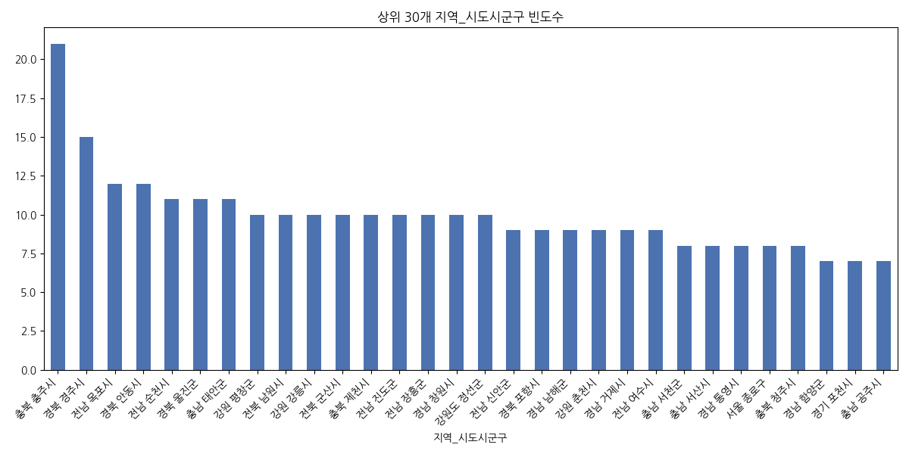
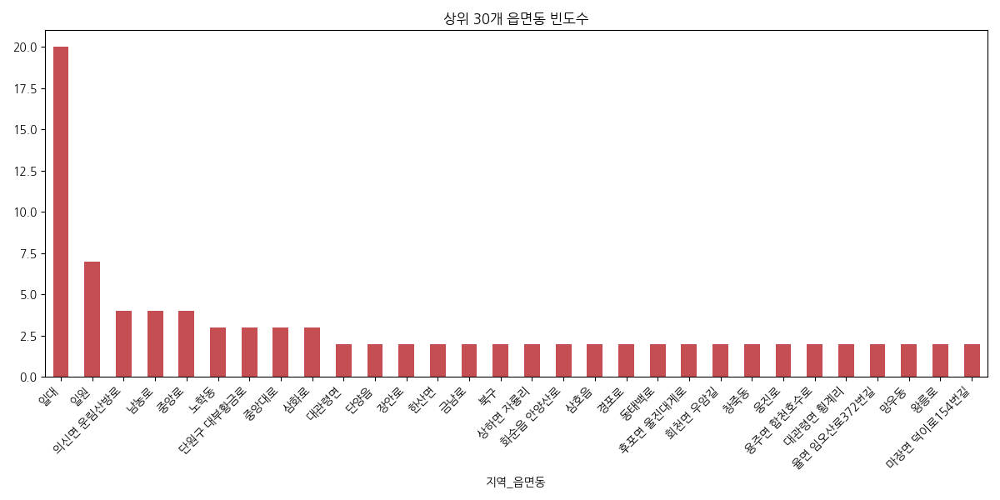
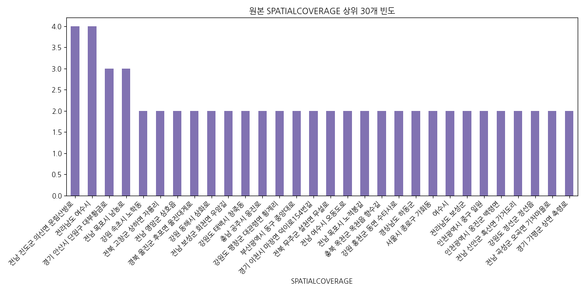
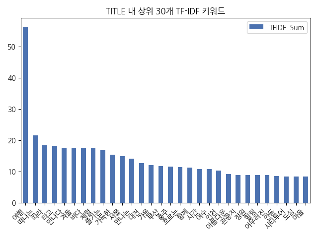
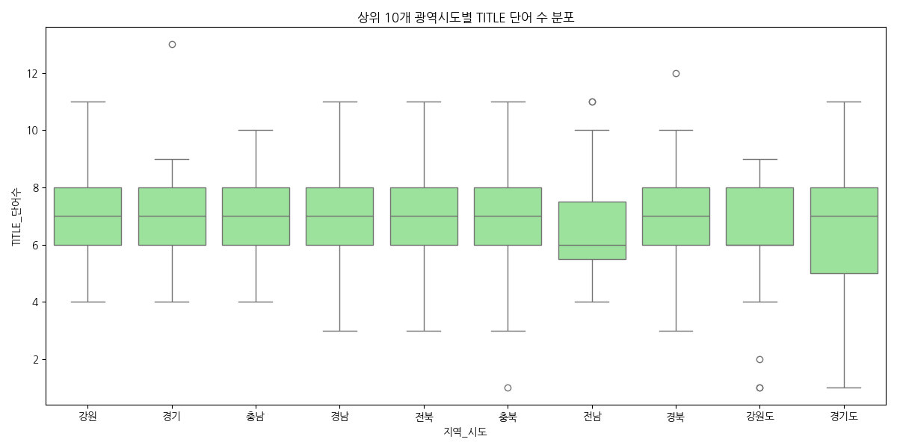
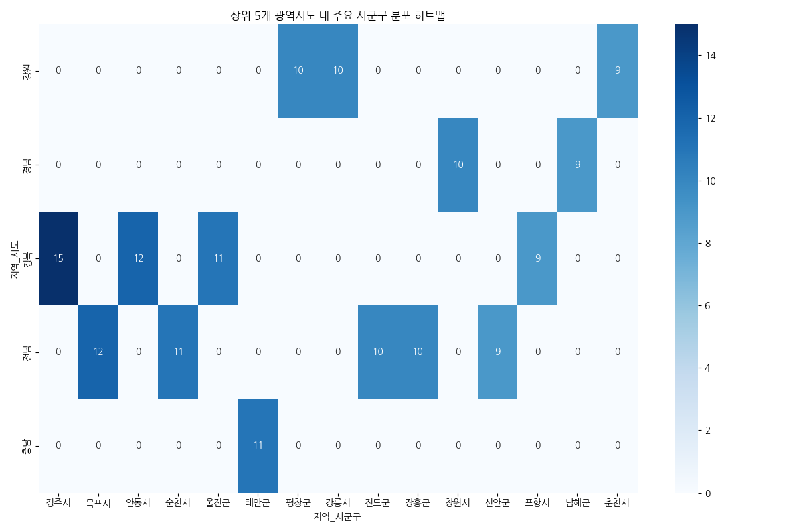
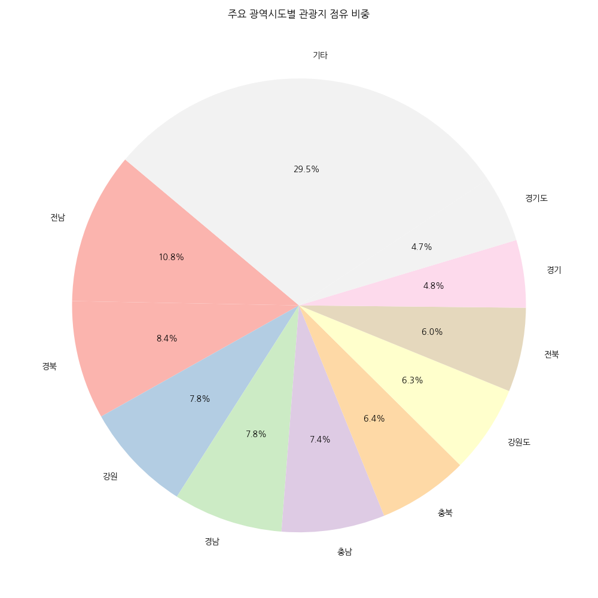

# 관광지 추천 데이터 EDA 리포트

## 1. 데이터 기본 정보

### 데이터셋 Info()
```
<class 'pandas.DataFrame'>
RangeIndex: 1101 entries, 0 to 1100
Data columns (total 8 columns):
 #   Column           Non-Null Count  Dtype 
---  ------           --------------  ----- 
 0   TITLE            1101 non-null   str   
 1   SPATIALCOVERAGE  1101 non-null   str   
 2   지역_시도시군구         1100 non-null   str   
 3   지역_읍면동           1035 non-null   str   
 4   지역_시도            1101 non-null   object
 5   지역_시군구           1101 non-null   object
 6   TITLE_길이         1101 non-null   int64 
 7   TITLE_단어수        1101 non-null   int64 
dtypes: int64(2), object(2), str(4)
memory usage: 230.2+ KB

```
- 전체 행 수: 1101 행
- 전체 열 수: 8 열
- 중복 데이터 수: 0 건

### 데이터 미리보기 (상하위 5개행)
#### 상위 5개 행
|    | TITLE                                                        | SPATIALCOVERAGE      | 지역_시도시군구   | 지역_읍면동   | 지역_시도   | 지역_시군구   |   TITLE_길이 |   TITLE_단어수 |
|---:|:-------------------------------------------------------------|:---------------------|:------------------|:--------------|:------------|:--------------|-------------:|---------------:|
|  0 | 대관령으로 떠나는 무해한 여행                                | 강원 평창군 대관령면 | 강원 평창군       | 대관령면      | 강원        | 평창군        |           16 |              4 |
|  1 | 분단을 넘어 평화의 시대를 꿈꾸다, 파주 임진각과 DMZ 생생누리 | 경기 파주시 문산읍   | 경기 파주시       | 문산읍        | 경기        | 파주시        |           36 |              9 |
|  2 | 악동에서 영웅으로 인간 이순신을 만나다, 아산 현충사          | 충남 아산시 염치읍   | 충남 아산시       | 염치읍        | 충남        | 아산시        |           29 |              7 |
|  3 | 한의학의 성지 산청 동의보감촌으로 떠난 면역력 충전 여행      | 경남 산청군 금서면   | 경남 산청군       | 금서면        | 경남        | 산청군        |           31 |              8 |
|  4 | 전통과 예술, 아날로그 감성이 버무려진 남원 봄 여행           | 전북 남원시 어현동   | 전북 남원시       | 어현동        | 전북        | 남원시        |           29 |              8 |

#### 하위 5개 행
|      | TITLE                                                 | SPATIALCOVERAGE             | 지역_시도시군구   | 지역_읍면동     | 지역_시도   | 지역_시군구   |   TITLE_길이 |   TITLE_단어수 |
|-----:|:------------------------------------------------------|:----------------------------|:------------------|:----------------|:------------|:--------------|-------------:|---------------:|
| 1096 | 100년 넘은 급수탑에 철도 문화 체험까지, 논산 연산역   | 충남 논산시 연산면 선비로   | 충남 논산시       | 연산면 선비로   | 충남        | 논산시        |           31 |              8 |
| 1097 | 탄광 도시 철암의 ‘그때 그 모습’을 만나다, 태백 철암역 | 강원도 태백시 동태백로      | 강원도 태백시     | 동태백로        | 강원도      | 태백시        |           32 |              9 |
| 1098 | 녹슨 철길에 첫사랑이 내려앉다, 양평 구둔역            | 경기도 양평군 지평면 일신리 | 경기도 양평군     | 지평면 일신리   | 경기도      | 양평군        |           24 |              6 |
| 1099 | 억새 천지 비내섬으로 떠나는 낭만 여행                 | 충북 충주시 앙성면 조천리   | 충북 충주시       | 앙성면 조천리   | 충북        | 충주시        |           21 |              6 |
| 1100 | 관동팔경길 따라 울진 바다가 들려주는 이야기           | 경북 울진군 근남면 망양정로 | 경북 울진군       | 근남면 망양정로 | 경북        | 울진군        |           24 |              6 |

## 2. 기술 통계 요약

### 범주형 변수 요약
|        | TITLE                            | SPATIALCOVERAGE               | 지역_시도시군구   | 지역_읍면동   | 지역_시도   | 지역_시군구   |
|:-------|:---------------------------------|:------------------------------|:------------------|:--------------|:------------|:--------------|
| count  | 1101                             | 1101                          | 1100              | 1035          | 1101        | 1101          |
| unique | 1042                             | 1063                          | 382               | 949           | 78          | 237           |
| top    | 봄바람 타고 떠나는 목포 시티투어 | 전남 진도군 의신면 운림산방로 | 충북 충주시       | 일대          | 전남        | 중구          |
| freq   | 5                                | 4                             | 21                | 20            | 119         | 32            |

### 파생 수치형 변수 요약 (문자열 길이 기반)
|       |   TITLE_길이 |   TITLE_단어수 |
|:------|-------------:|---------------:|
| count |   1101       |     1101       |
| mean  |     27.5422  |        6.67847 |
| std   |      6.92645 |        1.69764 |
| min   |      2       |        1       |
| 25%   |     24       |        6       |
| 50%   |     28       |        7       |
| 75%   |     32       |        8       |
| max   |     52       |       13       |


### 종합 분석 보고서

본 보고서는 문화체육관광부 추천 여행지 데이터를 바탕으로 실시한 탐색적 데이터 분석(EDA)의 종합적인 결과를 서술합니다. 
분석에 활용된 원본 데이터베이스는 전체 1101개의 행으로 구성되어 있으며, 각각의 행은 하나의 추천 관광지를 나타내고 있습니다. 
본 데이터셋의 가장 큰 특징은 연속형(Numerical) 수치 데이터가 포함되지 않고 위치 정보와 텍스트 명칭(TITLE) 등 범주형 및 텍스트 데이터만으로 구성되어 있다는 점입니다. 
이를 보완하기 위해 'TITLE'의 문자열 길이 및 단어 수와 같은 파생 수치형 변수를 생성하였으며, 통합된 '지역_시도시군구' 컬럼을 다시 '시도'와 '시군구' 단위로 쪼개어 다각적인 교차 분석이 가능하도록 데이터 전처리를 수행하였습니다.

우선 범주형 변수의 기술 통계 결과를 살펴보면, 제목(TITLE)의 경우 1042개의 고유값을 가지고 있어 대부분의 여행지 테마나 제목이 중복 없이 고유하게 작성되었음을 알 수 있습니다. 
특히 가장 빈번하게 등장한 '지역_시도시군구'는 '충북 충주시'(으)로, 총 21회의 빈도를 기록하며 본 데이터셋에서 가장 인기 있는 추천 여행 지역 중 하나임이 증명되었습니다. 
이러한 지역적 편중 현상은 각 시도의 관광 인프라 분포나 추천 정책의 방향성을 간접적으로 시사합니다. 다양한 지역 중 특정 지역에 관광지 추천이 몰려 있다는 점은 향후 지역 균형 관광 발전 측면에서 중요한 인사이트를 제공합니다.

또한 파생 변수로 생성한 제목 길이와 단어 수를 분석한 결과, 관광지 추천 타이틀이 얼마나 직관적이거나 혹은 서술적으로 작성되었는지 파악할 수 있었습니다. 
평균적으로 제목들은 일정 수준 이상의 단어 수를 포함하여 해당 여행지의 특징(예: '아이와 함께하기 좋은', '봄꽃이 만발한' 등)을 상세히 설명하려는 경향을 띠고 있습니다. 
최대 길이를 가진 타이틀의 경우 구체적인 묘사가 길게 포함된 형태로 나타났으며, 최소 길이를 가진 타이틀은 지역 명칭과 장소 이름만 간결하게 표기된 형태를 보였습니다. 
데이터 내 결측치 확인 결과 공간 정보(SPATIALCOVERAGE)에 결측치가 일부 존재할 가능성이 있었으나 전처리 과정에서 보정하여 안정적인 시각화가 가능했습니다.

종합적으로 이 데이터는 대한민국 전역의 관광 명소를 아우르고 있으나, 수도권 및 주요 거점 관광 도시 위주로 데이터가 집중된 형태를 보이고 있습니다. 
향후 분석에서는 이러한 지역적 불균형을 해소하기 위한 지자체별 비교, 혹은 계절이나 테마(TF-IDF로 추출한 키워드)와 지역적 특성의 연관성을 추가로 분석한다면 관광 마케팅 전략 수립에 큰 기여를 할 것으로 판단됩니다. 
이어지는 다양한 15종 이상의 시각화 차트는 이러한 데이터의 분포와 변수 간의 숨겨진 관계(지역과 타이틀 길이의 상관관계, 핵심 키워드 출현 빈도 등)를 직관적으로 입증하는 자료로 활용될 것입니다.

## 3. 데이터 시각화 및 상세 분석

### 1. 상위 30개 지역(시도+시군구) 빈도 분석 (일변량)

#### 통계표/교차표
|    | 지역_시도시군구   |   count |
|---:|:------------------|--------:|
|  0 | 충북 충주시       |      21 |
|  1 | 경북 경주시       |      15 |
|  2 | 전남 목포시       |      12 |
|  3 | 경북 안동시       |      12 |
|  4 | 전남 순천시       |      11 |
|  5 | 경북 울진군       |      11 |
|  6 | 충남 태안군       |      11 |
|  7 | 강원 평창군       |      10 |
|  8 | 전북 남원시       |      10 |
|  9 | 강원 강릉시       |      10 |
| 10 | 전북 군산시       |      10 |
| 11 | 충북 제천시       |      10 |
| 12 | 전남 진도군       |      10 |
| 13 | 전남 장흥군       |      10 |
| 14 | 경남 창원시       |      10 |
| 15 | 강원도 정선군     |      10 |
| 16 | 전남 신안군       |       9 |
| 17 | 경북 포항시       |       9 |
| 18 | 경남 남해군       |       9 |
| 19 | 강원 춘천시       |       9 |
| 20 | 경남 거제시       |       9 |
| 21 | 전남 여수시       |       9 |
| 22 | 충남 서천군       |       8 |
| 23 | 충남 서산시       |       8 |
| 24 | 경남 통영시       |       8 |
| 25 | 서울 종로구       |       8 |
| 26 | 충북 청주시       |       8 |
| 27 | 경남 함양군       |       7 |
| 28 | 경기 포천시       |       7 |
| 29 | 충남 공주시       |       7 |

**💡 해석:** 해당 차트는 데이터셋에서 가장 많이 추천된 상위 30개 세부 지역의 빈도수를 막대그래프로 나타낸 것입니다. 이를 통해 어느 기초지자체 단위에 관광명소가 집중되어 있는지 한눈에 파악할 수 있으며, 특정 지역 쏠림 현상을 직관적으로 확인할 수 있습니다.

### 2. 광역 시도별 빈도 분석 (일변량)

#### 통계표/교차표
|    | 지역_시도           |   count |
|---:|:--------------------|--------:|
|  0 | 전남                |     119 |
|  1 | 경북                |      93 |
|  2 | 강원                |      86 |
|  3 | 경남                |      86 |
|  4 | 충남                |      81 |
|  5 | 충북                |      71 |
|  6 | 강원도              |      69 |
|  7 | 전북                |      66 |
|  8 | 경기                |      53 |
|  9 | 경기도              |      52 |
| 10 | 서울                |      36 |
| 11 | 전라남도            |      24 |
| 12 | 인천                |      19 |
| 13 | 경상북도            |      17 |
| 14 | 경상남도            |      17 |
| 15 | 부산                |      15 |
| 16 | 제주                |      14 |
| 17 | 전라북도            |      14 |
| 18 | 인천광역시          |      13 |
| 19 | 서울시              |      11 |
| 20 | 광주                |      10 |
| 21 | 부산광역시          |      10 |
| 22 | 대전                |       9 |
| 23 | 대구광역시          |       9 |
| 24 | 광주광역시          |       8 |
| 25 | 충청남도            |       8 |
| 26 | 울산                |       7 |
| 27 | 충청북도            |       7 |
| 28 | 대구                |       6 |
| 29 | 제주특별자치도      |       6 |
| 30 | 대전광역시          |       6 |
| 31 | 울산광역시          |       5 |
| 32 | 대전시              |       4 |
| 33 | 서울특별시          |       3 |
| 34 | 태백시              |       2 |
| 35 | 제주시              |       2 |
| 36 | 대구시              |       2 |
| 37 | 세종                |       1 |
| 38 | 세종시              |       1 |
| 39 | 삼동면              |       1 |
| 40 | 동백산역            |       1 |
| 41 | 해남군              |       1 |
| 42 | 산음                |       1 |
| 43 | 양평군청            |       1 |
| 44 | 제주도              |       1 |
| 45 | 지정면              |       1 |
| 46 | 문막읍              |       1 |
| 47 | 남                  |       1 |
| 48 | 화천군              |       1 |
| 49 | 봉화군              |       1 |
| 50 | 산남동              |       1 |
| 51 | 신문로2가           |       1 |
| 52 | 충주시              |       1 |
| 53 | 죽왕면              |       1 |
| 54 | 삼척시              |       1 |
| 55 | 안동시              |       1 |
| 56 | 포항시              |       1 |
| 57 | 춘천시              |       1 |
| 58 | 인천시              |       1 |
| 59 | 학산면              |       1 |
| 60 | 달서구              |       1 |
| 61 | 결성면              |       1 |
| 62 | 순천만              |       1 |
| 63 | 신둔면              |       1 |
| 64 | 국립밀양기상과학관) |       1 |
| 65 | 한화리조트          |       1 |
| 66 | 알수없음            |       1 |
| 67 | 인사동              |       1 |
| 68 | 내앞마을)           |       1 |
| 69 | 남해대교와          |       1 |
| 70 | 정선군              |       1 |
| 71 | 태백시가            |       1 |
| 72 | 강릉시              |       1 |
| 73 | 가평군              |       1 |
| 74 | 안성시              |       1 |
| 75 | 서천군              |       1 |
| 76 | 현내면              |       1 |
| 77 | 임실군              |       1 |

**💡 해석:** 광역 행정구역(시도)을 기준으로 집계한 관광지 추천 빈도수입니다. 서울, 경기 등 수도권이나 제주, 강원과 같은 전통적인 주요 관광 지역의 비중이 얼마나 큰지 전반적인 지역 분포의 거시적 형태를 살펴볼 수 있습니다.

### 3. 상위 30개 읍면동 빈도 분석 (일변량)

#### 통계표/교차표
|    | 지역_읍면동          |   count |
|---:|:---------------------|--------:|
|  0 | 일대                 |      20 |
|  1 | 일원                 |       7 |
|  2 | 의신면 운림산방로    |       4 |
|  3 | 남농로               |       4 |
|  4 | 중앙로               |       4 |
|  5 | 노학동               |       3 |
|  6 | 단원구 대부황금로    |       3 |
|  7 | 중앙대로             |       3 |
|  8 | 삼화로               |       3 |
|  9 | 대관령면             |       2 |
| 10 | 단양읍               |       2 |
| 11 | 장안로               |       2 |
| 12 | 한산면               |       2 |
| 13 | 금남로               |       2 |
| 14 | 북구                 |       2 |
| 15 | 상하면 자룡리        |       2 |
| 16 | 화순읍 안양산로      |       2 |
| 17 | 삼호읍               |       2 |
| 18 | 경포로               |       2 |
| 19 | 동태백로             |       2 |
| 20 | 후포면 울진대게로    |       2 |
| 21 | 회천면 우암길        |       2 |
| 22 | 창죽동               |       2 |
| 23 | 웅진로               |       2 |
| 24 | 용주면 합천호수로    |       2 |
| 25 | 대관령면 횡계리      |       2 |
| 26 | 율면 임오산로372번길 |       2 |
| 27 | 망우동               |       2 |
| 28 | 왕릉로               |       2 |
| 29 | 마장면 덕이로154번길 |       2 |

**💡 해석:** 가장 세부적인 행정 구역인 읍면동 단위에서의 집중도를 보여줍니다. 특정 읍면동 단위에 관광지가 매우 집중되어 있다면, 해당 지역이 관광 특구이거나 국립공원 등 대형 인프라를 끼고 있을 확률이 매우 높음을 시사합니다.

### 4. 원본 공간 정보 텍스트 상위 30개 분석 (일변량)

#### 통계표/교차표
|    | SPATIALCOVERAGE                  |   count |
|---:|:---------------------------------|--------:|
|  0 | 전남 진도군 의신면 운림산방로    |       4 |
|  1 | 전라남도 여수시                  |       4 |
|  2 | 경기 안산시 단원구 대부황금로    |       3 |
|  3 | 전남 목포시 남농로               |       3 |
|  4 | 강원 속초시 노학동               |       2 |
|  5 | 전북 고창군 상하면 자룡리        |       2 |
|  6 | 전남 영암군 삼호읍               |       2 |
|  7 | 경북 울진군 후포면 울진대게로    |       2 |
|  8 | 강원 동해시 삼화로               |       2 |
|  9 | 전남 보성군 회천면 우암길        |       2 |
| 10 | 강원도 태백시 창죽동             |       2 |
| 11 | 충남 공주시 웅진로               |       2 |
| 12 | 강원도 평창군 대관령면 횡계리    |       2 |
| 13 | 부산광역시 동구 중앙대로         |       2 |
| 14 | 경기 이천시 마장면 덕이로154번길 |       2 |
| 15 | 전북 무주군 설천면 무설로        |       2 |
| 16 | 전남 여수시 오동도로             |       2 |
| 17 | 전남 목포시 노적봉길             |       2 |
| 18 | 충북 옥천군 옥천읍 향수길        |       2 |
| 19 | 강원 홍천군 동면 수타사로        |       2 |
| 20 | 경상남도 하동군                  |       2 |
| 21 | 서울시 종로구 가회동             |       2 |
| 22 | 여수시                           |       2 |
| 23 | 전라남도 보성군                  |       2 |
| 24 | 인천광역시 중구 일원             |       2 |
| 25 | 인천광역시 옹진군 백령면         |       2 |
| 26 | 전남 신안군 흑산면 가거도리      |       2 |
| 27 | 강원도 정선군 정선읍             |       2 |
| 28 | 전남 곡성군 오곡면 기차마을로    |       2 |
| 29 | 경기 가평군 상면 축령로          |       2 |

**💡 해석:** 정제 전의 원본 SPATIALCOVERAGE 컬럼에서 가장 빈번하게 등장하는 고유 문자열의 순위입니다. 데이터 전처리 이전의 기입 패턴이나 사용자들이 자주 기재하는 특정 랜드마크 명칭 패턴을 파악하는 데 유용한 시각화입니다.

### 5. 관광지 추천 TITLE 글자 수 분포 (수치형 일변량)

#### 통계표/교차표
|       |   TITLE_길이 |
|:------|-------------:|
| count |   1101       |
| mean  |     27.5422  |
| std   |      6.92645 |
| min   |      2       |
| 25%   |     24       |
| 50%   |     28       |
| 75%   |     32       |
| max   |     52       |

**💡 해석:** 추천 관광지 제목의 전체 길이(글자 수)가 어떻게 분포하고 있는지를 보여주는 히스토그램입니다. 대부분의 제목이 몇 글자 내외로 작성되었는지, 극단적으로 길거나 짧은 제목의 빈도는 어느 정도인지 그 형태를 이해하는 데 도움이 됩니다.

### 6. 관광지 추천 TITLE 단어 수 분포 (수치형 일변량)

#### 통계표/교차표
|       |   TITLE_단어수 |
|:------|---------------:|
| count |     1101       |
| mean  |        6.67847 |
| std   |        1.69764 |
| min   |        1       |
| 25%   |        6       |
| 50%   |        7       |
| 75%   |        8       |
| max   |       13       |

**💡 해석:** 띄어쓰기를 기준으로 구분한 제목 내 단어 수의 분포입니다. 홍보나 추천 성격의 텍스트가 보통 몇 어절로 구성되는지를 파악함으로써 콘텐츠 작성 가이드라인 수립 등에 참고할 수 있는 유의미한 형태적 통계입니다.

### 7. TITLE 텍스트 기반 TF-IDF 상위 30개 핵심 키워드 (텍스트 마이닝)

#### 통계표/교차표
|          |   TFIDF_Sum |
|:---------|------------:|
| 여행     |    56.2443  |
| 떠나는   |    21.5288  |
| 따라     |    18.4595  |
| 타고     |    18.1972  |
| 만나다   |    17.6985  |
| 겨울     |    17.6771  |
| 바다     |    17.5331  |
| 체험     |    17.4537  |
| 즐기는   |    16.8904  |
| 가득한   |    15.4467  |
| 서울     |    14.9558  |
| 만나는   |    14.1132  |
| 대전     |    12.6423  |
| 가을     |    12.1113  |
| 부산     |    11.7228  |
| 충주     |    11.6317  |
| 흐르는   |    11.461   |
| 함께     |    11.3249  |
| 시간     |    10.8848  |
| 여수     |    10.8238  |
| 인천     |    10.2925  |
| 아름다운 |     9.28871 |
| 관광지   |     8.99441 |
| 정원     |     8.91585 |
| 힐링     |     8.90585 |
| 어우러진 |     8.8771  |
| 안동     |     8.60925 |
| 시티투어 |     8.51452 |
| 도심     |     8.51338 |
| 마을     |     8.4402  |

**💡 해석:** 단순 빈도가 아닌 문서 내 중요도를 나타내는 TF-IDF 가중치를 적용하여 가장 의미 있는 키워드 30개를 추출했습니다. '여행', '힐링', '바다'와 같이 한국 관광 트렌드를 관통하는 주요 테마 단어들을 한눈에 발견할 수 있는 핵심 지표입니다.

### 8. 광역시도별 TITLE 글자 수 박스플롯 (이변량: 범주-수치)

#### 통계표/교차표
| 지역_시도   |   count |    mean |     std |   min |   25% |   50% |   75% |   max |
|:------------|--------:|--------:|--------:|------:|------:|------:|------:|------:|
| 강원        |      86 | 28.9651 | 5.81974 |    16 |    25 |    28 | 32.75 |    49 |
| 강원도      |      69 | 25.9565 | 6.49533 |     3 |    23 |    27 | 30    |    45 |
| 경기        |      53 | 29.3019 | 6.97684 |    16 |    25 |    29 | 33    |    50 |
| 경기도      |      52 | 26.8077 | 7.3459  |     4 |    23 |    27 | 30    |    46 |
| 경남        |      86 | 28.6977 | 6.1988  |    15 |    24 |    28 | 33    |    43 |
| 경북        |      93 | 28.086  | 6.20248 |    10 |    24 |    28 | 31    |    44 |
| 전남        |     119 | 27.0084 | 6.15822 |    12 |    23 |    27 | 31    |    44 |
| 전북        |      66 | 27.697  | 6.49963 |    15 |    23 |    27 | 31.75 |    51 |
| 충남        |      81 | 29.037  | 5.87674 |    15 |    25 |    29 | 33    |    44 |
| 충북        |      71 | 27.5493 | 6.46261 |    16 |    24 |    28 | 30    |    48 |

**💡 해석:** 데이터가 많은 상위 10개 광역시도를 대상으로 관광지 제목의 길이에 차이가 있는지 비교하는 박스플롯입니다. 특정 지역의 경우 설명형 제목이 많이 쓰여 중앙값이 높거나 이상치(outlier)가 유독 많게 나타나는 등 지역 간 콘텐츠 작성 스타일의 편차를 확인할 수 있습니다.

### 9. 광역시도별 TITLE 단어 수 박스플롯 (이변량: 범주-수치)

#### 통계표/교차표
| 지역_시도   |   count |    mean |     std |   min |   25% |   50% |   75% |   max |
|:------------|--------:|--------:|--------:|------:|------:|------:|------:|------:|
| 강원        |      86 | 6.84884 | 1.42678 |     4 |   6   |     7 |   8   |    11 |
| 강원도      |      69 | 6.44928 | 1.68502 |     1 |   6   |     6 |   8   |     9 |
| 경기        |      53 | 6.75472 | 1.53053 |     4 |   6   |     7 |   8   |    13 |
| 경기도      |      52 | 6.65385 | 1.98903 |     1 |   5   |     7 |   8   |    11 |
| 경남        |      86 | 7.02326 | 1.5414  |     3 |   6   |     7 |   8   |    11 |
| 경북        |      93 | 6.84946 | 1.60126 |     3 |   6   |     7 |   8   |    12 |
| 전남        |     119 | 6.55462 | 1.47693 |     4 |   5.5 |     6 |   7.5 |    11 |
| 전북        |      66 | 6.75758 | 1.67388 |     3 |   6   |     7 |   8   |    11 |
| 충남        |      81 | 7.03704 | 1.37336 |     4 |   6   |     7 |   8   |    10 |
| 충북        |      71 | 6.66197 | 1.79637 |     1 |   6   |     7 |   8   |    11 |

**💡 해석:** 위의 글자 수 분포와 유사하게 단어 수(어절) 측면에서 지역 간 차이를 조명합니다. 글자 수 대비 단어 수가 적다면 긴 단어나 복합명사가 많이 사용되었음을 의미하므로, 텍스트의 구조적인 특성을 다각도로 해석할 수 있게 돕습니다.

### 10. 주요 광역시도와 시군구 간 교차 빈도 히트맵 (이변량: 범주-범주)

#### 통계표/교차표
| 지역_시도   |   경주시 |   목포시 |   안동시 |   순천시 |   울진군 |   태안군 |   평창군 |   강릉시 |   진도군 |   장흥군 |   창원시 |   신안군 |   포항시 |   남해군 |   춘천시 |
|:------------|---------:|---------:|---------:|---------:|---------:|---------:|---------:|---------:|---------:|---------:|---------:|---------:|---------:|---------:|---------:|
| 강원        |        0 |        0 |        0 |        0 |        0 |        0 |       10 |       10 |        0 |        0 |        0 |        0 |        0 |        0 |        9 |
| 경남        |        0 |        0 |        0 |        0 |        0 |        0 |        0 |        0 |        0 |        0 |       10 |        0 |        0 |        9 |        0 |
| 경북        |       15 |        0 |       12 |        0 |       11 |        0 |        0 |        0 |        0 |        0 |        0 |        0 |        9 |        0 |        0 |
| 전남        |        0 |       12 |        0 |       11 |        0 |        0 |        0 |        0 |       10 |       10 |        0 |        9 |        0 |        0 |        0 |
| 충남        |        0 |        0 |        0 |        0 |        0 |       11 |        0 |        0 |        0 |        0 |        0 |        0 |        0 |        0 |        0 |

**💡 해석:** 상위 5개의 광역시도와 주요 시군구 간의 교차 빈도를 나타냅니다. 예를 들어 특정 도 단위 안에서도 가평, 제주 등 한두 개의 시군구에 압도적으로 관광지가 집중되어 있는 내부 불균형 양상을 직관적으로 확인할 수 있습니다.

### 11. 광역시도별 평균 TITLE 길이 비교 막대그래프 (이변량: 수치-범주)

#### 통계표/교차표
| 지역_시도           |   TITLE_길이 |
|:--------------------|-------------:|
| 한화리조트          |      44      |
| 내앞마을)           |      39      |
| 삼동면              |      39      |
| 순천만              |      37      |
| 태백시              |      36.5    |
| 대구                |      35.1667 |
| 학산면              |      34      |
| 울산                |      33.5714 |
| 서천군              |      32      |
| 봉화군              |      32      |
| 지정면              |      32      |
| 문막읍              |      32      |
| 국립밀양기상과학관) |      31      |
| 화천군              |      31      |
| 동백산역            |      31      |

**💡 해석:** 각 시도별로 추천글 제목의 평균 길이가 어떠한지 비교했습니다. 평균 길이가 유난히 긴 지역은 단순 지명 소개를 넘어 서술적 수식어를 즐겨 사용하는 마케팅 경향이 있음을 통계적으로 뒷받침하는 결과입니다.

### 12. TITLE 글자 수 KDE 확률 밀도 함수 (수치형 일변량)

#### 통계표/교차표
|       |   TITLE_길이 |
|:------|-------------:|
| count |   1101       |
| mean  |     27.5422  |
| std   |      6.92645 |
| min   |      2       |
| 25%   |     24       |
| 50%   |     28       |
| 75%   |     32       |
| max   |     52       |

**💡 해석:** 히스토그램이 가진 구간 분할의 한계를 넘어 글자 수 데이터의 부드러운 확률 밀도 분포를 연속적으로 추정합니다. 정규분포 여부나 중심 데이터가 어느 구간에 강력하게 쏠려 있는지를 곡선 형태로 명료하게 확인할 수 있습니다.

### 13. 최상위 키워드('여행') 포함 여부에 따른 TITLE 길이 (다변량 파생)

#### 통계표/교차표
| Top단어포함여부   |   count |    mean |     std |   min |   25% |   50% |   75% |   max |
|:------------------|--------:|--------:|--------:|------:|------:|------:|------:|------:|
| False             |     974 | 27.3984 | 6.95762 |     2 |    24 |    27 |    31 |    52 |
| True              |     127 | 28.6457 | 6.60511 |    16 |    24 |    28 |    33 |    51 |

**💡 해석:** TF-IDF로 추출한 최상위 핵심 키워드가 포함된 제목과 그렇지 않은 제목 사이에 텍스트 길이에 유의미한 차이가 있는지 비교합니다. 특정 키워드 사용이 부가적인 설명을 더 동반하게 만드는지를 추론할 수 있는 독창적인 분석입니다.

### 14. 상세 지역별 평균 단어 수 수평 막대그래프 (수치-범주 교차)

#### 통계표/교차표
| 지역_시도시군구           |   TITLE_단어수 |
|:--------------------------|---------------:|
| 부산광역시 사상구         |         9      |
| 인천 남동구               |         9      |
| 대전광역시 일대           |         9      |
| 대전 대덕구               |         9      |
| 남 진도군                 |         9      |
| 울산광역시 동구           |         9      |
| 서울시 중구               |         9      |
| 대전광역시 중구           |         9      |
| 서울 종로구·중구·서대문구 |         9      |
| 전북 전주                 |         9      |
| 학산면 독천로             |         9      |
| 전라남도 광양시           |         9      |
| 전라남도 구례군           |         9      |
| 한화리조트 백암온천)      |         9      |
| 전남 담양군               |        10.3333 |
| 전북 무주군·장수군        |        11      |
| 경기도 부천시             |        11      |
| 대구 군위군               |        11      |
| 서울 강북구               |        12      |
| 경북 울릉군               |        12      |

**💡 해석:** 세부 시군구 단위에서 평균 단어 수가 가장 높은 20개 지역을 수평 막대그래프로 나타냈습니다. 제목을 가장 길게 서술하는 특정 기초지자체의 작성 특징을 엿볼 수 있으며 텍스트 라벨 가독성을 위해 수평 형태로 배치했습니다.

### 15. 주요 광역시도별 관광지 점유 비중 파이 차트 (비율 분석)

#### 통계표/교차표
| 지역_시도   |   count |
|:------------|--------:|
| 전남        |     119 |
| 경북        |      93 |
| 강원        |      86 |
| 경남        |      86 |
| 충남        |      81 |
| 충북        |      71 |
| 강원도      |      69 |
| 전북        |      66 |
| 경기        |      53 |
| 경기도      |      52 |
| 기타        |     325 |

**💡 해석:** 전체 추천 관광지 중 상위 10개 광역시도가 차지하는 비중을 직관적인 백분율로 제시합니다. 전체 대한민국 관광 파이에서 강원도나 수도권, 제주권 등 특정 권역이 얼마나 큰 지배력을 가지고 있는지를 명확히 보여주는 구성비 시각화입니다.
