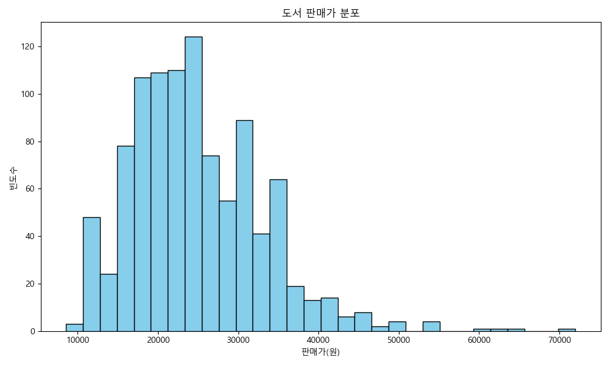
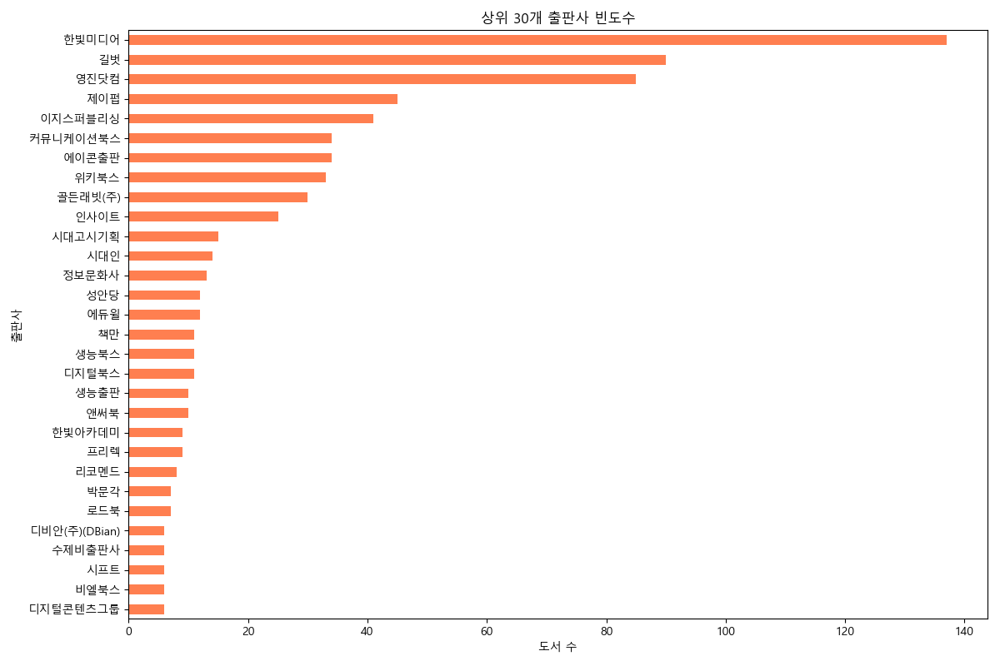
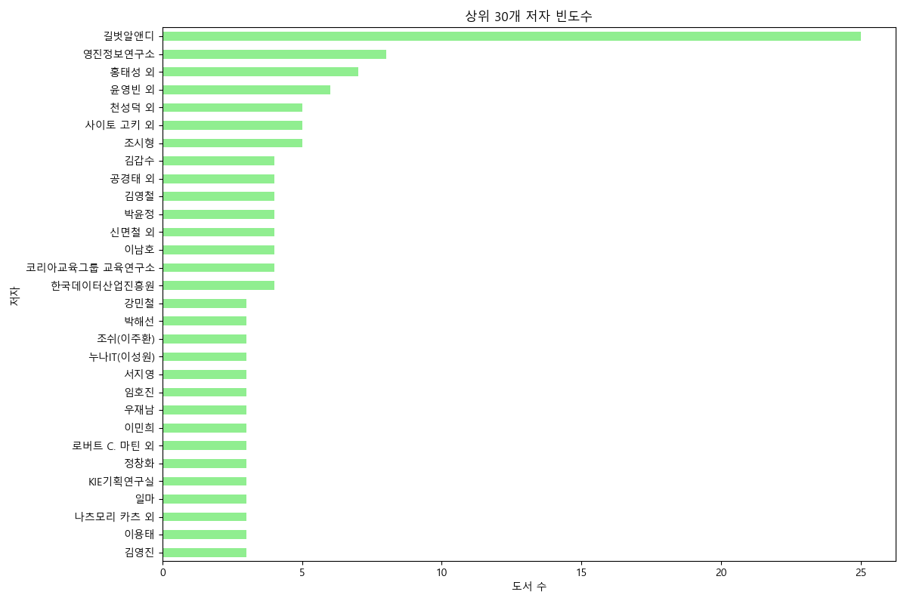
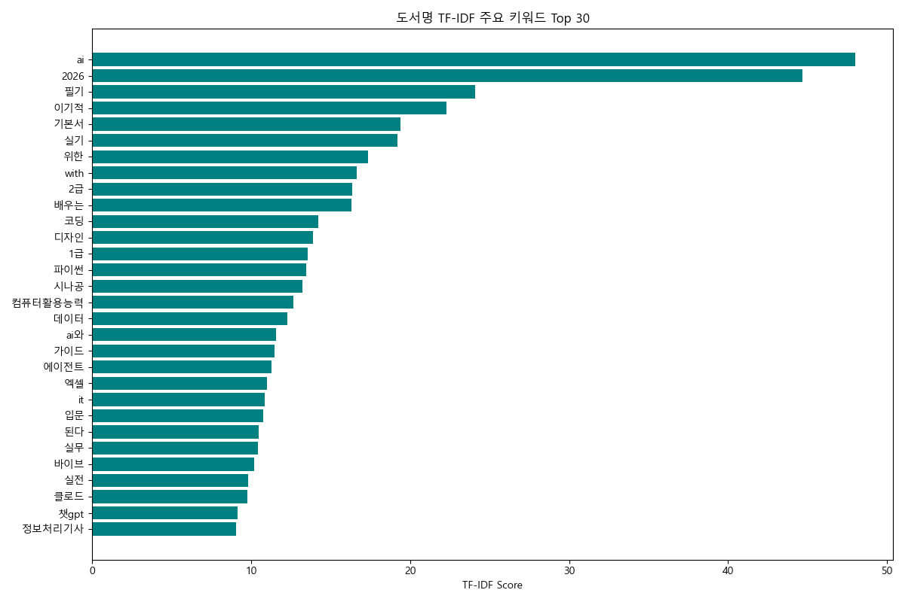
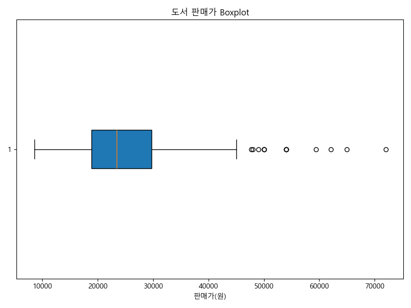
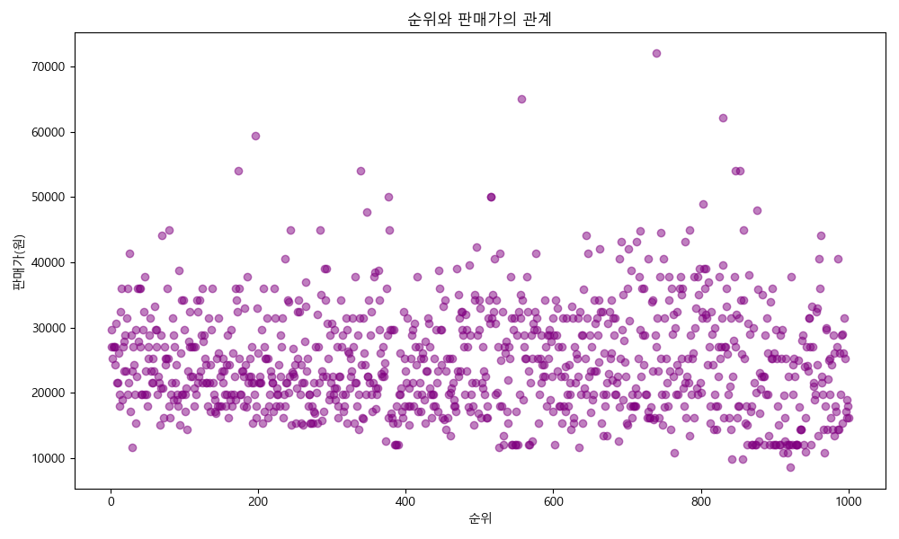
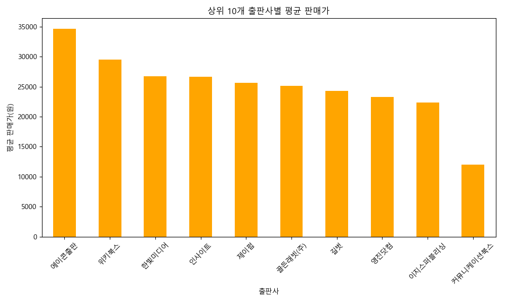
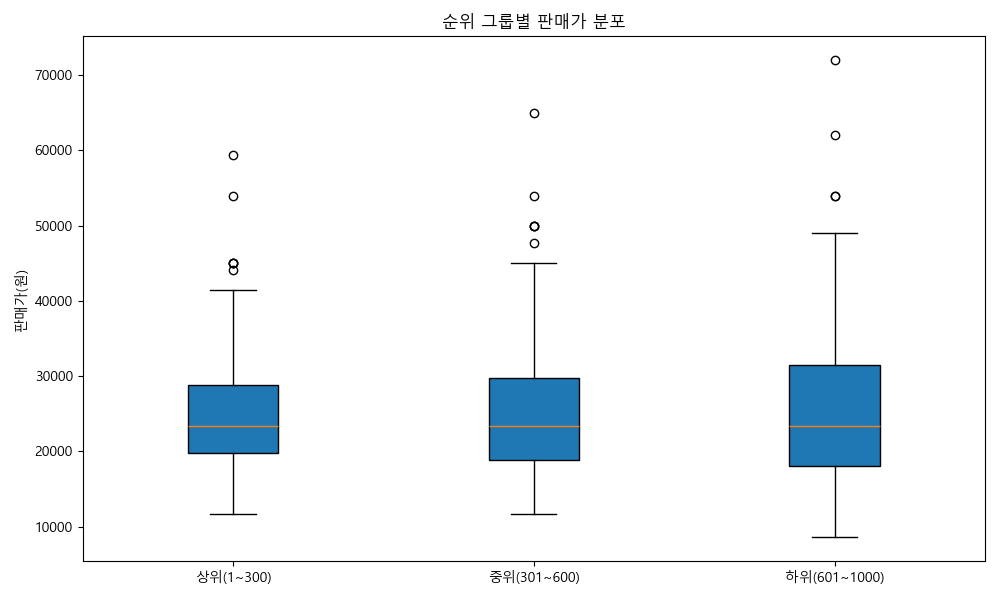
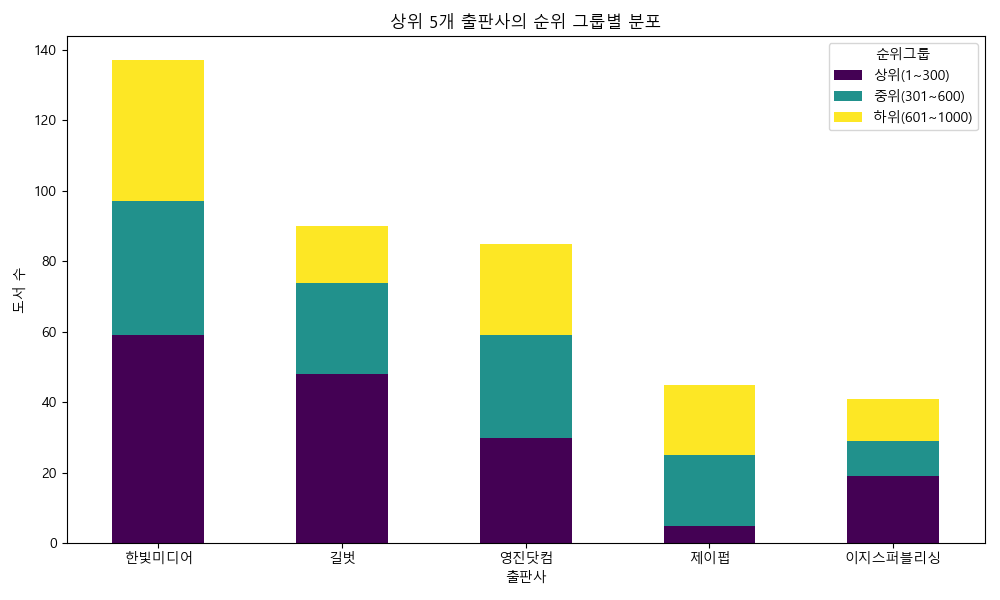
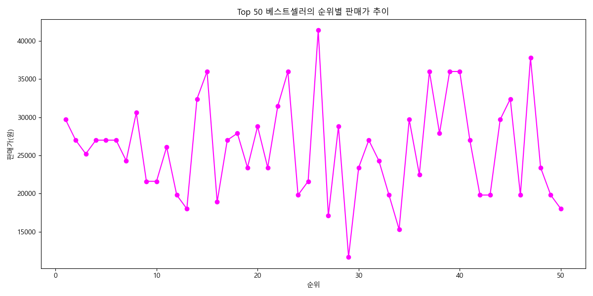

# 교보문고 컴퓨터/IT 베스트셀러 데이터 분석 및 비즈니스 리포트

## 1. 데이터 기본 정보 및 기술 통계 분석 보고서

본 보고서는 교보문고 온라인 베스트셀러(컴퓨터/IT 카테고리) 상위 1,000건의 데이터를 기반으로 작성되었습니다. 총 7개의 속성(순위, 도서명, 저자, 출판사, 출간일, ISBN, 판매가)을 포함하며, 결측치나 중복 데이터 없이 온전한 1,000건의 고유 데이터를 확보했습니다.

### 기술통계 분석 상세 리포트
수치형 데이터와 범주형 데이터를 분석한 결과, 컴퓨터/IT 도서 시장의 주요 트렌드와 특징을 다음과 같이 도출할 수 있었습니다.
첫째, **판매가 분포의 특성**입니다. 분석 대상 1,000권의 평균 판매가는 약 24,778원으로 나타났으며, 중앙값은 23,400원입니다. 전체 도서의 50%가 18,900원에서 29,700원 사이의 가격대를 형성하고 있습니다. 최소값은 8,550원이고 최대값은 72,000원으로, 이는 가벼운 입문서나 수험서부터 깊이 있는 전문 개발서 및 전공 서적까지 매우 다양한 깊이의 콘텐츠가 혼재되어 있음을 의미합니다. 표준편차가 약 8,251원 수준이므로 일반 단행본 대비 IT 서적의 가격 변동 폭이 크며, 이는 책의 분량이나 다루는 기술의 전문성에 따라 가격 책정이 세분화되어 있음을 방증합니다.
둘째, **출판사 생태계 및 점유율**입니다. 총 181개의 고유 출판사가 등장하지만, 시장은 소수의 대형 출판사에 의해 크게 주도되고 있습니다. '한빛미디어'가 1,000위 안에 무려 137종의 도서를 올려 압도적인 1위를 차지했으며, 이어서 '길벗'(90종), '영진닷컴'(85종), '제이펍'(45종), '이지스퍼블리싱'(41종)이 상위권을 지키고 있습니다. 이들 상위 5개 출판사가 전체 베스트셀러의 약 40% 가까이를 점유하고 있으며, 이는 IT 도서 독자들이 신뢰할 수 있는 특정 브랜드를 선호하는 경향이 매우 강함을 보여줍니다. 
셋째, **저자(집필진)의 특성**입니다. 총 808명의 고유 저자가 식별되었으나, 가장 높은 빈도를 보인 것은 개인 저자가 아닌 '길벗알앤디'(25회), '영진정보연구소'(8회), '한국데이터산업진흥원'(4회) 등 기업형 혹은 연구소 집필진입니다. 이는 자격증(컴퓨터활용능력, 정보처리기사, ADsP 등) 수험서와 단기 완성형 교재가 베스트셀러의 상당 부분을 차지하고 있음을 시사합니다.
넷째, **주요 키워드 트렌드**입니다. 도서명에서 추출된 TF-IDF 핵심 키워드를 보면 'AI', '2026', '필기', '실기', '파이썬', '데이터', '챗gpt' 등이 두드러집니다. AI와 ChatGPT 등 인공지능 관련 최신 기술 서적에 대한 수요가 폭발적이며, 동시에 매년 갱신되는 '2026' 수험서(필기/실기) 라인업이 IT 도서 매출의 안정적인 캐시카우 역할을 하고 있음을 알 수 있습니다.

---

## 2. TF-IDF 키워드 추출 및 범주형 데이터 표

### 2.1 도서명 TF-IDF 주요 키워드 상위 30
| 순위 | 키워드 | TF-IDF Score | 순위 | 키워드 | TF-IDF Score |
|---|---|---|---|---|---|
| 1 | ai | 47.97 | 16 | 컴퓨터활용능력 | 12.67 |
| 2 | 2026 | 44.67 | 17 | 데이터 | 12.28 |
| 3 | 필기 | 24.09 | 18 | ai와 | 11.56 |
| 4 | 이기적 | 22.28 | 19 | 가이드 | 11.50 |
| 5 | 기본서 | 19.38 | 20 | 에이전트 | 11.28 |
| 6 | 실기 | 19.23 | 21 | 엑셀 | 11.00 |
| 7 | 위한 | 17.37 | 22 | it | 10.87 |
| 8 | with | 16.63 | 23 | 입문 | 10.75 |
| 9 | 2급 | 16.34 | 24 | 된다 | 10.50 |
| 10 | 배우는 | 16.33 | 25 | 실무 | 10.44 |
| 11 | 코딩 | 14.25 | 26 | 바이브 | 10.19 |
| 12 | 디자인 | 13.88 | 27 | 실전 | 9.81 |
| 13 | 1급 | 13.57 | 28 | 클로드 | 9.77 |
| 14 | 파이썬 | 13.49 | 29 | 챗gpt | 9.18 |
| 15 | 시나공 | 13.23 | 30 | 정보처리기사 | 9.05 |

### 2.2 상위 10개 출판사 및 저자 빈도수
- **출판사**: 한빛미디어(137), 길벗(90), 영진닷컴(85), 제이펍(45), 이지스퍼블리싱(41), 에이콘출판(34), 커뮤니케이션북스(34), 위키북스(33), 골든래빗(30), 인사이트(25)
- **저자**: 길벗알앤디(25), 영진정보연구소(8), 홍태성 외(7), 윤영빈 외(6), 사이토 고키 외(5), 조시형(5)

---

## 3. 데이터 시각화 및 해석

### [일변량 분석 1] 도서 판매가 분포

- **해석**: 판매가는 2만 원대 초중반에 가장 많이 밀집되어 있으며, 오른쪽으로 긴 꼬리를 가지는 우측 비대칭 분포를 띱니다. 이는 4만 원 이상의 고가 전문 서적이 소수지만 뚜렷하게 존재함을 의미하며, 대중적인 서적은 2만 원 내외로 가격이 형성되어 있음을 확실하게 보여줍니다.

### [일변량 분석 2] 상위 30개 출판사 빈도수

- **해석**: 한빛미디어가 압도적으로 많은 책을 베스트셀러에 등재시키며 IT 시장의 지배자임을 시각적으로 증명합니다. 최상위 3~4개 출판사가 시장 파이의 상당량을 점유하는 '파레토 법칙'과 유사한 현상이 나타나는 구조적 한계를 보여줍니다.

### [일변량 분석 3] 상위 30개 저자 빈도수

- **해석**: 기획/연구소 기반의 단체 저자(길벗알앤디, 영진정보연구소 등)가 상위권을 휩쓸고 있습니다. 이는 IT 도서 시장에서 개인 저자의 역량도 중요하지만, 수험서나 매뉴얼 중심의 조직적 집필 시스템이 꾸준한 성과를 내고 있다는 명확한 증거입니다.

### [일변량 분석 4] 도서명 TF-IDF 주요 키워드

- **해석**: AI, 2026(수험서 연도), 필기/실기 등이 최상단에 위치합니다. 이는 현재 독자들이 인공지능 트렌드를 가장 궁금해하며, 실질적인 취업/자격 취득을 목적으로 한 목적성 도서 구매가 동시에 활발하다는 점을 명확히 보여줍니다.

### [일변량 분석 5] 도서 판매가 Boxplot

- **해석**: 중앙값이 23,400원 근처에 있으며, 45,000원을 초과하는 다수의 이상치(Outlier)들이 존재합니다. 이 이상치들은 주로 대학교재나 하드코어 개발자들을 위한 레퍼런스 도서들로, 높은 가격에도 불구하고 꾸준한 수요가 있는 롱테일 시장임을 파악할 수 있습니다.

### [이변량 분석 1] 순위와 판매가의 관계

- **해석**: 순위가 높다고 해서 반드시 가격이 저렴한 것은 아니며, 전 구간에 걸쳐 다양한 가격대가 퍼져 있습니다. 다만 4만 원 이상의 초고가 서적들은 1~100위 권의 최상위보다는 중위권 이후에 고르게 분포하는 경향이 있어, 베스트셀러 최상위는 진입 장벽(가격)이 상대적으로 낮은 책이 유리함을 알 수 있습니다.

### [이변량 분석 2] 상위 10개 출판사별 평균 판매가

- **해석**: 에이콘출판, 커뮤니케이션북스 등의 평균 가격이 상대적으로 매우 높게 형성된 반면, 수험서 위주의 영진닷컴이나 에듀윌 등은 상대적으로 평균가가 낮습니다. 이는 출판사별로 명확한 타겟 고객층과 전문성 지향점(번역/전문서 vs 대중서/수험서)이 다름을 시각적으로 확인시켜 줍니다.

### [다변량/교차 분석 1] 순위 그룹별 판매가 분포 (Boxplot)

**순위 그룹별 판매가 통계 (평균/표준편차)**
- 상위(1~300위): 24,767원 / std 6,966
- 중위(301~600위): 24,842원 / std 8,092
- 하위(601~1000위): 24,738원 / std 9,221
- **해석**: 그룹 간 평균 판매가 차이는 거의 없으나, 하위 그룹으로 갈수록 표준편차가 커집니다. 최상위권은 대중성이 보장된 2만원대 초중반 서적이 안전하게 자리잡고, 하위권에서는 아주 저렴한 책과 매우 비싼 전문서가 혼재하여 분산이 커지는 현상이 나타납니다.

### [다변량/교차 분석 2] 상위 5개 출판사의 순위 그룹별 분포

**출판사/순위그룹 교차표 요약**
| 출판사 | 상위(1~300) | 중위(301~600) | 하위(601~1000) |
|---|---|---|---|
| 길벗 | 48 | 26 | 16 |
| 영진닷컴 | 30 | 29 | 26 |
| 이지스퍼블리싱| 19 | 10 | 12 |
| 제이펍 | 5 | 20 | 20 |
| 한빛미디어 | 59 | 38 | 40 |
- **해석**: 한빛미디어와 길벗은 최상위(1~300위)에 가장 많은 도서를 랭크시키며 압도적인 퍼포먼스를 내고 있습니다. 반면 제이펍의 경우 상위보다는 중-하위 그룹에 고르게 두터운 팬층을 형성하며 니치 마켓을 공략하는 전략적 차이를 보여줍니다.

### [이변량 분석 3] Top 50 베스트셀러의 순위별 판매가 추이

- **해석**: 1위부터 50위까지의 세부 판매가를 연결한 결과, 10~30위 사이에서 가격의 급등락이 발견됩니다. 1~10위 극상위권은 비교적 안정된 2만 원대 밴드를 형성하는 반면, 그 직후부터는 단가가 높은 트렌드 서적이나 세트 상품 등이 일시적으로 치고 올라오는 패턴을 보입니다.

---

## 4. 비즈니스 액션 플랜 및 마케팅 전략

### 🎯 1. 트렌드 키워드 선점 마케팅 (AI & ChatGPT)
**Insight**: TF-IDF 분석 결과 'AI', '클로드', '에이전트', '챗GPT' 등이 가장 핫한 키워드로 도출되었습니다.
**Action Plan**:
- 교보문고 메인 화면에 **"2026년형 AI와 프롬프트 엔지니어링의 모든 것"** 기획전 신설
- 검색 엔진(SEO) 및 추천 알고리즘에 해당 키워드 가중치 상향 조정
- 출판사들과 협력하여 구형 IT 도서를 개정할 때 'AI 활용법' 챕터를 추가하도록 기획 유도

### 🎯 2. 수험서 정기 구독 및 패키징 프로모션
**Insight**: '2026', '필기', '실기', '컴퓨터활용능력' 관련 도서가 다수 포진되어 있으며, 이들은 매년 1~2월에 폭발적으로 소비됩니다.
**Action Plan**:
- 매년 말 ~ 연초에 **'IT 자격증 합격 패스'** 명목으로 필기+실기 세트 구매 시 10% 추가 할인 쿠폰 발급
- 합격 후기 인증 시 교보 e캐시 환급(페이백) 이벤트 진행으로 바이럴 마케팅 강화
- 자격증 서적 구매자에게 관련 인강 제휴 할인 난수 쿠폰 번들링 제공

### 🎯 3. 프리미엄 IT 전문서 타겟팅 강화 (VIP 마케팅)
**Insight**: 판매가 4만 원 이상의 전문 개발서는 순위가 극상위는 아니더라도 충성도 높은 개발자 계층에 의해 안정적으로 판매됩니다.
**Action Plan**:
- B2B 영업 활성화: 기업의 기술 블로그, IT 스타트업 개발팀 대상 **'기업 도서관(B2B) 포인트 충전'** 마케팅 전개
- 구매 이력이 높은 개발자 독자를 VIP로 분류하여, 에이콘출판, 인사이트 등의 신간 출시 시 전용 뉴스레터 및 사전예약 혜택 제공

### 🎯 4. 가격대별 맞춤 노출 전략 (UI/UX 개선)
**Insight**: 순위 최상위권은 대중성이 보장된 2만원 초중반 도서가 지배적입니다.
**Action Plan**:
- 온라인 서점 상세 검색에서 **'입문자를 위한 가성비 IT 도서 (2만원 이하)'** 필터 추가
- 모바일 앱 첫 화면에 가볍게 시작할 수 있는 코딩 입문서(파이썬, 엑셀)를 전략적 배치하여 IT 비전공자의 진입 장벽 축소
