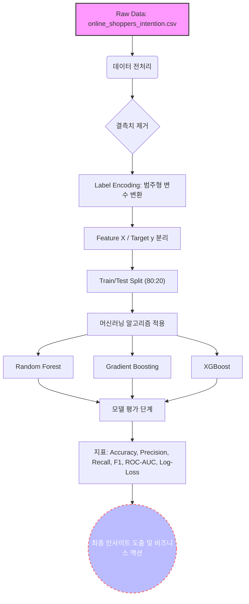
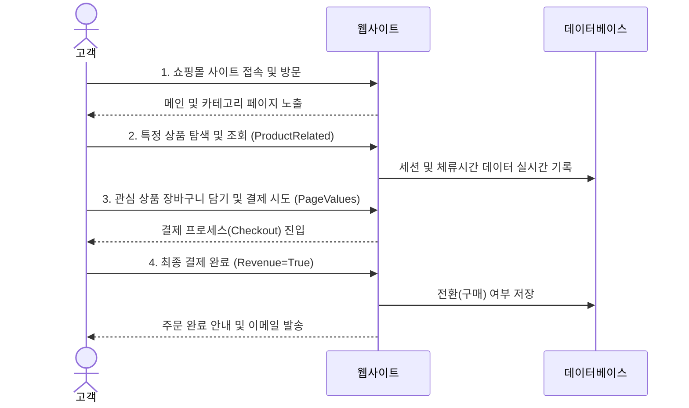

# 🛒 Online Shoppers Purchasing Intention 심층 분석 및 머신러닝 리포트

본 리포트는 이커머스 방문자의 세션 행동 데이터를 바탕으로 탐색적 데이터 분석(EDA)을 진행하고, 최종적으로 수익(Revenue, 구매 전환) 발생 여부를 예측하는 머신러닝 모델링 평가 결과를 정리한 마크다운 기반의 심층 리포트입니다. `/ml-report` 스킬의 가이드라인에 맞춰 작성되었습니다.

---

## 1. 개요 및 파이프라인

데이터 분석부터 머신러닝 모델링까지의 전체 아키텍처 흐름과 고객의 웹사이트 상호작용 여정을 정의합니다.

### 1.1 데이터 및 ML 파이프라인 흐름도

### 1.2 고객 구매 여정 시퀀스 다이어그램

---

## 2. 탐색적 데이터 분석 (EDA)

고객들의 방문 행동 특성을 파악하기 위해, 대표적인 범주형 변수인 **방문자 유형(VisitorType)**에 따른 구매 여부(Revenue) 전환 현황을 중점적으로 분석했습니다.

### 2.1 방문자 유형별 구매 여부 현황 (빈도 및 비율표)

| VisitorType | 비구매 (Revenue=False) Count | 구매 전환 (Revenue=True) Count | 비구매 비율 (%) | 구매 전환 비율 (%) |
|---|---:|---:|---:|---:|
| **New_Visitor (신규 방문자)** | 1,272 | 422 | 75.09% | **24.91%** |
| **Other (기타)** | 69 | 16 | 81.18% | 18.82% |
| **Returning_Visitor (재방문자)** | 9,081 | 1,470 | 86.07% | **13.93%** |

### 2.2 방문자 유형별 시각화

> [!NOTE]
> 하단 그래프는 방문자 유형에 따른 세션 수를 나타낸 Bar 차트입니다. 구매 전환 여부(Revenue)에 따라 색상이 구분되어 있습니다.

### 💡 [심층 인사이트: 비즈니스 적용 방안]
위의 방문자 유형별 구매 전환 여부 교차표 및 시각화 그래프를 살펴보면, 전체 트래픽의 대다수를 차지하는 것은 재방문자(Returning_Visitor) 그룹입니다. 하지만 흥미롭게도 구매 전환율(Revenue=True의 비율) 관점에서는 신규 방문자(New_Visitor)가 약 24.91%의 꽤 높은 전환율을 보여주고 있으며, 트래픽 비중이 압도적인 재방문자는 오히려 13.93%로 상대적으로 낮은 전환 효율을 보이고 있습니다. 이는 이커머스 웹사이트에 처음 유입된 고객들이 명확한 구매 목적을 가지고 접속하거나, 첫 방문 혜택(신규 가입 쿠폰, 웰컴 프로모션 등)에 즉각적으로 반응하여 결제까지 이어지는 경우가 많음을 시사합니다. 반면, 재방문자들은 단순히 신상품을 탐색하거나 장바구니에만 담아두는 아이쇼핑을 목적으로 웹사이트를 빈번하게 들르는 패턴을 보이고 있을 가능성이 높습니다.

따라서 이러한 데이터를 기반으로 비즈니스 액션 플랜을 수립할 때, 첫째로 **신규 방문자의 높은 구매 의향을 극대화**하기 위해 랜딩 페이지에서 강력한 첫 방문 혜택(팝업 배너, 한정 시간 할인 쿠폰 등)을 직관적으로 노출하여 이탈 전에 즉각적인 장바구니 담기와 결제를 유도해야 합니다. 둘째로 **비중은 가장 높으나 전환율이 낮은 재방문자** 그룹의 전환을 이끌어내기 위해, 장바구니에 담아두고 결제하지 않은 상품에 대한 리타겟팅(Retargeting) 이메일이나 앱 푸시 알림을 발송하여 이탈률을 방어해야 합니다. 또한 재방문자들이 자주 머무는 페이지의 UI/UX를 개선하고, 개인화된 큐레이션 및 상품 추천 시스템을 도입하여 단순히 둘러보는 행위가 실제 구매 행동으로 이어지도록 설계하는 그로스 해킹(Growth Hacking) 전략이 필수적입니다.

---

## 3. 머신러닝 모델링 평가

구매 전환(Revenue) 여부를 예측하기 위해 세 가지 트리 기반 앙상블 알고리즘 모델(`Random Forest`, `Gradient Boosting`, `XGBoost`)을 구축하여 학습시켰으며, 예측의 정확성을 평가하기 위해 6가지 평가지표를 다각도로 적용했습니다.

### 3.1 모델별 평가 지표 비교표

| 모델 (Model) | Accuracy | Precision | Recall | F1-Score | ROC-AUC | Log-Loss |
|---|:---:|:---:|:---:|:---:|:---:|:---:|
| **Random Forest** | **0.9006** | **0.7354** | 0.5602 | **0.6360** | 0.9178 | 0.2537 |
| **Gradient Boosting** | 0.8982 | 0.7148 | **0.5707** | 0.6346 | **0.9251** | **0.2358** |
| **XGBoost** | 0.8921 | 0.6813 | **0.5707** | 0.6211 | 0.9184 | 0.2640 |

> [!TIP]
> 본 데이터와 같은 타겟 클래스 불균형(Imbalanced) 환경에서는 단순 정확도(Accuracy)뿐만 아니라, **F1-Score** 및 **ROC-AUC** 지표를 함께 고려하는 것이 모델의 실질적인 성능을 판단하는 데 유리합니다.

### 3.2 모델별 ROC-AUC 스코어 시각화

### 3.3 피처 중요도 (Feature Importance - XGBoost 기준)

| Feature | Importance Score |
|---|---:|
| **PageValues** | **0.4005** |
| Month | 0.0991 |
| BounceRates | 0.0520 |
| Administrative | 0.0423 |
| VisitorType | 0.0422 |
| ProductRelated | 0.0358 |

### 💡 [심층 인사이트: 모델 성능 평가 및 비즈니스 연계 방안]
세 가지 머신러닝 모델을 통해 구매 전환 예측을 수행한 결과, 세 모델 모두 약 89~90% 수준의 전반적으로 높은 Accuracy(정확도)를 보여주고 있습니다. 특히 이탈 방지나 마케팅 효율화에서 중요한 척도인 확률 기반의 **ROC-AUC 지표에서는 Gradient Boosting 모델이 0.9251로 가장 우수한 성능**을 기록했으며, 정답 확률과 예측 확률의 차이를 나타내는 **Log-Loss 오차 지표에서도 0.2358로 예측의 신뢰도가 가장 뛰어나게** 나타났습니다. 하지만 본 이커머스 데이터셋과 같이 전체 세션 중 실제 구매자(Revenue=True) 비율이 비구매자에 비해 상대적으로 적은 클래스 불균형(Class Imbalance) 환경에서는, 정밀도(Precision)와 재현율(Recall) 간의 트레이드오프 관계를 함께 고려하여 F1-Score를 눈여겨보는 것이 실무 적용에 매우 중요합니다. 종합적인 조화평균 지표인 F1-Score와 오탐지를 줄이는 Precision 측면에서는 Random Forest가 뛰어난 결과를 보였습니다. 타겟 마케팅 시 비용 효율화가 중요하다면 Precision이 높은 모델을 채택하고, 놓치는 고객 없이 최대한 넓게 구매 유도 프로모션을 진행하고자 한다면 Recall에 집중해야 합니다.

아울러 피처 중요도(Feature Importance) 분석 결과를 보면, **`PageValues` 변수가 전체 모델 판단 기준의 약 40% 이상을 압도적으로 차지하며 가장 결정적인 예측 변수로 작용**하고 있습니다. `PageValues`는 사용자가 방문한 페이지들의 평균적인 가치를 나타내는 지표로, 쉽게 말해 방문자가 결제 페이지나 장바구니 페이지 등 구매 완료 직전 단계에 도달한 빈도를 의미합니다. 그 외에 방문 월(`Month`), 반송률(`BounceRates`), 관리자 페이지 접속 빈도(`Administrative`) 등이 유의미한 변수로 도출되었습니다. 

이러한 머신러닝 결과를 실무에 연계하기 위해서는 명확한 그로스 해킹 전략이 필요합니다. 먼저, 고객의 웹사이트 체류 중 `PageValues` 가중치가 높은 핵심 페이지(장바구니, 체크아웃 등)로의 동선 유입을 적극적으로 유도하는 것이 수익 창출의 핵심 키입니다. 메인 페이지나 특정 상품 상세 페이지에서 결제 페이지로 자연스럽게 넘어갈 수 있도록 결제 버튼(CTA)의 직관성과 가시성을 개선하고, 결제 단계의 불필요한 번거로움을 최소화하는 간편 1-Click 결제 시스템의 전면적인 도입을 최우선으로 검토해야 합니다. 나아가 머신러닝이 산출한 실시간 구매 예측 확률을 활용해, 구매 가능성이 상위 10%에 해당하는 가망 고객군을 타겟팅하여 장바구니 화면에서 맞춤형 타임세일 할인 쿠폰을 자동으로 팝업 형태로 제공한다면, 망설이는 고객의 이탈률(Bounce Rate)을 대폭 낮추고 전체 매출(Revenue)을 효과적으로 끌어올릴 수 있을 것입니다.

---

## 4. 결론 및 향후 과제

본 리포트를 통해 Online Shoppers 데이터셋에서 고객의 구매 전환 특성을 도출하고 고도화된 머신러닝 예측 모델을 검증했습니다.
신규 방문자의 높은 전환율을 유지함과 동시에 가장 비중이 큰 재방문자의 구매 전환을 높이기 위한 세밀한 퍼널 관리와, 핵심 변수인 `PageValues`를 높이기 위한 UI/UX 개선이 이커머스 성장의 핵심 열쇠임을 확인했습니다. 

향후에는 시계열 데이터를 활용해 고객의 행동 이력을 순차적으로 반영하는 딥러닝 텍스트/시퀀스 예측 모델 도입을 고려해 볼 수 있으며, 특정 월(Month)이나 기념일(SpecialDay)에 따른 시즌별 모델을 별도 분리하여 운영하는 하이브리드 전략을 테스트해볼 것을 권장합니다.
