# 서울 생활인구 데이터 기본 EDA 리포트

본 리포트는 Streamlit 대시보드를 통해 자동 생성된 데이터 분석 결과입니다.

## 성별 데이터 빈도 분석

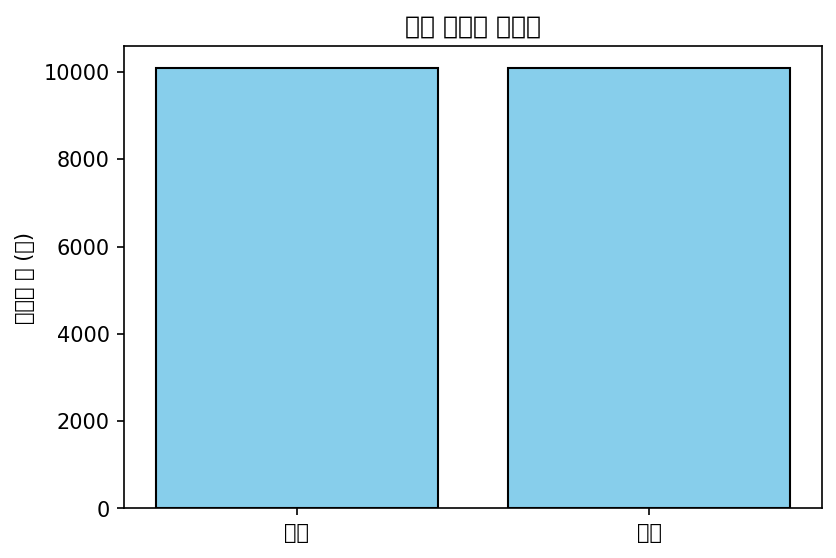

**해석**: 전체 데이터 중 각 성별이 차지하는 관측치 건수를 나타냅니다. 성별에 따른 측정 데이터 비율을 확인하여 성별 간의 균형 및 특정 경제 활동이나 주거 형태가 특정 성별에 편중되어 있는지 판단할 수 있는 중요한 기초 지표입니다.

### 관련 통계표
| 성별   |   count |
|:-------|--------:|
| 남자   | 4273920 |
| 여자   | 4273920 |

---

## 연령대별 데이터 빈도 분석

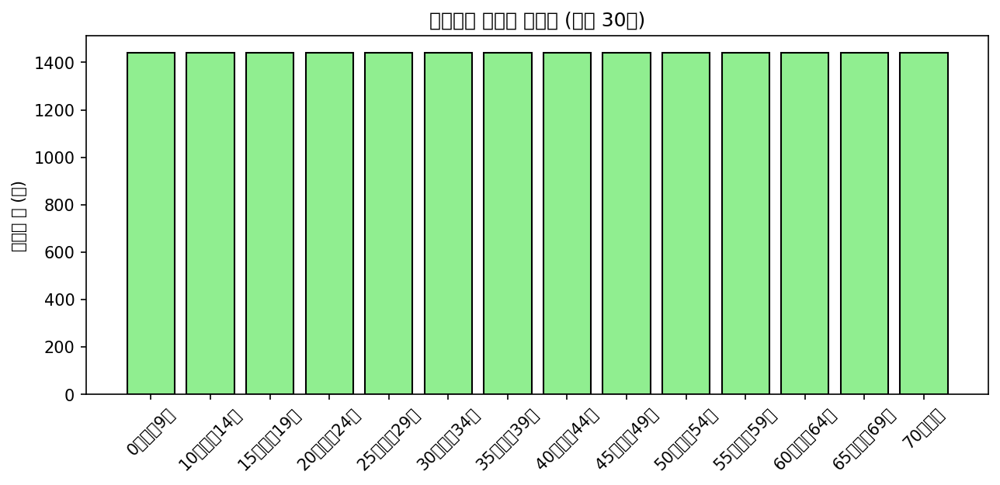

**해석**: 연령대 그룹별로 수집된 데이터의 총 건수를 시각화한 결과입니다. 사회적, 경제적 활동의 주축이 되는 연령층의 분포를 파악하고, 각 연령대가 도시 내에서 활동하는 보편적 빈도 패턴을 이해하는 데 큰 도움이 됩니다.

### 관련 통계표
| 연령대       |   count |
|:-------------|--------:|
| 0세부터9세   |  610560 |
| 10세부터14세 |  610560 |
| 15세부터19세 |  610560 |
| 20세부터24세 |  610560 |
| 25세부터29세 |  610560 |
| 30세부터34세 |  610560 |
| 35세부터39세 |  610560 |
| 40세부터44세 |  610560 |
| 45세부터49세 |  610560 |
| 50세부터54세 |  610560 |
| 55세부터59세 |  610560 |
| 60세부터64세 |  610560 |
| 65세부터69세 |  610560 |
| 70세이상     |  610560 |

---

## 시간대별 관측 빈도

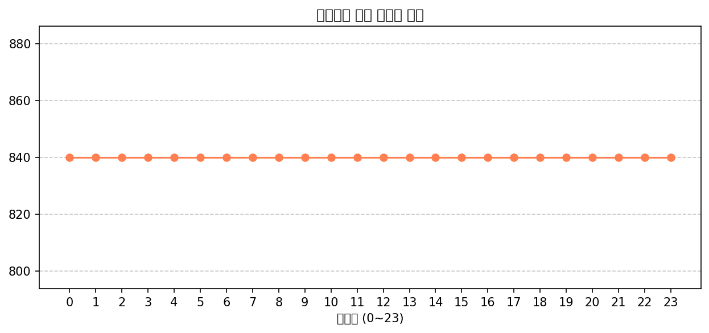

**해석**: 하루 24시간 중 어느 시간대에 데이터가 집중적으로 기록되었는지 나타냅니다. 심야나 낮 시간대의 데이터 누락 여부를 판단하고 수집 시스템의 균형성을 평가할 수 있어 데이터 품질 점검 시 필수적인 지표입니다.

### 관련 통계표
|       |      0 |      1 |      2 |      3 |      4 |      5 |      6 |      7 |      8 |      9 |     10 |     11 |     12 |     13 |     14 |     15 |     16 |     17 |     18 |     19 |     20 |     21 |     22 |     23 |
|:------|-------:|-------:|-------:|-------:|-------:|-------:|-------:|-------:|-------:|-------:|-------:|-------:|-------:|-------:|-------:|-------:|-------:|-------:|-------:|-------:|-------:|-------:|-------:|-------:|
| count | 356160 | 356160 | 356160 | 356160 | 356160 | 356160 | 356160 | 356160 | 356160 | 356160 | 356160 | 356160 | 356160 | 356160 | 356160 | 356160 | 356160 | 356160 | 356160 | 356160 | 356160 | 356160 | 356160 | 356160 |

---

## 성별 평균 생활인구수

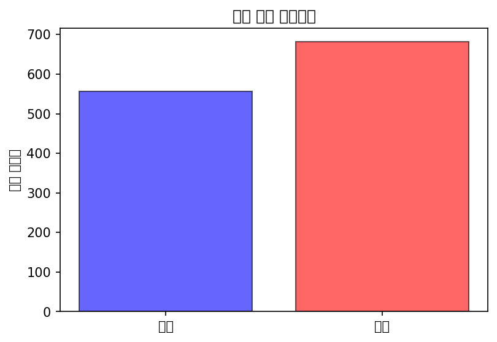

**해석**: 남성과 여성 간 평균적으로 관측되는 총 생활인구의 차이를 보여줍니다. 지역 사회의 기초 인프라 및 소비재 기획에 있어 성별 타겟팅 전략을 수립하거나, 성별 활동성 편차를 규명하는 핵심 근거로 활용됩니다.

### 관련 통계표
| 성별   |   생활인구수 |
|:-------|-------------:|
| 남자   |      802.824 |
| 여자   |      910.834 |

---

## 연령대별 평균 생활인구

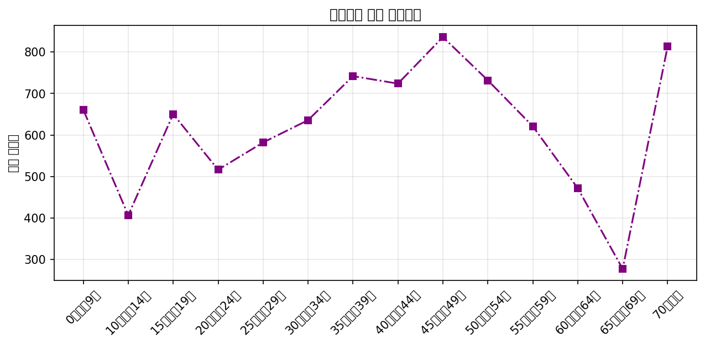

**해석**: 각 연령대별로 평균적으로 도심 내에 얼마나 많은 인구가 존재(생활)하는지 파악할 수 있는 그래프입니다. 상권의 주 소비 연령층을 파악하고 교통, 복지 시설 등의 인프라 수요를 연령대별로 최적화하는 데 매우 유용한 정보를 제공합니다.

### 관련 통계표
| 연령대       |   생활인구수 |
|:-------------|-------------:|
| 0세부터9세   |      831.52  |
| 10세부터14세 |      447.42  |
| 15세부터19세 |      627.485 |
| 20세부터24세 |      877.306 |
| 25세부터29세 |      982.758 |
| 30세부터34세 |      927.309 |
| 35세부터39세 |     1082.91  |
| 40세부터44세 |     1001.93  |
| 45세부터49세 |     1075.04  |
| 50세부터54세 |      895.941 |
| 55세부터59세 |      866.958 |
| 60세부터64세 |      669.231 |
| 65세부터69세 |      492.931 |
| 70세이상     |     1216.87  |

---

## 시간대별 평균 생활인구수 추이

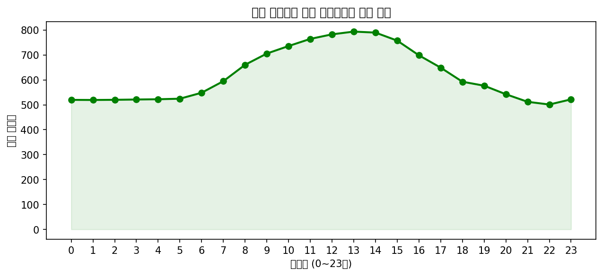

**해석**: 0시부터 23시까지 24시간 동안 서울시 내 평균 생활인구의 증감 패턴을 직관적으로 보여줍니다. 출퇴근에 따른 유동인구 증가 시간대와 심야 야간 상주인구 시간대를 확연히 구분할 수 있어 교통 혼잡 대응에 필수적입니다.

### 관련 통계표
|   시간대구분 |   생활인구수 |
|-------------:|-------------:|
|            0 |      833.398 |
|            1 |      832.686 |
|            2 |      832.303 |
|            3 |      832.019 |
|            4 |      832.023 |
|            5 |      833.113 |
|            6 |      836.468 |
|            7 |      846.576 |
|            8 |      859.761 |
|            9 |      869.52  |
|           10 |      874.602 |
|           11 |      877.882 |
|           12 |      881.138 |
|           13 |      883.541 |
|           14 |      884.524 |
|           15 |      883.961 |
|           16 |      881.989 |
|           17 |      877.841 |
|           18 |      869.337 |
|           19 |      860.173 |
|           20 |      854.358 |
|           21 |      848.608 |
|           22 |      842.407 |
|           23 |      835.672 |

---

## 성별 및 시간대별 인구 추이

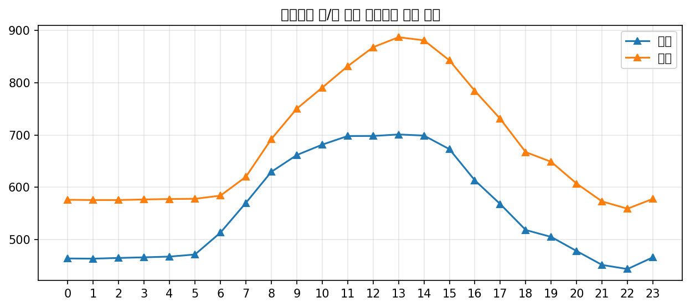

**해석**: 시간대 변수와 성별 변수를 동시에 교차하여 시각화한 결과로, 낮과 밤 시간대에 따라 남성과 여성 간의 활동 패턴 차이가 어떻게 변하는지를 상세히 확인할 수 있습니다. 심야 안전 귀가 정책 등 성별 맞춤 정책 수립에 큰 도움을 줍니다.

### 관련 통계표
|   시간대구분 |    남자 |    여자 |
|-------------:|--------:|--------:|
|            0 | 782.367 | 884.43  |
|            1 | 781.534 | 883.838 |
|            2 | 781.074 | 883.532 |
|            3 | 780.71  | 883.329 |
|            4 | 780.685 | 883.362 |
|            5 | 782.12  | 884.106 |
|            6 | 785.823 | 887.113 |
|            7 | 795.572 | 897.581 |
|            8 | 806.455 | 913.067 |
|            9 | 814.189 | 924.851 |
|           10 | 817.86  | 931.345 |
|           11 | 820.003 | 935.762 |
|           12 | 822.545 | 939.731 |
|           13 | 824.562 | 942.521 |
|           14 | 825.484 | 943.564 |
|           15 | 825.402 | 942.521 |
|           16 | 824.456 | 939.521 |
|           17 | 821.367 | 934.314 |
|           18 | 814.497 | 924.176 |
|           19 | 806.483 | 913.862 |
|           20 | 801.63  | 907.086 |
|           21 | 796.757 | 900.458 |
|           22 | 791.4   | 893.413 |
|           23 | 784.797 | 886.547 |

---

## 상위 10개 행정동

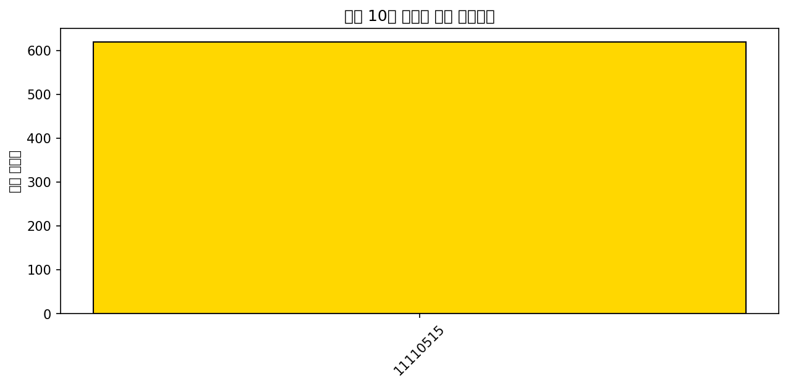

**해석**: 서울시 내에서 평균 생활인구가 가장 많은 상위 10개 행정동을 추출한 결과입니다. 주요 업무 지구이거나 초대형 주거 단지가 밀집한 지역을 빠르게 식별함으로써 한정된 행정 자원과 상업 자본을 집중해야 할 우선순위 지역을 명확히 제시합니다.

### 관련 통계표
|   행정동코드 |   생활인구수 |
|-------------:|-------------:|
|     11560540 |      3605.39 |
|     11680640 |      3483.97 |
|     11500593 |      2548.67 |
|     11440660 |      2512.24 |
|     11650530 |      2423.71 |
|     11110615 |      2190.43 |
|     11650651 |      2151.3  |
|     11545510 |      2144.37 |
|     11410585 |      2121.89 |
|     11740685 |      2110.07 |

---

## 최상위 5개 행정동 시간대별 추이

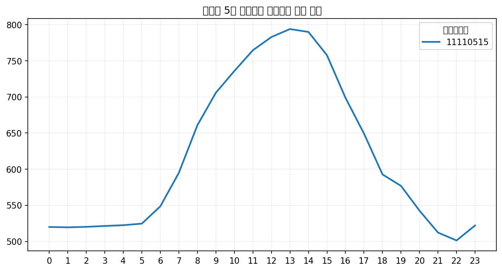

**해석**: 가장 혼잡한 상위 5개 행정동이 시간대별로 겪는 인구 파동을 동시에 비교합니다. 지역별로 피크타임(예: 출근 시간 vs 퇴근 시간)이 어떻게 다른지 비교 분석하여 국지적인 교통 대책 및 지역별 상권 개점 시간 최적화에 기여할 수 있습니다.

### 관련 통계표
|   시간대구분 |   11440660 |   11500593 |   11560540 |   11650530 |   11680640 |
|-------------:|-----------:|-----------:|-----------:|-----------:|-----------:|
|            0 |    1795.83 |    2726.77 |    1858.24 |    1618.86 |    2190.94 |
|            1 |    1721.68 |    2767.92 |    1827.93 |    1610.53 |    2138.74 |
|            2 |    1668.29 |    2718.02 |    1810.56 |    1602.54 |    2113.2  |
|            3 |    1620.91 |    2730.58 |    1806.11 |    1597.24 |    2093.54 |
|            4 |    1577.57 |    2789.13 |    1845.67 |    1606.57 |    2085.22 |

---

## 성별 및 연령대 교차 분석

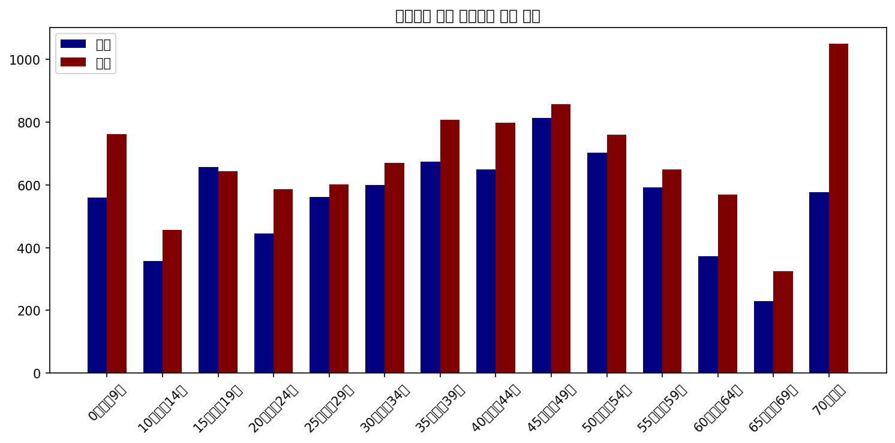

**해석**: 각 연령대 그룹 안에서 성별 간의 인구 밀집도 차이를 정밀하게 비교 분석한 그래프입니다. 특정 세대에서만 나타나는 젠더 간 이동 패턴의 격차를 포착하여 보다 세분화되고 타겟팅된 마케팅 그룹을 형성하는 데 탁월한 효과를 발휘합니다.

### 관련 통계표
| 연령대       |     남자 |     여자 |
|:-------------|---------:|---------:|
| 0세부터9세   |  847.529 |  815.511 |
| 10세부터14세 |  457.923 |  436.917 |
| 15세부터19세 |  625.763 |  629.208 |
| 20세부터24세 |  733.477 | 1021.14  |
| 25세부터29세 |  887.22  | 1078.3   |
| 30세부터34세 |  869.317 |  985.301 |
| 35세부터39세 | 1043.56  | 1122.27  |
| 40세부터44세 |  991.257 | 1012.6   |
| 45세부터49세 | 1080.69  | 1069.39  |
| 50세부터54세 |  905.21  |  886.672 |
| 55세부터59세 |  843.229 |  890.686 |
| 60세부터64세 |  613.372 |  725.091 |
| 65세부터69세 |  430.275 |  555.587 |
| 70세이상     |  910.714 | 1523.03  |

---

## 주야간 생활인구 비교

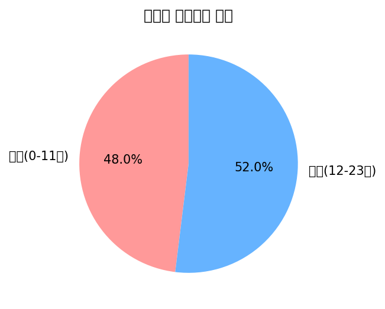

**해석**: 하루 24시간을 크게 오전과 오후(주야간) 두 개의 굵직한 시간대로 나누어, 전체 생활인구가 어느 시간대에 더 집중되어 활동하는지를 직관적인 파이 차트로 보여줍니다. 거시적인 도시 활성화 시간대를 가늠하는 데 유용합니다.

### 관련 통계표
| 주야간        |   생활인구수 |
|:--------------|-------------:|
| 오전(0-11시)  |      846.696 |
| 오후(12-23시) |      866.962 |

---

## 연령대별 분포 범위

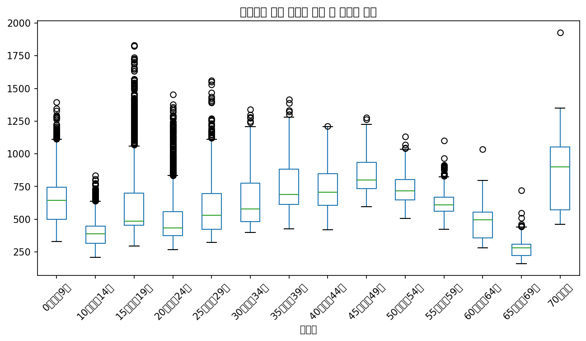

**해석**: 박스플롯을 통해 각 연령대 그룹의 평균뿐만 아니라 1사분위에서 3사분위까지의 데이터 퍼짐 정도, 그리고 극단값(Outliers)의 존재 유무를 시각화합니다. 대규모 콘서트, 시위, 또는 특정 축제 등 국지적으로 급증한 비정상적인 인구 쏠림 현상을 감지하는 데 필수적인 차트입니다.

### 관련 통계표
| 연령대       |   count |     mean |      std |      min |     25% |      50% |      75% |      max |
|:-------------|--------:|---------:|---------:|---------:|--------:|---------:|---------:|---------:|
| 0세부터9세   |    7183 |  830.235 |  631.233 |  13.6881 | 425.217 |  654.297 | 1061.54  |  5542.77 |
| 10세부터14세 |    7104 |  449.585 |  374.377 |   1.9713 | 211.404 |  343.613 |  559.089 |  3975.3  |
| 15세부터19세 |    7155 |  626.784 |  531.365 |  28.5498 | 293.141 |  479.122 |  776.994 |  6507.27 |
| 20세부터24세 |    7150 |  871.338 |  920.075 |  38.3384 | 392.343 |  609.251 |  976.477 | 14686.9  |
| 25세부터29세 |    7169 |  993.456 | 1007.26  |  51.0679 | 451.082 |  732.279 | 1174.37  | 15689.3  |
| 30세부터34세 |    7223 |  920.882 |  856.823 |  68.3395 | 458.956 |  714.657 | 1091.37  | 14215.5  |
| 35세부터39세 |    7196 | 1076.44  |  832.747 |  90.1865 | 581.482 |  864.845 | 1302.17  | 15162.7  |
| 40세부터44세 |    7149 |  991.676 |  804.014 | 106.404  | 542.695 |  774.557 | 1197.38  | 15012.7  |
| 45세부터49세 |    7000 | 1095.03  |  876.544 |  99.2082 | 590.655 |  853.9   | 1317.19  | 14952.3  |
| 50세부터54세 |    7213 |  896.48  |  624.887 | 106.257  | 528.64  |  738.811 | 1101.66  | 12264.2  |
| 55세부터59세 |    7137 |  872.01  |  509.903 |  94.3011 | 552.713 |  752.988 | 1078.87  |  8668.03 |
| 60세부터64세 |    7119 |  666.07  |  343.075 |  75.5751 | 441.357 |  594.25  |  816.718 |  3728.46 |
| 65세부터69세 |    7137 |  487.324 |  245.509 |  37.271  | 318.874 |  437.238 |  611.859 |  2480.45 |
| 70세이상     |    7065 | 1203.16  |  662.44  |  88.9574 | 744.111 | 1060.86  | 1499.44  |  5800.21 |

---

## 전체 인구 분포 빈도도

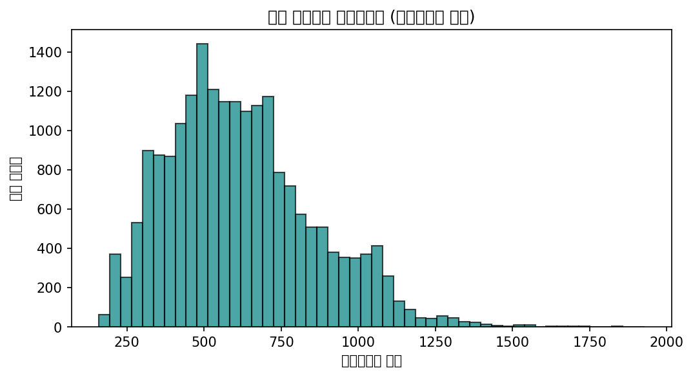

**해석**: 생활인구수 변수 그 자체가 어떤 형태의 분포를 따르고 있는지 확인하는 단변량 차트입니다. 보통 인구 밀도가 낮은 지역 및 시간대의 데이터가 다수를 차지하는 롱테일(Long-tail) 분포를 그리는 경향을 띠며, 데이터 스케일링 등의 전처리 방향성을 결정짓습니다.

---

## 시간대 x 연령대 매트릭스

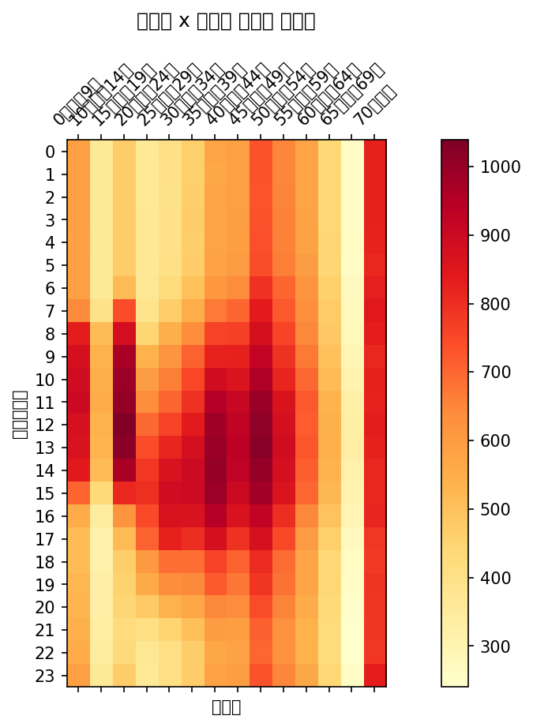

**해석**: 24개의 시간대와 모든 연령대 그룹 간의 조합을 2차원 매트릭스로 생성하고 인구수에 따라 색상의 농도를 달리 표현한 차트입니다. 특정 시간대에 특정 연령층이 어느 정도로 응집해 있는지 한눈에 파악이 가능하며 핫스팟(가장 붐비는 조합)을 시각적으로 강렬하게 식별합니다.

### 관련 통계표
|   시간대구분 |   0세부터9세 |   10세부터14세 |   15세부터19세 |   20세부터24세 |   25세부터29세 |   30세부터34세 |   35세부터39세 |   40세부터44세 |   45세부터49세 |   50세부터54세 |   55세부터59세 |   60세부터64세 |   65세부터69세 |   70세이상 |
|-------------:|-------------:|---------------:|---------------:|---------------:|---------------:|---------------:|---------------:|---------------:|---------------:|---------------:|---------------:|---------------:|---------------:|-----------:|
|            0 |      829.459 |        443.485 |        609.919 |        847.234 |        943.109 |        888.603 |        1036.73 |        961.364 |        1037.82 |        869.842 |        848.014 |        659.421 |        487.201 |    1205.37 |
|            1 |      829.715 |        443.467 |        609.345 |        845.651 |        941.399 |        887.215 |        1035.49 |        960.275 |        1036.91 |        869.312 |        847.577 |        659.088 |        487.003 |    1205.15 |
|            2 |      829.713 |        443.426 |        609.082 |        844.763 |        940.342 |        886.441 |        1034.78 |        959.725 |        1036.45 |        869.198 |        847.428 |        658.888 |        486.888 |    1205.11 |
|            3 |      829.742 |        443.445 |        608.918 |        844.079 |        939.527 |        885.714 |        1034.17 |        959.251 |        1036.19 |        869.085 |        847.426 |        658.846 |        486.864 |    1205.02 |
|            4 |      829.617 |        443.461 |        608.793 |        843.508 |        939.018 |        885.472 |        1034.13 |        959.127 |        1036.31 |        869.148 |        847.831 |        659.313 |        487.134 |    1205.47 |

---

## 성별 x 주야간 스택 비교

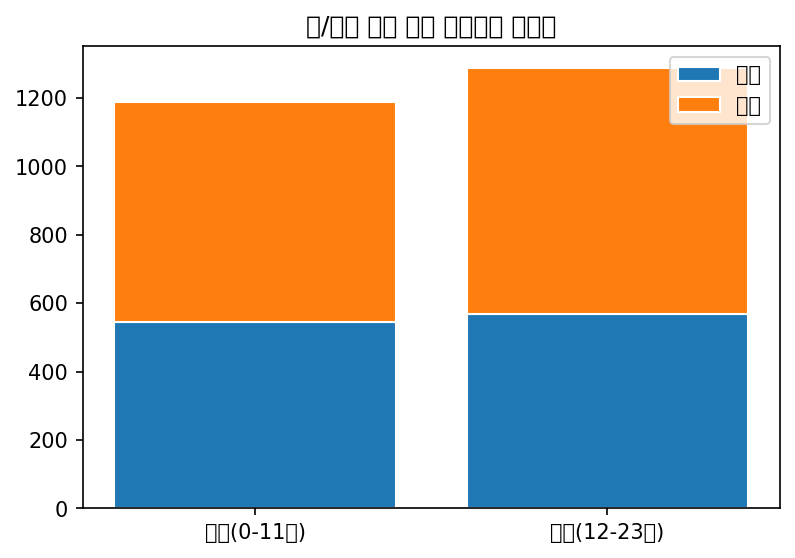

**해석**: 오전과 오후라는 광범위한 시간대 블록 속에서 남성과 여성 인구의 비중이 스택형으로 어떻게 축적되어 있는지를 보여줍니다. 각 주야간 블록에서 절대적인 인구의 규모와 그 안의 성별 비율을 동시에 읽어낼 수 있는 다차원적이고 효율적인 정보 전달 방식입니다.

### 관련 통계표
| 주야간        |    남자 |    여자 |
|:--------------|--------:|--------:|
| 오전(0-11시)  | 794.032 | 899.359 |
| 오후(12-23시) | 811.615 | 922.31  |

---

