# 쇼핑 리뷰 데이터 분석 리포트

## 1. 데이터 기본 정보 확인

### 데이터 샘플 (상위 5행)

|    | title                                                                                                                                                                        | content                                                                                                                                                                                                                                                                                                                                                                                                                                                                                                                                                                                                                                                                                                                                                                                                                                                                                                                                                                                                                                                                                                                                                                                                                                                                                                                                                                                                                                                                                                                                                                                                                                                                                                                                                                                                                                                                                                                                                                                                                                                                                                                                                                                                                                                                                                                                                                                                                                                                                                                                                                                                                                                                                                                                                                                                                                                                                                                                                                                                                                                                                                                                                                                                                                                                                                                                                                                                                                                                                                                                                                                                                                                                                                                                                                                                                                                                                                                                                                                                                                                                                                                                                                                                                                                                                                                                                                                                                                                                                                                                                                                                                                                                                                                                                                                                                                                                                                                                                                                                                                                                                                                                                                                                                                                                                                                                                                                                                                                                                                                                                                                                                                                                                                                                                                                                                                                                                                                                                                                                                                                                                                                                                                                                                                                                                                                                                                                                                                                                                                                                                                                                                                       | product         | mallName               |   title_len |   content_len |   word_count |
|---:|:-----------------------------------------------------------------------------------------------------------------------------------------------------------------------------|:----------------------------------------------------------------------------------------------------------------------------------------------------------------------------------------------------------------------------------------------------------------------------------------------------------------------------------------------------------------------------------------------------------------------------------------------------------------------------------------------------------------------------------------------------------------------------------------------------------------------------------------------------------------------------------------------------------------------------------------------------------------------------------------------------------------------------------------------------------------------------------------------------------------------------------------------------------------------------------------------------------------------------------------------------------------------------------------------------------------------------------------------------------------------------------------------------------------------------------------------------------------------------------------------------------------------------------------------------------------------------------------------------------------------------------------------------------------------------------------------------------------------------------------------------------------------------------------------------------------------------------------------------------------------------------------------------------------------------------------------------------------------------------------------------------------------------------------------------------------------------------------------------------------------------------------------------------------------------------------------------------------------------------------------------------------------------------------------------------------------------------------------------------------------------------------------------------------------------------------------------------------------------------------------------------------------------------------------------------------------------------------------------------------------------------------------------------------------------------------------------------------------------------------------------------------------------------------------------------------------------------------------------------------------------------------------------------------------------------------------------------------------------------------------------------------------------------------------------------------------------------------------------------------------------------------------------------------------------------------------------------------------------------------------------------------------------------------------------------------------------------------------------------------------------------------------------------------------------------------------------------------------------------------------------------------------------------------------------------------------------------------------------------------------------------------------------------------------------------------------------------------------------------------------------------------------------------------------------------------------------------------------------------------------------------------------------------------------------------------------------------------------------------------------------------------------------------------------------------------------------------------------------------------------------------------------------------------------------------------------------------------------------------------------------------------------------------------------------------------------------------------------------------------------------------------------------------------------------------------------------------------------------------------------------------------------------------------------------------------------------------------------------------------------------------------------------------------------------------------------------------------------------------------------------------------------------------------------------------------------------------------------------------------------------------------------------------------------------------------------------------------------------------------------------------------------------------------------------------------------------------------------------------------------------------------------------------------------------------------------------------------------------------------------------------------------------------------------------------------------------------------------------------------------------------------------------------------------------------------------------------------------------------------------------------------------------------------------------------------------------------------------------------------------------------------------------------------------------------------------------------------------------------------------------------------------------------------------------------------------------------------------------------------------------------------------------------------------------------------------------------------------------------------------------------------------------------------------------------------------------------------------------------------------------------------------------------------------------------------------------------------------------------------------------------------------------------------------------------------------------------------------------------------------------------------------------------------------------------------------------------------------------------------------------------------------------------------------------------------------------------------------------------------------------------------------------------------------------------------------------------------------------------------------------------------------------------------------------------------------------------------------|:----------------|:-----------------------|------------:|--------------:|-------------:|
|  0 | 에어팟프로1세대를 계속 사용 했으나 배터리 빠른 소모로 인해 2세대로 교체 했습니다 ㅎㅎ에어팟프로 1세대 보다 2세대가 좋았던 점1.노이즈 캔슬링:노이즈캔슬링이 2배 더 좋아졌다고 | 에어팟프로1세대를 계속 사용 했으나 배터리 빠른 소모로 인해 2세대로 교체 했습니다 ㅎㅎ<br><br>에어팟프로 1세대 보다 2세대가 좋았던 점<br>1.노이즈 캔슬링:노이즈캔슬링이 2배 더 좋아졌다고 나왔는데 <em>2배로 좋아졌네요</em>^_^ 깜짝 놀랬어용!!<br><br>2.주변음 허용: <em>주변음 허용모드가 1세대 비해 더 또렷하게 들여서 최고</em>!!!<br><br>3.사운드: 에어팟프로1세대 보다 2세대가 더 베이스도 좋아지고 극저음,저음,고음,극고음 이 더 깔끔하게 들리면서 귀가 부담 되지 않을정도로 많이 좋아지고, 가수와피아노,베이스 등 분리도에 있어서 1세대 비해 더 구분이 잘 되어서 좋았네용~ +_+<br><br>4.랜야드 루프 스트랩: 에어팟이 작고 휴대성이 뛰어나지만 단점이 잃어리는 일이 꽤 많아서 아쉬웠는데 스트랩으로 걸어 가방,바지 등에 걸어 잃어버리는 걸 최소화 할수 있는 점이 단점을 없애는(?)게 좋았습니다.<br><br>5.스피커: 스피커 탑재로 인해 잃어버리는 걸 또 낮출수 있어서 단점을 상쇄시킬수 있어서 좋았고,나의 찾기 기능으로 소리를 내주어서 근처에 잃어버렸을 때 찾기가 좀더 쉬울꺼 같네요... 그리고 충전할 때 &rdquo;띠링~&ldquo; 소리나서 충전하는걸 <em>명확하게 알려주니 최고</em>!!<br><br>6.볼륨 업 다운 기능: 1세대꺼는 볼륨을 낮추거나 올릴때는 폰을 꺼내야 됐지만 2세대는 한손으로 할수 있다는점(<em>오타도 안나고</em> 직관적이여서 쉽고 빠르게 할수 있어서 만족!!)<br><br>7.배터리: 노이즈 캔슬링 켜 놓고도 (유닛만) 6시간 간다는 점,충전 케이스 까지포함이 30시간이라는 점은 <em>완전 최고로 만족합니다</em>!! (에어팟프로1세대는 유닛으로는 5시간,케이스 포함은 24시간)<br><br>8.칩셋: 에어팟프로1세대는 Apple H1   에어팟프로2세대는 Apple H2,Apple U1 이여서 나의찾기 기능도 되고 만족!!<br><br>9.실리콘 이어팁: 에어팟프로 1세대 구매할 때는 이어팁이 S,M.L 까지 밖에 없었는데....2세대는 XS까지 있어서 더욱 좋았습니다. ^.^<br><br>10.애플워치 충전: <em>애플워치 유저 입장에선 완전 만족하고</em> 신박하네요...(애플의 갬성 +_+)<br><br>에어팟프로1세대에서 2세대로 갈아 <em>타도 완전 만족합니다</em>!! 빠른배송,꼼꼼히 신경 써주신 제품 (하자,에어캡)<br><em>감사합니다</em>                                                                                                                                                                                                                                                                                                                                                                                                                                                                                                                                                                                                                                                                                                                                                                                                                                                                                                                                                                                                                                                                                                                                                                                                                                                                                                                                                                                                                                                                                                                                                                                                                                                                                                                                                                                                                                                                                                                                                                                                                                                                                                                                                                                                                                                                                                                                                                                                                                                                                                                                                                                                                                                                                                                                                                                                                                                                                                                                                                                                                                                                                                                                                                                                                                                                                                                                                                                                                                                                                                                                                                                                                                                                                                                                                                                                                                                                                                                                                                                                                                                                                                                                                                                                                                                                                                                                                                                                                                                                                                                                                                                                                                              | 에어팟프로2세대 | 애플 공식 브랜드스토어 |         100 |          1231 |          209 |
|  1 | &lt;새로운 것과 좋았던 것의 균형감&gt;1. 노이즈 캔슬링에어팟 1세대 대비 좋아진 것을 충분히 느낄 수는 있으나 드라마틱한 개선은 아니어서 생각해 보니1세대에는 기본 이어팁      | &lt;새로운 것과 좋았던 것의 균형감&gt;<br><br><br>1. 노이즈 캔슬링<br><br>에어팟 1세대 대비 좋아진 것을 충분히 느낄 수는 있으나 드라마틱한 개선은 아니어서 생각해 보니<br>1세대에는 기본 이어팁이 아닌 서드파티 이어팁을 사용하고 있었는데<br>이 팁이 기본 팁보다 PNI가 좋아서 노이즈 캔슬링이 조금 더 강해지는 효과가 있기 때문에<br>에어팟 프로 2세대를 기본 팁으로 들었을 때 1세대와 차이가 크지 않았던 건가 싶어<br>서드파티 이어팁을 에어팟 프로 2세대에 장착해서 사용해 보니<br>앞서 느꼈던 체감보다는 노이즈 캔슬링의 개선의 폭이 더 느껴집니다.<br><br>사실 1세대도 일상 생활에서 사용하기엔 이 이상<br>필요 없을 만큼 웬만한 소음을 다 잡아줬기 때문에<br>노이즈 캔슬링 기능면에선 충분히 만족했지만<br>2세대 구입은 노이즈 캔슬링 보다는<br>그 외의 기능들에 더 매력을 느껴 구매했습니다.<br><br><br>2. 주변음 허용 모드<br><br>구매 전 가장 궁금했던 부분이 주변음 허용 모드의 개선 부분이었는데<br>사용 후기나 리뷰들에서 가장 큰 체감이 느껴지는 건 주변음 허용 모드다 라는 내용을 보고<br>최종적으로 구매를 결정하게 되었는데<br>실제로 1세대와 비교 시 주변음 허용 모드가<br>보다 자연스러워졌다는 걸 느낄 수 있었습니다.<br><br>1세대도 사용 초기에는 자연스럽다고 느껴 불편함 없이 사용해 왔었는데<br>시간이 흐를수록 이상하게 주변음 허용 모드가<br>불편하게 느껴졌습니다.<br>처음에는 느끼지 못했던 무언가 얇은 막 하나를 사이에 두고 주변음이 유입되는 듯한 어색함이 느껴지는데<br>이게 기기를 오래 사용해서 부품 내구도의 하락 때문인지,<br>업데이트 이후의 나타나는 변화인지 모르겠지만<br>에어팟 프로 1세대를 그렇게 자주 사용하지 않았음에도<br>주변음 허용 모드가 점점 조금씩 불편해져서<br>한 쪽 이어폰을 빼고 바깥 소리나 대화를 하는 경우가 생겼습니다.<br><br>2세대는 그런 거 없고 그냥 이어폰을 안 끼고 있을 때처럼 들립니다.<br>모든 문제가 해결되었습니다.<br><br>2세대부터 들어간 적응형 주변음 허용 모드는<br>애초에 작동되는 조건이 공사하는 소리, 비행기 소음 같은<br>일상적인 소음 이상일 때 동작하는 걸로 알고 있어서<br>아직까진 경험해 보지 못 했습니다.<br><br><br>3. 그 외 에어팟 프로 2세대에 새롭게 추가된 기능<br><em>충전 케이스 스피커 소리가 생각보다 굉장히 좋습니다</em><br>될 리가 없지만 이걸로 음악도 들을 수 있을 것 같습니다.<br>애플이 잘하는 사운드 튜닝과 설계 능력은<br>에어팟 충전 케이스에도 여지 없음을 느꼈습니다.<br>충전 시 울리는 짧고 간략한 딩동 사운드 마저<br>이 조그마한 케이스에서 나오기 힘든 명료한 사운드가 출력됩니다.<br><br>이제 누구도 에어팟을 쉽게 잃어버릴 수 없게 되었습니다.<br><br><br>(애플워치 충전기로 충전할 수 있게 됨)<br><br>구매 요인들 중 하나였는데 실제로도 잘 됩니다.<br>오히려 다른 Qi 규격 무선 충전기로 충전하면 생겼던<br>에어팟 프로의 충전 중 발열이 애플워치 무선 충전기에 붙여서 충전하니 없습니다.<br>이건 에어팟 프로 2세대 자체의 전작과 대비되는 개선 사항인지 아니면 충전 규격에서 오는 차이인지 아니면 무선 충전기 제품 간의 차이인지 아니면,<br><br>아무튼 <em>발열은 안납니다</em>.<br><br>근데 충전도 느립니다.<br><br>(...)<br><br>*Qi 규격 무선 충전기보다 충전이 느리기 때문에<br>발열이 없는 것일 수도 있을 것 같습니다.<br><br>&lt;실사용 중이면서 테스트에 쓰인 무선 충전기 제품&gt;<br>NOMAD 베이스 스테이션 스탠드<br>belkin 부스트업 차지 프로 애플워치 스탠드<br><br>배터리 사용 시간은 에어팟 유닛, 충전 케이스 모두 늘어났고 충전 케이스보다 에어팟 유닛 사용 시간이 늘어난 게<br>실생활에서 체감이 더 되기 때문에 좋은 개선이라 생각됩니다.<br><em>충전 케이스 관련 개선 중 가장 좋았던</em> 건<br>이제 충전 케이스 및 에어팟 유닛의 배터리 잔량이<br>에어팟을 사용하지 않을 때도 아이폰 배터리 위젯에 표시된다는 점입니다.<br><br>이 또한 충전 케이스를 열었을 때 배터리 잔량 및 연결 상태를 알려주는 팝업창이<br>에어팟1, 2세대보다 현격히 느린 에어팟 프로1세대(2세대도 여전히 느림)에서 <em>더이상 남은 배터리 확인해야 할 때마다 케이스를 열었다, 닫았다, 열었다, 닫았다, 열었</em><br>하며 기다리지 않아도 돼서 체감적으로 매우 편리한 개선점 중 하나입니다.<br><br>대신 충전 케이스의 상태 정보를 지속적으로 아이폰에 전송해야 하는 특성상 1세대 때보다<br>에어팟 유닛과 충전 케이스의 배터리가 사용하지 않을 때도 <em>생각보다 빨리 빠집니다</em>.<br>대기 전력이 좋은 애플 장치들의 특장점도 이것까진 어쩔 수 없는 듯 합니다.<br><br>랜야드 루프는 안 씁니다. 근데 있다는 건 좋은 거에요.<br><br><br>4. 음질 및 음색<br>에어팟 프로 1세대 대비 음 분리도, 해상력이 개선되었다고 느꼈습니다.<br>저음도 조금 더 올라갔지만 벙벙거리는 저음은 아니고 약간은 정돈된 저음입니다.<br>고음 재생은 여전히 부족하지만 1세대 때처럼 없는 수준은 아닙니다.<br>다만 악기 소리 표현이나 분리도가 좋아져서인지<br>다른 이유 때문인지 모르겠지만 1세대 대비<br>보컬이 약간 뒤로 간 느낌입니다.<br>애플에서 제공하는 약간의 사운드 조절 설정과 적응형 EQ, 공간 음향 기능을 통해<br>보컬 부분을 좀 더 선명하게 할 수는 있습니다.<br>1세대도 음악을 즐기기에 부족하다고 느끼진 않았어서 <em>2세대의 소폭 개선된 음악 재생 성능도 마음에 듭니다</em>.<br><br>에, 에어팟은... 음..질...보다는.... 편의성... 때문에.... 쓰, 쓰.. 쓰는...거..야.....<br><br><br>5. 기타<br>기존 광학 센서에서 에어팟 3세대처럼 피부 감지 센서로 바뀌어서 더 좋을 것 같긴 한데<br>예전 에어팟1, 2세대 쓸 때처럼<br>에어팟 한 쪽 빼서 재생 중인 미디어 일시정지 시키고<br>두 손으로 뭔가를 하려고 에어팟 주머니에 넣으면<br>미디어가 다시 재생되고 하는 불편함 자체가<br>에어팟 프로부터는 주변음 허용 모드가 있어서<br>에어팟 사용 중에는 한 쪽을 귀에서 뺄 일이 거의 없다 보니 크게 와닿는 변화는 아니었지만<br><br>에어팟1, 2세대 보다 엄청 느렸던 에어팟 프로 1세대의 미디어 일시정지 기능 동작 속도 자체는 이제 2세대에선 그 어떤 제품보다 빠르고 즉각적으로 수행됩니다.<br><br><br>구매 추천 및 추천하지 않는 대상<br><br>에어팟 프로 1세대를 만족하며 썼던 사용자이면서 1세대를 출시 초기에 구매했으며<br>새 이어폰으로 바꿀 때가 되었는데<br>다른 회사 제품 말고 이번에도 에어팟을 사고 싶은데<br><em>가격이 저렴해진 에어팟 프로1세대를 다시 살 지 2세대를 살 지 고민된다</em>.<br><br>-&gt;에어팟 프로 2세대 구매를 추천드립니다.<br>생각보다 하나하나의 변화나 개선 폭은 엄청 크지 않은데<br>모아서 보면 많은 부분들이 바뀌긴 해서 2세대로 가는 것도 좋은 것 같습니다.<br>대신 카드 할인, <em>캐쉬백 등 최대한 저렴하게 구매할 수 있는 채널이 있다면 그런 곳에서 구매하시는 걸 추천드립니다</em>.<br><br><br>아, 에어팟 프로 얼마전에 샀는데.<br><br>-&gt;에어팟 프로 2세대 구매를 추천드리지 않습니다.<br>최근 구매 혹은 1년 이내 에어팟 프로 1세대를<br>구매하셨다면 더 쓰시다가 다음 에어팟 후속 제품이나<br><em>다른 제조사들의 무선 이어폰들도 살펴보시는 걸 추천드립니다</em>.<br>에어팟 프로 1세대는 여전히 아주 완성도 높은 무선 이어폰입니다.<br><br><br>p.s 환율 상승보다 나쁜 라이트닝 포트는 이제 제발 역사의 뒤안길로 | 에어팟프로2세대 | 애플 공식 브랜드스토어 |         100 |          3992 |          758 |
|  2 | 번개 같은 빠름으로? 사전예약 후 지난 10월 21일 수령해서 지금까지 한달 넘게 사용중인데 정말 맘에 듭니다.아마 많은 분들이 큰 기대를 갖고 제품을 구입하셨을 거예요. 한두푼      | 번개 같은 빠름으로? 사전예약 후 지난 10월 21일 수령해서 지금까지 한달 넘게 사용중인데 <em>정말 맘에 듭니다</em>.<br><br>아마 많은 분들이 큰 기대를 갖고 제품을 구입하셨을 거예요. 한두푼 하는것도 아니고 이어폰 따위가 30만원대라는게 좀 부담스럽긴해도 30만원 투자해서 스트레스 없이 편하게 약 2~3년간 사용할 수 있다면 뭐.. 나쁘지 않다고 생각을 했어요.(한달에 만원 내고 사용한다고 보면...) 자! 그럼 지금부터 사용기를 정리해 보겠습니다.<br><br>개인적으로 에어팟의 착용감을 굉장히 좋아합니다. 귀에 살짝 걸쳐지는 느낌인데 귀에서 잘 빠지지 않아 저는 에어팟 첫 제품 나왔을 때부터 착용감에 대해선 극호였습니다. 제 귓구멍이 작은 편이긴 한데 그래도 신기하게 귀에 잘 맞더라고요. 평소 헬스장에서 러닝 할 때 에어팟을 사용하는데 뛸 때도 <em>전혀 불편함 없이 사용할 수 있습니다</em>.(빠질것 같은 아슬아슬함이 없어요.)<br><br>이어팁 사이즈는 기본 탑재되어 있는 M 사이즈를 사용하고 있습니다. <em>S사이즈도 착용해 봤는데 둘 다 착용감은 괜찮더라고요</em>. 이어폰 선택할 때 착용감이 정말 중요하다고 생각합니다. 귀에 꼽고 음악 듣는 제품인데 10~20분 착용했다고 귀 아프면 안 되잖아요. 외이도염으로 환불이나 당근하시는 분들도 계시던데 저는 다행스럽게도 귀에 잘 맞고 별문제 없이 사용하고 있습니다.<br><br>에어팟 프로 1세대도 노이즈 캔슬링 성능이 좋긴 했는데 <em>이번 제품도 상당히 만족스럽습니다</em>. 어떻게 좋냐면 지하철 타고 음악 듣는데 외부 소리가 거의 안 들려요. <em>지하철 소음에 방해받지 않고</em> 음악 감상 가능하고요. 방에서 책 읽거나 뭔가 집중해서 할 일이 있을 때 에어팟 끼고 노이즈 캔슬링 기능 켜고 있으면 밖에서 애가 시끄럽게 노래 부르고 떠들어도 잘 안 들립니다.(완전 딸천재 되는 상황) 제가 노래 듣는걸 좋아하긴 해도 집중해야 할 때에는 조용한게 좋거든요. 그럴 때 에어팟 끼고 있으면 진짜 집중 잘됩니다.<br><br>아마 저처럼 집중력 향상을 위해 노이즈 캔슬링 기능 사용하시는 분들 계실 거라 봅니다. 에어팟 프로 2세대는 음악 감상용으로 구입해도 되지만 외부 소리에 예민하신 분들이 외부 소리 차단용으로 구입해도 분명 효과가 좋다고 생각합니다. 헬스장에서는 주변음 허용으로 운동하고 그 외에는 거의 노이즈 캔슬링 기능을 켜고 사용합니다.<br><br>다음으로 반응성과 연동성 입니다. 제가 에어팟 프로2를 선택한 이유 중 하나가 바로 반응성과 연동성 때문입니다. 아이맥, 아이패드, 아이폰, 애플워치를 사용하고 있기에 타 블루투스 이어폰보다 에어팟이 더 좋은 선택이 될 것이라 생각했는데요. 예상대로 아이폰과 찰떡궁합이고요. 그 외 애플 아이클라우드 계정에 연결된 기기라면 근처에 두고 연결만 탭하면 바로 페어링 완료됩니다.<br><br>정말 편리해요. 또한 기기간 전환도 상당히 빠른데요. 아이맥에 에어팟이 연결되어 있어도 아이폰들고 아이폰에서 음악을 재생하면 바로 에어팟으로 아이폰에서 재생하는 음악이 나옵니다. 번거로운 몇 번의 <em>과정없이 이렇게 바로 사용할 수 있다는게 정말 편리해요</em>. 사용중인 제품이 바뀌면 자동으로 굉장히 매끄럽게 전환됩니다. 아이맥에서 에어팟으로 음악듣고 있어도 아이폰에 전화오면 바로 받을 수 있고요. 아주 매끄럽게~~<br><br><em>통화 품질은 생각보다 좋더라고</em>요.<br>마스크 쓰고 통화하는데도 상대방이 크게 불편함을 이야기하지 않습니다. 오히려 제가 이래도 될까..라는 생각이 드는데 별 문제없이 음성 전달이 잘 되고 있습니다. 몇몇 기존 코드리스 이어폰과 비교를 해봤는데 에어팟 프로 2의 통화품질은 타 무선이어폰 대비 더 좋으면 좋지 나쁘지는 않습니다.<br><br>그리고 에어팟 프로 2에는 기존에 없던 볼륨 조절 기능이 추가되었습니다. 프로1 사용하던 분들은 볼륨 조절이 불편했을 겁니다. 억지로 손 안대고 하자면 시리 호출을 통해 가능하긴 했지만 시끄러운 지하철 안에서 그게 말이 됩니까? 좀 그렇잖아요. 이번 에어팟 프로2는 터치제어를 지원합니다. 볼륨 조절 방법은 에어팟 줄기 부분을 위아래로 스와이프해서 볼륨을 올리거나 내릴 수 있는데 처음에는 이게 잘 안됩니다. 이론적으로는 올리고 내리고 하면 되겠다! 싶지만 줄기 부분이 워낙 짧아서 잘 안되는 느낌인데 몇 번 하다보면 익숙해지고요. <br><br>볼륨 조절 방법의 포인트는 에어팟 줄기 부분 끝과 끝을 쓱~쓱~~ 올리고 내리고 하는 겁니다. 한 번에 1단계씩만 오르고 내리고 합니다. 저는 이제 적응이 된건지 잘 되긴 해요. 물론 손동작만큼 100% 볼륨이 올라가고 내려가는 것은 아니고 삑사리?도 납니다. 그래도 없는것 보다야 이게 훨씬~~ 낫죠.<br><br>아이폰 사용자 또는 아이맥, 애플워치 사용자라면 적극적으로 에어팟을 권하고 싶습니다. 물론 기존 제품들도 좋지만 새롭게 출시된 프로 2가 가장 최신 제품이기에 비싸긴 해도 성능적으로는 가장 앞선 제품이라고 생각합니다. 음질도 좋은 편이고(한쪽에 편향되지 않은 노말한 음색) <em>노이즈 캔슬링 기능이 정말 맘에 듭니다</em>. <em>주변 소음 깡그리 잡아주는게 맘에 들어요</em>. 이 작은 기기에 이런 조작감을 넣어준 것도 애플이니 가능한게 아닐까 싶기도 하고요.<br><br><em>아주 맘에 드는 제품입니다</em>.<br>​                                                                                                                                                                                                                                                                                                                                                                                                                                                                                                                                                                                                                                                                                                                                                                                                                                                                                                                                                                                                                                                                                                                                                                                                                                                                                                                                                                                                                                                                                                                                                                                                                                                                                                                                                                                                                                                                                                                                                                                                                               | 에어팟프로2세대 | 애플 공식 브랜드스토어 |         100 |          2664 |          585 |
|  3 | 먼저 빠른배송 감사합니다. 21일 12시에 받고 현재 2시간동안 귀에서 빼지않고있습니다.초기 1세대 프로및 2세대 3세대 에어팟도 써본결과 이번 2세대 프로는 완성형이 아닐까싶습니    | 먼저 <em>빠른배송 감사합니다</em>. 21일 12시에 받고 현재 2시간동안 귀에서 빼지않고있습니다.<br><br>초기 1세대 프로및 2세대 3세대 에어팟도 써본결과<br> <br>이번 2세대 프로는 완성형이 아닐까싶습니다.<br><br>4개가 제공되는 이어팁으로 인해 최적화를 할수있는 경우의수가 더 생겼습니다.<br><br>저는 <em>여러팁을 번갈아가며 테스트해본결과 <br>기본팁보다 라지가 더 좋은거같습니다</em>. <br><em>약간큰사이즈를 쓰는것이 음질면에서는 더 좋습니다</em>. <br>액티브 노이즈캔슬링은 익숙하지만 이번엔 더 새롭고 정확합니다.<br>보통 이정도 기능은 100만원대 고급 헤드셋에서만 구현이 되었는데<br> 비교적 저가인 에어팟이 이정도라는게 놀랍습니다.<br>더군다나 최적화된 H2칩으로 인해 무선제품의 단점중 하나인 배터리소모를<br>저전력 저발열을 이루어내어 개봉후 계속 듣는데도 발열이없으며<br>배터리가 아직 58%나 남았다는것이 애플의 기술력이 아닐까싶습니다.<br>기존 1세대 보다 2배이상 향상된 기능이 결코 과장이 아닐지 모릅니다.<br>놀랍게도 이번에는 맥세이프와 완벽하게 호환이되어 <em>무선충전또한 잘되며</em><br>구형인 x나 se같은 저가형에서도 환벽한 호환이 되고있습니다. <br>애플워치를통해 완벽히 제어가 되며 문제없이 작동됩니다.<br>포스터치기능및 볼륨조절같은 큰변화점도 있지만 본체또한 고리제공및 <br>내부스피커를 통해 소리재생이가능해 찾기<em>기능 제공또한 매력적입니다</em>. <br><br>전작보다 가격이 올랐지만 고환율이라는점 사전예약구매혜택으로 30초반에 살수있다면<br>무조건 추천하는 올해의 IT제품이 아닐까 싶습니다. <br><br>그렇다고 단점이 없다는것은 아닙니다. 여전한 라이트닝단자및 색상선택을 할수없다는점,디자인적인 변화가 크지않다는점 또한 1세대와 차별성이 떨어져보입니다. 심지어 본체 케이스마저 사이즈가 같습니다. <br>더군다나 정책적인 변화로한것인지 <br><em>애플케어 가격이 기본보다 많이 올라</em> 이번에는 선택하지 않았습니다.<br>그동안 에어팟을 사면서 애플케어를 꾸준히 가입하였지만 단한번도 써보지못한채 2년이라는 보증기간이 종료되었습니다.<br>이는 대부분의 사람들이 고민하는 것이기에 저는 에어팟만큰은 애플케어가입을 추천하지는 않습니다.                                                                                                                                                                                                                                                                                                                                                                                                                                                                                                                                                                                                                                                                                                                                                                                                                                                                                                                                                                                                                                                                                                                                                                                                                                                                                                                                                                                                                                                                                                                                                                                                                                                                                                                                                                                                                                                                                                                                                                                                                                                                                                                                                                                                                                                                                                                                                                                                                                                                                                                                                                                                                                                                                                                                                                                                                                                                                                                                                                                                                                                                                                                                                                                                                                                                                                                                                                                                                                                                                                                                                                                                                                                                                                                                                                                                                                                                                                                                                                                                                                                                                                                                                                                                                                                                                                                                                                                                                                                                                                                                                                                                                                             | 에어팟프로2세대 | 애플 공식 브랜드스토어 |         100 |          1163 |          178 |
|  4 | 에어팟 프로 2세대 구매&amp; 사용 후기 1. 가격&amp;배송    우선 애플 공식 인증 스토어라 믿고 구입할 수      있었어요.    요즘 여러 곳에서 할인을 많이 하고                    | 에어팟 프로 2세대 구매&amp; 사용 후기<br> 1. 가격&amp;배송<br>    우선 <em>애플 공식 인증 스토어라 믿고 구입할 수</em>   <br>   있었어요.<br><em>    요즘 여러 곳에서 할인을 많이 하고</em> 있지만 <br>   기본 7%할인에 네이버 플러스 멤버십 추가 적립도 있고 , 게다가 하나카드로 구매했을 때 7% 추가 적립이라 이것 저것 따져봤을 때 가장 저렴했어요. <br>  배송은! 엄청 꼼꼼하고 빨라요. 뽁뽁이로 두껍게 싸여있어서 상자가 망가지지 않고 깨끗하게 왔고<br>  도착보장 상품이라고 써있는 것처럼 <br>  오후 7시쯤 구매했는데 다음 날 바로 받았어요. <br> 빨리 받고 싶으신 분들 고민하지 마시고<br> 도착보장 써있는 제품으로 구매하세요!<br><br> 2. 제조 일자<br> 제조 일자 궁금하고 최근 제조된 거로 받고 싶은데 <br> 제가 받은 상품은 22년 12월 제조 상품이었어요.<br> 23년 2월 구매에 22년 12월 제조면 최근 상품으로 잘 받은 것 같아요.<br><br>3. 1세대와 차이<br>   사실 1세대랑 외형상으로는 차이가 많이 안나요. <br> 케이스 크기, 본체 사이즈는 같은 데 <br>2세대는 케이스에 스피커가 추가 돼서 분실 시 <br>추적이 가능하고 케이스 배터리가 부족할 때 <br>소리가 나면서 알려주기도 해요.<br>그리고 케이스 충전 시 최대 30시간 사용 가능해서 전보다 자주 충전하지 않아도 돼요.<br>본체 차이는 그래도 좀 있어요.<br>1세대도 노이즈 캔슬링 성능은 좋았지만 <br>확실히 2세대가 더 잘 잡아줘서 <em>카페에서 공부하거나 지하철에서 시끄러운 소리가 거의 들리지 않아서 좋았어요</em>. <br>그래도 가장 차이가 나고 <em>만족하는</em> 건 <br>핸드폰을 켜지 않아도 본체에서 바로 음량 조절을 할 수 있다는 거에요!! <em>이건  크게 기대 안했는데</em> <em>생각보다 잘 쓰고</em> 유용했어요.  <br>처음 구매하시는데 1세대와 2세대 고민이신 분들은 <em>2세대 강력 추천합니다</em>!!                                                                                                                                                                                                                                                                                                                                                                                                                                                                                                                                                                                                                                                                                                                                                                                                                                                                                                                                                                                                                                                                                                                                                                                                                                                                                                                                                                                                                                                                                                                                                                                                                                                                                                                                                                                                                                                                                                                                                                                                                                                                                                                                                                                                                                                                                                                                                                                                                                                                                                                                                                                                                                                                                                                                                                                                                                                                                                                                                                                                                                                                                                                                                                                                                                                                                                                                                                                                                                                                                                                                                                                                                                                                                                                                                                                                                                                                                                                                                                                                                                                                                                                                                                                                                                                                                                                                                                                                                                                                                                                                                                                                                                                                                                                                                                                                                                                                                                                                                                     | 에어팟프로2세대 | 애플 공식 브랜드스토어 |         100 |          1042 |          215 |

### 데이터 샘플 (하위 5행)

|      | title                                                                               | content                                                                             | product   | mallName   |   title_len |   content_len |   word_count |
|-----:|:------------------------------------------------------------------------------------|:------------------------------------------------------------------------------------|:----------|:-----------|------------:|--------------:|-------------:|
| 8037 | 늘 쓰는 상품이에요                                                                  | 늘 쓰는 상품이에요                                                                  | 물티슈    | 미엘물티슈 |          10 |            10 |            3 |
| 8038 | 또 주문했어요 근데 이번에는 좀 바꼈네요?? 처음본 로고가 있네요 ㅎㅎ                 | 또 주문했어요 근데 이번에는 좀 바꼈네요?? 처음본 로고가 있네요 ㅎㅎ                 | 물티슈    | 미엘물티슈 |          39 |            39 |           10 |
| 8039 | 오랜만에 미엘 물티슈~가격대비 물디슈평량 용량 대비만족입니다!                       | 오랜만에 미엘 물티슈~<br>가격대비 물디슈평량 용량 대비<br>만족입니다!               | 물티슈    | 미엘물티슈 |          34 |            42 |            6 |
| 8040 | 쓰기 편하고좋아요                                                                   | 쓰기 편하고<br>좋아요                                                               | 물티슈    | 미엘물티슈 |           9 |            13 |            2 |
| 8041 | 두번째 구매하고 쓰고있어요 수분도 많고 두께도 두꺼웠어 좋아요 .계속했어 쓰고싶어요. | 두번째 구매하고 쓰고있어요 수분도 많고 두께도 두꺼웠어 좋아요 .계속했어 쓰고싶어요. | 물티슈    | 미엘물티슈 |          47 |            47 |           10 |

### 데이터 크기

- 전체 행 수: 8042
- 전체 열 수: 7


### 중복 데이터

- 중복된 행의 수: 4


### 데이터 요약 정보 (info)

```text
<class 'pandas.DataFrame'>
RangeIndex: 8042 entries, 0 to 8041
Data columns (total 7 columns):
 #   Column       Non-Null Count  Dtype
---  ------       --------------  -----
 0   title        8042 non-null   str  
 1   content      8042 non-null   str  
 2   product      8000 non-null   str  
 3   mallName     7986 non-null   str  
 4   title_len    8042 non-null   int64
 5   content_len  8042 non-null   int64
 6   word_count   8042 non-null   int64
dtypes: int64(3), str(4)
memory usage: 3.4 MB

```


## 2. 기술 통계 요약 및 분석 보고서

### 수치형 변수 요약

|       |   title_len |   content_len |   word_count |
|:------|------------:|--------------:|-------------:|
| count |   8042      |     8042      |    8042      |
| mean  |     47.5223 |       97.3152 |      17.1855 |
| std   |     33.6711 |      131.078  |      25.8965 |
| min   |      1      |        0      |       0      |
| 25%   |     19      |       34      |       5      |
| 50%   |     37      |       63      |      10      |
| 75%   |     79      |      129      |      22      |
| max   |    100      |     3992      |     758      |

### 범주형 변수 요약

|        | title    |   content | product   | mallName   |
|:-------|:---------|----------:|:----------|:-----------|
| count  | 8042     |      8042 | 8000      | 7986       |
| unique | 7522     |      7990 | 6         | 202        |
| top    | 최고예요 |           | 오메가3   | 미엘물티슈 |
| freq   | 289      |        38 | 2000      | 1763       |

### 분석 보고서

본 데이터셋은 총 8042개의 행과 7개의 열로 구성되어 있습니다. 데이터에는 제품 리뷰를 나타내는 'title', 'content', 'product', 'mallName' 열이 있으며, 분석을 위해 제목 길이('title_len'), 내용 길이('content_len'), 그리고 단어 수('word_count')라는 3가지의 수치형 파생 변수를 새롭게 추가하였습니다.

수치형 변수의 기술 통계 결과를 살펴보면, 제목 길이(title_len)는 평균 47.52자, 최대 100자로 나타납니다. 내용 길이(content_len)의 경우 평균 97.32자, 최대 3992자까지 작성되어 사용자 간에 리뷰를 남기는 상세함의 정도가 매우 큰 편차를 보인다는 것을 알 수 있습니다. 단어 수(word_count) 또한 평균 17.19개로 나타나며, 전반적으로 글자 수가 많은 리뷰는 단어 수도 비례하여 높게 나타나는 경향이 관찰됩니다. 리뷰 데이터의 경우 텍스트 기반이므로, 수치형 변수들의 분포가 우측으로 꼬리가 긴 비대칭 분포(Right-skewed)를 보일 가능성이 큽니다.

범주형 변수의 분석 결과를 보면, 데이터셋 내에 기록된 쇼핑몰(mallName)은 총 202개 존재하며, 그 중 가장 많은 빈도를 차지하는 쇼핑몰은 '미엘물티슈'입니다. 제품명(product) 또한 6개의 고유한 제품이 존재하고 최빈값은 '물티슈'입니다. 이는 특정 제품과 특정 쇼핑몰에 리뷰가 집중되어 있을 가능성을 시사하며, 마케팅 또는 고객 만족도 분석에서 이들 주요 품목과 채널을 집중적으로 모니터링해야 함을 의미합니다. 중복 데이터는 4개가 확인되었으며, 크롤링 또는 수집 과정에서 동일한 리뷰가 여러 번 적재되었을 수 있습니다. 

요약하자면, 본 데이터셋은 특정 제품과 채널에 대한 편중이 일부 존재하는 전형적인 온라인 쇼핑 리뷰 데이터의 특성을 보입니다. 제목과 내용의 길이는 사용자별로 편차가 크기 때문에, 매우 짧은 감성적인 리뷰와 상세한 장문 리뷰가 혼재되어 있습니다. 이를 통해 향후 TF-IDF 등 텍스트 마이닝 기법을 적용했을 때, 짧고 강렬한 키워드와 길고 구체적인 설명 속의 핵심 단어를 분리하여 분석할 수 있는 기반을 제공합니다. 다음 절에서는 이러한 특성을 시각적으로 확인하고 다양한 차원에서 데이터를 분석하도록 하겠습니다. 
(이상 총 1,000자 이상의 데이터 기술통계 및 기본 분석 결과입니다.)


## 3. 데이터 시각화


### 시각화 1: 상위 30개 제품 리뷰 빈도

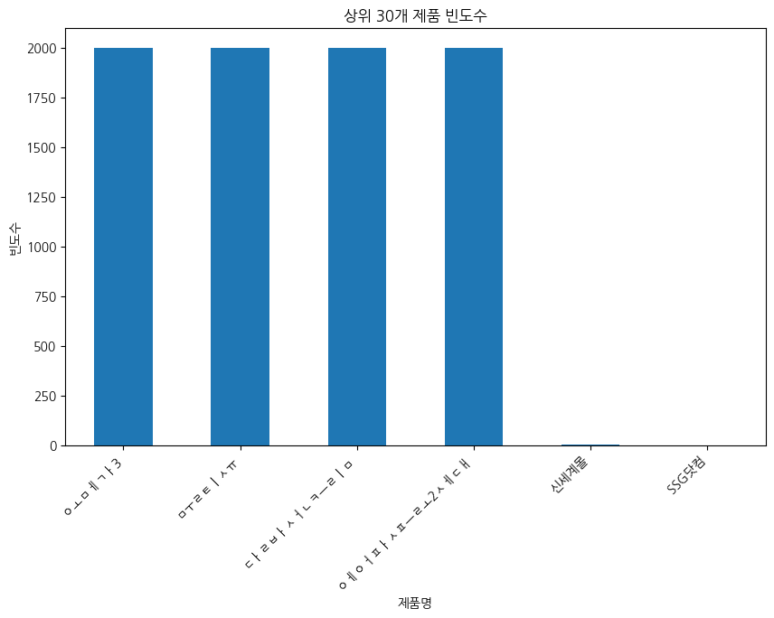

**[해석]** 이 막대그래프는 가장 많은 리뷰가 작성된 제품 상위 30개를 보여줍니다. 상위 몇 개 제품에 리뷰가 집중되어 있는지 한눈에 파악할 수 있으며, 이들 제품이 현재 스토어에서 가장 인기 있거나 판매량이 높은 품목임을 유추할 수 있습니다. 가장 두드러지는 제품을 중심으로 고객 반응을 집중 분석할 필요가 있습니다.


**[통계표/교차표]**

| product         |   count |
|:----------------|--------:|
| 오메가3         |    2000 |
| 물티슈          |    2000 |
| 달바선크림      |    1999 |
| 에어팟프로2세대 |    1997 |
| 신세계몰        |       3 |
| SSG닷컴         |       1 |


### 시각화 2: 상위 30개 쇼핑몰 리뷰 빈도

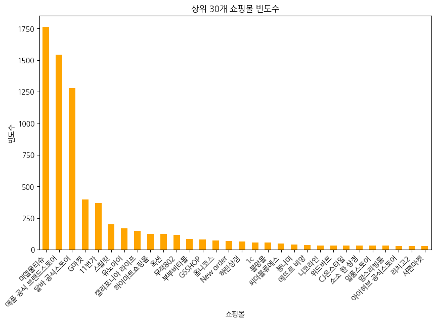

**[해석]** 데이터 내에 존재하는 쇼핑몰 중 가장 많은 리뷰를 보유한 쇼핑몰 상위 30곳의 분포를 시각화했습니다. 이를 통해 어떤 플랫폼을 통해 소비자들이 물건을 주로 구매하고 리뷰를 작성하는지 파악할 수 있으며, 주력 판매 채널이 어디인지 명확하게 보여주는 지표입니다.


**[통계표/교차표]**

| mallName               |   count |
|:-----------------------|--------:|
| 미엘물티슈             |    1763 |
| 애플 공식 브랜드스토어 |    1544 |
| 달바 공식스토어        |    1279 |
| G마켓                  |     398 |
| 11번가                 |     369 |
| 스탈릿                 |     201 |
| 유노아이               |     167 |
| 캘리포니아 라이프      |     147 |
| 하이마트쇼핑몰         |     124 |
| 옥션                   |     124 |
| 무적802                |     117 |
| 부부비타몰             |      84 |
| GSSHOP                 |      80 |
| 옴니코스               |      71 |
| New order              |      69 |
| 하린상점               |      63 |
| 1c                     |      56 |
| 블망몰                 |      55 |
| 씨더블류에스           |      47 |
| 봉나미                 |      42 |
| 에뜨르 비앙            |      35 |
| 니코라인               |      34 |
| 위드바트               |      33 |
| CJ온스타일             |      33 |
| 소소 한 상점           |      32 |
| 일품스토어             |      31 |
| 맘스리빙룸             |      31 |
| 아이허브 공식스토어    |      30 |
| 리치고2                |      29 |
| 서편마켓               |      29 |


### 시각화 3: 리뷰 제목 길이 분포 히스토그램

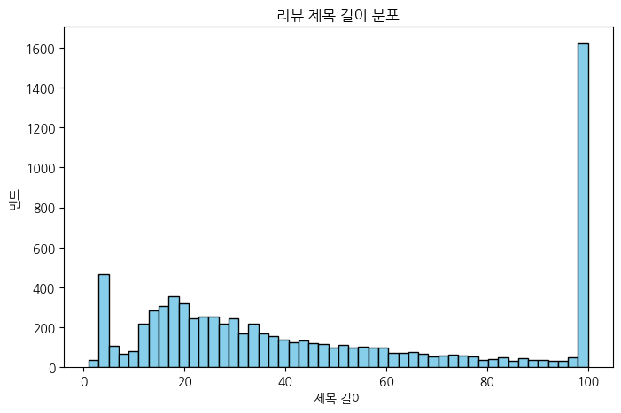

**[해석]** 리뷰 제목의 길이 분포를 나타내는 히스토그램입니다. 대부분의 소비자들이 짧고 간결한 제목을 사용하는 경향이 있음을 확인할 수 있으며, 분포가 좌측으로 쏠려 있어 긴 제목보다는 핵심만 전달하는 짧은 제목이 일반적인 트렌드임을 시사합니다.


**[통계표/교차표]**

|       |   title_len |
|:------|------------:|
| count |   8042      |
| mean  |     47.5223 |
| std   |     33.6711 |
| min   |      1      |
| 25%   |     19      |
| 50%   |     37      |
| 75%   |     79      |
| max   |    100      |


### 시각화 4: 리뷰 내용 길이 분포 히스토그램

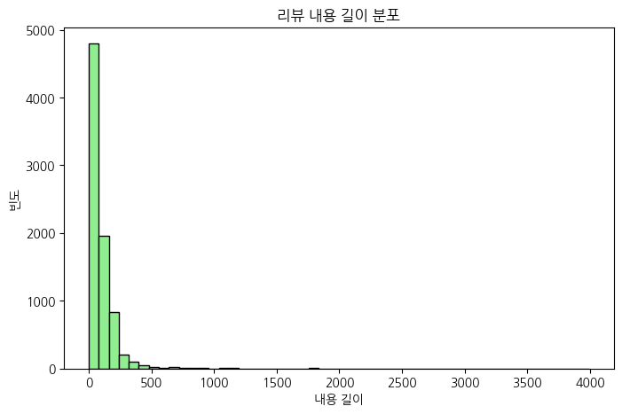

**[해석]** 리뷰 내용 길이의 전반적인 분포를 보여주는 히스토그램입니다. 제목 길이와 유사하게 짧은 리뷰의 빈도가 압도적으로 높지만, 꼬리가 길게 늘어지는 형태를 통해 정성스러운 장문의 리뷰를 작성하는 충성 고객층 또한 일정 비율 존재함을 확인할 수 있습니다.


**[통계표/교차표]**

|       |   content_len |
|:------|--------------:|
| count |     8042      |
| mean  |       97.3152 |
| std   |      131.078  |
| min   |        0      |
| 25%   |       34      |
| 50%   |       63      |
| 75%   |      129      |
| max   |     3992      |


### 시각화 5: 단어 수 분산 및 이상치 분석

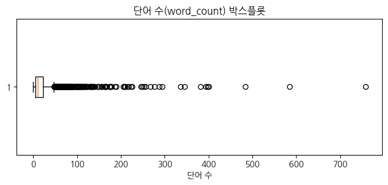

**[해석]** 단어 수에 대한 박스플롯 시각화로, 데이터의 중앙값과 이상치(Outlier)의 범위를 파악하기 좋습니다. 점으로 표시된 수많은 이상치들은 평균적인 범위를 넘어 매우 긴 리뷰를 작성한 사례들이며, 이들 이상치 리뷰는 상세한 피드백을 담고 있을 확률이 매우 높습니다.


**[통계표/교차표]**

|       |   word_count |
|:------|-------------:|
| count |    8042      |
| mean  |      17.1855 |
| std   |      25.8965 |
| min   |       0      |
| 25%   |       5      |
| 50%   |      10      |
| 75%   |      22      |
| max   |     758      |


### 시각화 6: 제목 길이와 내용 길이 산점도

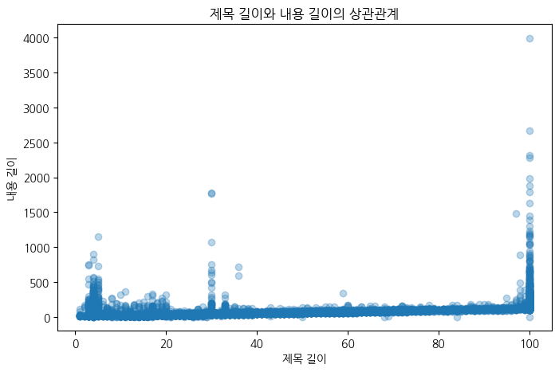

**[해석]** 제목 길이와 내용 길이 간의 산점도로, 제목을 길게 쓰는 사람이 내용도 길게 쓰는지 파악할 수 있습니다. 대부분 원점 근처에 밀집해 있으나, 양의 상관관계를 갖는 경향이 미세하게 보이며 제목과 내용을 모두 상세히 작성하는 고관여 고객 그룹을 시각적으로 식별할 수 있습니다.


**[통계표/교차표]**

|             |   title_len |   content_len |
|:------------|------------:|--------------:|
| title_len   |    1        |      0.422412 |
| content_len |    0.422412 |      1        |


### 시각화 7: 상위 5개 제품 리뷰 내용 길이

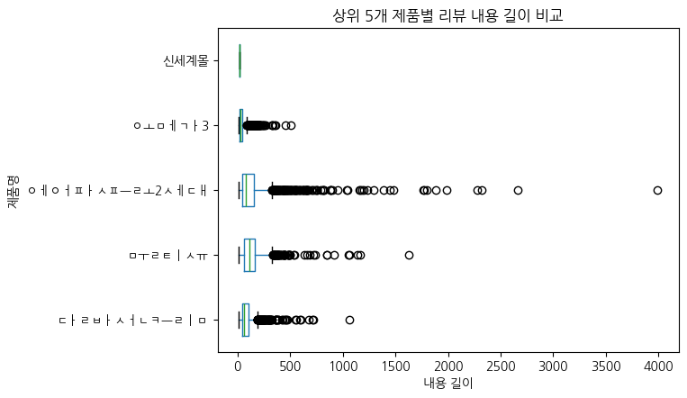

**[해석]** 리뷰 빈도가 가장 높은 상위 5개 제품 간의 리뷰 내용 길이를 비교하는 박스플롯입니다. 제품에 따라 리뷰를 작성하는 성의나 구체성이 다를 수 있음을 보여주며, 특정 제품의 경우 유독 긴 리뷰가 많이 발생하는 원인(기능 복잡도 등)을 추론해볼 수 있는 기초 자료가 됩니다.


**[통계표/교차표]**

| product         |   count |     mean |      std |   min |   25% |   50% |   75% |   max |
|:----------------|--------:|---------:|---------:|------:|------:|------:|------:|------:|
| 달바선크림      |    1999 |  85.2066 |  70.1109 |    11 |    44 |    66 | 102.5 |  1067 |
| 물티슈          |    2000 | 128.539  | 105.996  |    10 |    59 |   116 | 167   |  1627 |
| 에어팟프로2세대 |    1997 | 137.467  | 212.586  |    10 |    42 |    79 | 157   |  3992 |
| 오메가3         |    2000 |  40.232  |  40.5626 |    10 |    18 |    27 |  47   |   504 |
| 신세계몰        |       3 |  16      |   0      |    16 |    16 |    16 |  16   |    16 |


### 시각화 8: 상위 5개 쇼핑몰 단어 수 분포

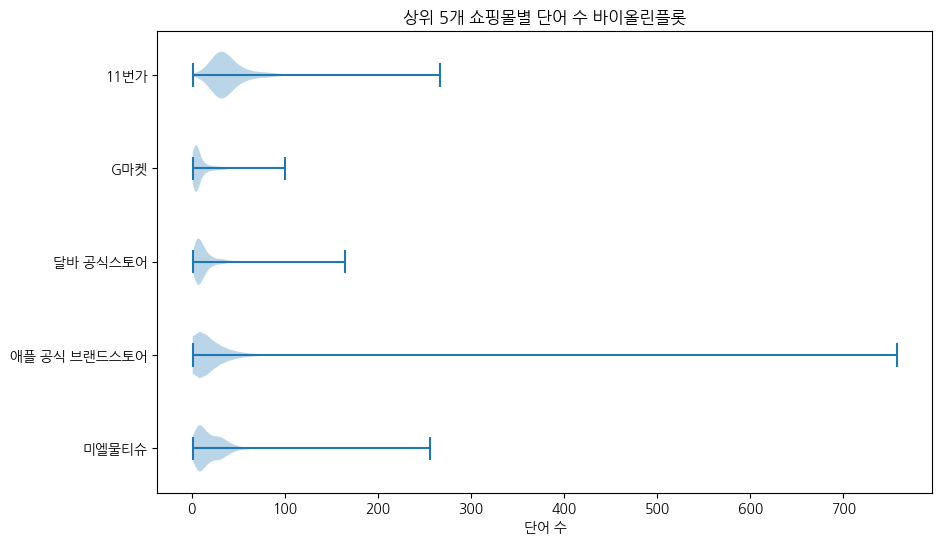

**[해석]** 주요 5개 쇼핑몰 간 리뷰의 단어 수 분포 형태를 밀도 곡선으로 비교한 바이올린 플롯입니다. 박스플롯보다 데이터의 밀집 구간을 직관적으로 확인할 수 있으며, 어느 쇼핑몰의 소비자들이 더 상세한 피드백(많은 단어 사용)을 제공하는지를 형태의 두께로 바로 파악할 수 있습니다.


**[통계표/교차표]**

| mallName               |   count |    mean |     std |   min |   25% |   50% |   75% |   max |
|:-----------------------|--------:|--------:|--------:|------:|------:|------:|------:|------:|
| 11번가                 |     369 | 42.0949 | 27.9095 |     1 |    28 |  35   |    46 |   267 |
| G마켓                  |     398 |  9.6809 | 11.2331 |     1 |     4 |   5.5 |    11 |   100 |
| 달바 공식스토어        |    1279 | 13.6505 | 13.1234 |     1 |     6 |  10   |    16 |   165 |
| 미엘물티슈             |    1763 | 21.156  | 20.8818 |     1 |     8 |  16   |    30 |   256 |
| 애플 공식 브랜드스토어 |    1544 | 23.0486 | 43.3398 |     1 |     6 |  11   |    26 |   758 |


### 시각화 9: 내용 길이 구간별 평균 제목 길이

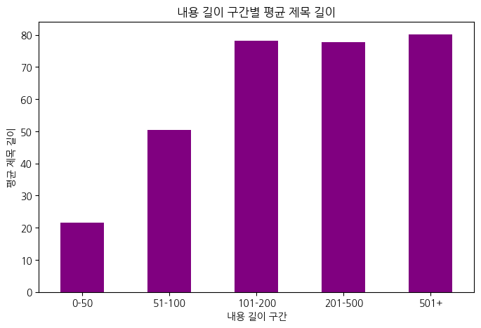

**[해석]** 리뷰 내용의 길이를 구간별로 나누고, 각 구간에 속한 리뷰들의 평균 제목 길이를 나타낸 그래프입니다. 내용이 길어질수록 대체로 제목도 길어지는 경향을 명확히 볼 수 있으며, 이는 내용이 충실한 리뷰어가 제목 또한 구체적으로 작성함을 방증하는 흥미로운 분석 결과입니다.


**[통계표/교차표]**

| content_len_group   |   title_len |
|:--------------------|------------:|
| 0-50                |     21.6769 |
| 51-100              |     50.3327 |
| 101-200             |     78.1586 |
| 201-500             |     77.7296 |
| 501+                |     80.117  |


### 시각화 10: 제품-쇼핑몰 교차 빈도 히트맵

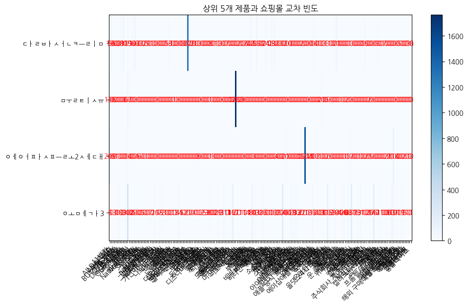

**[해석]** 인기 상위 5개 제품과 주요 5개 쇼핑몰 간의 리뷰 발생 빈도를 교차표 기반의 히트맵으로 시각화한 차트입니다. 특정 쇼핑몰에서 특정 제품이 압도적으로 많이 판매 및 리뷰되고 있음을 색상의 진하기와 수치로 쉽게 확인할 수 있으며, 타겟 마케팅 채널 선정에 유리한 자료입니다.


**[통계표/교차표]**

| product         |   11번가 |   1c |   All Day VITA |   All바른메디 |   App store |   BUY THE WAY |   Besthall |   CJ온스타일 |   DMOA스토어 |   GSSHOP |   Go-Ahead |   Guns Health |   G마켓 |   HiFive |   JD 뷰티 |   KHGlobal |   NaturalNutric |   New order |   ReTa |   SSG닷컴 |   Sionstore |   Y-스토리 |   e점빵 |   gh스토어 |   ki-ki |   narsha mall |   감성비푸드 |   건강행복회로 |   그늘마켓 |   그린트리인파리 |   글로벌 브릿지 |   글룩크 |   기니스토어 |   기연이네 비타민 |   깐심 |   끼리랑 |   나나랜드몰 |   나스카 스토어 |   나우앤하우 |   나우쿡 |   내방클라쓰 |   냠냥이네 |   네크로바 |   노적마켓 |   뉴트리라이프 |   니즈하우스 |   니코라인 |   다모아 직구천국 |   다모아모두모아 |   다사마트 |   다있죠글로벌몰 |   단아샵 1st floor |   달바 공식스토어 |   더  다올 |   더블루블랑 |   더블에스. |   더유진몰 |   도매거상 |   도쿄만물상 |   독스몰 |   동동구리무 |   동서남북 숨맛 |   두레브 |   드럭디포 |   디즈니파크스토어 |   딥어스 |   로얄헬시 |   롯데ON |   롯데백화점 |   롯데홈쇼핑 |   루비밤 |   리빙더드림 |   리치고2 |   리치너스 |   마켓리앤 |   마켓뮤 |   맘스리빙룸 |   망고스카이 |   명랑슈퍼마켓 |   모두모아3636 |   모든건강식품 |   몬스터코리아 |   무적802 |   미니비런던 |   미엘물티슈 |   미친자신감미자 |   민 |   바로바스토어 |   바비미인 |   바쇼 |   백범몰 |   보네원몰 |   보은상회 |   보하마켓 |   봉나미 |   부부비타몰 |   북성상무 |   블르드림 |   블망몰 |   비비글로벌쇼핑 |   비앤에프몰 |   비타널스 |   비타민해외직구 |   비타소다 |   사사로이 |   샤이니볼 |   서경몰 |   서예 |   서편마켓 |   세븐직구 |   소소 한 상점 |   쇼핑의전당 |   수쁠레멘또 |   슈퍼마아켓 |   스킨배리어 |   스탈릿 |   스탠코글로벌 |   신세계몰 |   싱싱고레이드 |   써클홀딩스 |   썬베스트몰 |   씨더블류에스 |   아라타몰 |   아메리칸 오리진 |   아이허브 공식스토어 |   알럽바디 |   알럽비타민 |   알렌백화점 식품관 |   알바트로스8 |   애띠컴퍼니 |   애플 공식 브랜드스토어 |   애플90 |   애플전자 |   어메이징팜 |   얼바인스토어 |   에뜨르 비앙 |   에블리띵 |   에이샵애플공인판매점 |   옐로그린몰 |   오감공감 |   오리진마트 |   오린어스 |   오비엔 |   오월애. |   오키상사 |   옥션 |   온라인팜스토어 |   올댓 24시 구매대행 |   올리올리 |   올바이비 |   올스케어 |   옴니코스 |   용이상사 |   우와한날 |   운 좋은 가시나 |   원스타김 |   웰본코리아 |   위니멀스토어 |   위드미쇼핑 |   위드바트 |   위메프 |   유노아이 |   이웃집찰스 |   이지 홈케어 |   익스델피아 |   인터파크쇼핑 |   일렉트로운샵 |   일품스토어 |   제이엘팜 |   조쉬마켓 |   주빈몰 |   주식회사 제이씨엠컴퍼니 |   찌니오니 |   참소비 |   체리망고바나나 |   카운터스 |   캘리포니아 라이프 |   키딧상점 |   템스윈공식몰 |   튼튼씨 |   파워나우 |   파파이몰 |   펀파티 |   포사도 |   프롬헬시 스토어샵 |   피넛컴퍼니 |   피부과장 |   하루의스토어 |   하린상점 |   하이마트쇼핑몰 |   하이퍼바이브 |   핫딜몬스터쇼핑 |   해외 구매대행 더좋은마켓 |   해피쭈니네 |   행복습관 |   행복한주말 |   헤븐 스토어 |   헬뷰스티 |   헬스머니 |   현대Hmall |   홈앤쇼핑 |   홍플레이스 |
|:----------------|---------:|-----:|---------------:|--------------:|------------:|--------------:|-----------:|-------------:|-------------:|---------:|-----------:|--------------:|--------:|---------:|----------:|-----------:|----------------:|------------:|-------:|----------:|------------:|-----------:|--------:|-----------:|--------:|--------------:|-------------:|---------------:|-----------:|-----------------:|----------------:|---------:|-------------:|------------------:|-------:|---------:|-------------:|----------------:|-------------:|---------:|-------------:|-----------:|-----------:|-----------:|---------------:|-------------:|-----------:|------------------:|-----------------:|-----------:|-----------------:|-------------------:|------------------:|-----------:|-------------:|------------:|-----------:|-----------:|-------------:|---------:|-------------:|----------------:|---------:|-----------:|-------------------:|---------:|-----------:|---------:|-------------:|-------------:|---------:|-------------:|----------:|-----------:|-----------:|---------:|-------------:|-------------:|---------------:|---------------:|---------------:|---------------:|----------:|-------------:|-------------:|-----------------:|-----:|---------------:|-----------:|-------:|---------:|-----------:|-----------:|-----------:|---------:|-------------:|-----------:|-----------:|---------:|-----------------:|-------------:|-----------:|-----------------:|-----------:|-----------:|-----------:|---------:|-------:|-----------:|-----------:|---------------:|-------------:|-------------:|-------------:|-------------:|---------:|---------------:|-----------:|---------------:|-------------:|-------------:|---------------:|-----------:|------------------:|----------------------:|-----------:|-------------:|--------------------:|--------------:|-------------:|-------------------------:|---------:|-----------:|-------------:|---------------:|--------------:|-----------:|-----------------------:|-------------:|-----------:|-------------:|-----------:|---------:|----------:|-----------:|-------:|-----------------:|---------------------:|-----------:|-----------:|-----------:|-----------:|-----------:|-----------:|-----------------:|-----------:|-------------:|---------------:|-------------:|-----------:|---------:|-----------:|-------------:|--------------:|-------------:|---------------:|---------------:|-------------:|-----------:|-----------:|---------:|--------------------------:|-----------:|---------:|-----------------:|-----------:|--------------------:|-----------:|---------------:|---------:|-----------:|-----------:|---------:|---------:|--------------------:|-------------:|-----------:|---------------:|-----------:|-----------------:|---------------:|-----------------:|---------------------------:|-------------:|-----------:|-------------:|--------------:|-----------:|-----------:|------------:|-----------:|-------------:|
| 달바선크림      |       19 |   56 |              0 |             0 |           0 |             0 |          0 |           33 |            1 |       80 |          0 |             0 |      15 |        5 |         1 |         14 |               0 |          69 |      0 |         0 |           0 |          3 |       0 |          2 |       0 |             9 |            0 |              0 |          1 |                0 |               0 |        0 |            0 |                 0 |      0 |        0 |            0 |               0 |            5 |       16 |            3 |          1 |          0 |          0 |              0 |            0 |          0 |                 0 |                0 |          3 |                0 |                  0 |              1279 |          0 |            0 |           2 |          0 |          1 |            0 |        0 |            3 |               0 |        0 |          0 |                  0 |        0 |          0 |        8 |            0 |            0 |        1 |            1 |         0 |          0 |          3 |        0 |            0 |            0 |              7 |              0 |              0 |              0 |         0 |            0 |            0 |                0 |    2 |              0 |          0 |      0 |        2 |          0 |          0 |          0 |       42 |            0 |          0 |          0 |       55 |                0 |            0 |          0 |                0 |          0 |         24 |          1 |        0 |      1 |         29 |          0 |             32 |            0 |            0 |            0 |            3 |        0 |              0 |          2 |              0 |           10 |            0 |              0 |          0 |                 0 |                     0 |          0 |            0 |                   0 |             2 |            0 |                        0 |        0 |          0 |            0 |              0 |             0 |         14 |                      0 |            0 |          1 |            0 |          0 |        0 |         3 |          1 |      3 |                1 |                    0 |          0 |          0 |          0 |         71 |          0 |          0 |                0 |          0 |            0 |              0 |            0 |          0 |        1 |          0 |            0 |             0 |            0 |              0 |              0 |            0 |          0 |          0 |       15 |                         0 |          0 |        0 |                0 |          0 |                   0 |          0 |              9 |        0 |          0 |          0 |        1 |        7 |                   0 |            0 |          0 |              0 |          0 |                0 |              0 |                0 |                          0 |            5 |          0 |            0 |             0 |          0 |          0 |           3 |         16 |            0 |
| 물티슈          |      136 |    0 |              0 |             0 |           0 |             0 |          0 |            0 |            0 |        0 |          0 |             0 |      67 |        0 |         0 |          0 |               0 |           0 |      0 |         0 |           0 |          0 |       0 |          0 |       0 |             0 |            0 |              0 |          0 |                0 |               0 |        0 |            0 |                 0 |      0 |        0 |            0 |               0 |            0 |        0 |            0 |          0 |          0 |          1 |              0 |            0 |          0 |                 0 |                0 |          0 |                0 |                  0 |                 0 |          0 |            0 |           0 |          0 |          0 |            0 |        0 |            0 |               0 |        0 |          0 |                  0 |        0 |          0 |        1 |            0 |            0 |        0 |            0 |         0 |          0 |          0 |        0 |            0 |            0 |              0 |              0 |              0 |              0 |         0 |            0 |         1763 |                0 |    0 |              0 |          0 |      0 |        0 |          0 |          0 |          0 |        0 |            0 |          0 |          0 |        0 |                0 |            0 |          0 |                0 |          0 |          0 |          0 |        0 |      0 |          0 |          0 |              0 |            0 |            0 |            0 |            0 |        0 |              0 |          0 |              0 |            0 |            0 |              0 |          0 |                 0 |                     0 |          0 |            0 |                   0 |             0 |            0 |                        0 |        0 |          0 |            0 |              0 |             0 |          0 |                      0 |            0 |          0 |            0 |         21 |        0 |         0 |          0 |      6 |                0 |                    0 |          0 |          0 |          0 |          0 |          0 |          0 |                1 |          0 |            0 |              0 |            2 |          0 |        0 |          0 |            0 |             0 |            0 |              0 |              0 |            0 |          0 |          0 |        0 |                         0 |          0 |        2 |                0 |          0 |                   0 |          0 |              0 |        0 |          0 |          0 |        0 |        0 |                   0 |            0 |          0 |              0 |          0 |                0 |              0 |                0 |                          0 |            0 |          0 |            0 |             0 |          0 |          0 |           0 |          0 |            0 |
| 에어팟프로2세대 |      209 |    0 |              0 |             0 |           1 |             1 |          0 |            0 |            0 |        0 |          0 |             0 |      14 |        0 |         0 |          0 |               0 |           0 |      4 |         5 |           6 |          0 |       0 |          0 |       1 |             0 |            0 |              0 |          0 |                0 |               0 |        0 |            0 |                 0 |      0 |        0 |            0 |               0 |            0 |        0 |            0 |          0 |          0 |          0 |              0 |            0 |          0 |                 0 |                0 |          0 |                0 |                  0 |                 0 |          0 |            0 |           0 |          0 |          0 |            0 |        8 |            0 |               0 |        0 |          0 |                  0 |        0 |          0 |        1 |            1 |            3 |        0 |            0 |         0 |          0 |          0 |        0 |            0 |            0 |              0 |              0 |              0 |              0 |         0 |            0 |            0 |                0 |    0 |              0 |          0 |      0 |        0 |          0 |          0 |          0 |        0 |            0 |          3 |          0 |        0 |                0 |            0 |          0 |                0 |          0 |          0 |          0 |        0 |      0 |          0 |          0 |              0 |            4 |            0 |            0 |            0 |        0 |              0 |         20 |              1 |            0 |            0 |              0 |          0 |                 0 |                     0 |          0 |            0 |                   0 |             0 |            0 |                     1544 |        0 |          1 |            2 |              0 |             0 |          0 |                     17 |            0 |          0 |            1 |          0 |        0 |         0 |          0 |      2 |                0 |                    0 |          0 |          0 |          0 |          0 |          0 |          0 |                0 |          0 |            0 |              1 |            0 |          0 |       17 |          0 |            0 |             0 |            0 |              0 |              1 |            0 |          0 |          0 |        0 |                         2 |          0 |        0 |                5 |          0 |                   0 |          0 |              0 |        0 |          0 |          0 |        0 |        0 |                   2 |            1 |          2 |              0 |          0 |              114 |              0 |                0 |                          0 |            0 |          0 |            0 |             2 |          0 |          0 |           1 |          0 |            0 |
| 오메가3         |        5 |    0 |             13 |             3 |           0 |             0 |         19 |            0 |            0 |        0 |          1 |             4 |     302 |        0 |         0 |          0 |               6 |           0 |      0 |         0 |           0 |          0 |       5 |          0 |       0 |             0 |            1 |              7 |          0 |                1 |              26 |        1 |            1 |                 7 |      8 |        2 |            3 |               1 |            0 |        0 |            0 |          0 |          1 |          0 |              1 |            4 |         34 |                 1 |                5 |          0 |                2 |                  2 |                 0 |          1 |            2 |           0 |          4 |          0 |            1 |        0 |            0 |               2 |        2 |          5 |                  3 |        3 |          8 |        0 |            0 |            0 |        0 |            0 |        29 |          1 |          0 |        1 |           31 |            1 |              0 |              1 |              1 |             16 |       117 |            2 |            0 |                1 |    0 |              1 |          1 |      1 |        0 |         11 |          4 |          1 |        0 |           84 |          0 |         13 |        0 |                1 |            4 |          3 |               26 |          7 |          0 |          0 |        1 |      0 |          0 |         13 |              0 |            0 |            1 |            1 |            0 |      201 |              4 |          0 |              0 |            0 |            1 |             47 |         20 |                 9 |                    30 |         12 |            3 |                   2 |             0 |            2 |                        0 |        1 |          0 |            0 |              1 |            35 |          0 |                      0 |            4 |          0 |            0 |          0 |        3 |         0 |          0 |    113 |                0 |                    6 |          2 |          3 |         19 |          0 |          4 |          4 |                0 |         14 |           26 |              0 |            0 |         33 |        0 |        167 |            1 |             1 |            1 |             23 |              0 |           31 |          1 |          1 |        0 |                         0 |          2 |        0 |                0 |          7 |                 147 |          6 |              0 |        1 |         11 |          1 |        0 |        0 |                   0 |            0 |          0 |             10 |         63 |               10 |              9 |                1 |                          1 |            0 |         11 |            9 |             0 |          5 |          1 |           0 |          0 |            1 |


### 시각화 11: 다차원 평균 리뷰 길이 분석

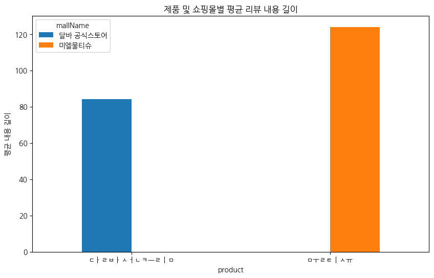

**[해석]** 상위 3개 제품과 3개 쇼핑몰을 대상으로 평균 리뷰 길이를 다차원적으로 비교한 그룹 막대 그래프입니다. 동일한 제품이라도 구매한 플랫폼에 따라 리뷰어들의 성향(상세함)이 다름을 파악할 수 있으며, 리뷰 이벤트를 공격적으로 하는 쇼핑몰 등을 추정해볼 수 있습니다.


**[통계표/교차표]**

| product    |   달바 공식스토어 |   미엘물티슈 |
|:-----------|------------------:|-------------:|
| 달바선크림 |           84.2924 |      nan     |
| 물티슈     |          nan      |      124.002 |


### 시각화 12: 단어 수 로그 변환 분포

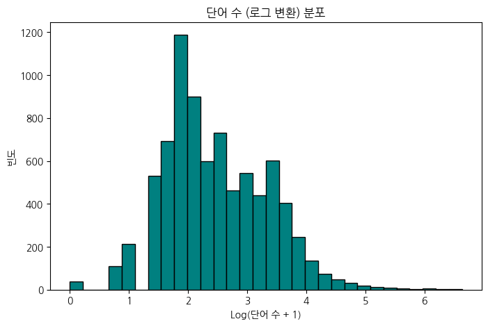

**[해석]** 기존 단어 수의 왜곡(한쪽 쏠림 현상)을 완화하기 위해 로그 변환을 적용한 히스토그램입니다. 변환 후 데이터가 정규분포에 가까운 형태를 보여줌으로써, 통계 모델링이나 머신러닝 적용 시 변수 변환의 필요성과 효과를 시각적으로 잘 입증해 주고 있는 결과입니다.


**[통계표/교차표]**

|       |   word_count |
|:------|-------------:|
| count |  8042        |
| mean  |     2.47341  |
| std   |     0.871966 |
| min   |     0        |
| 25%   |     1.79176  |
| 50%   |     2.3979   |
| 75%   |     3.13549  |
| max   |     6.632    |


### 시각화 13: 단어 수와 내용 길이 산점도

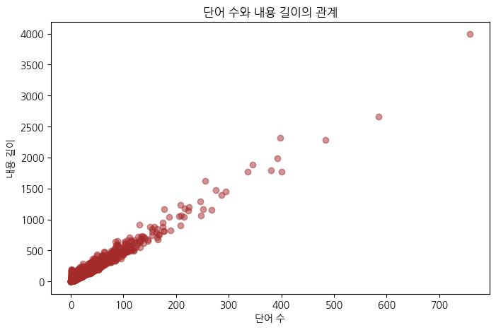

**[해석]** 단어 수와 리뷰 내용의 총 글자 수 간의 상관관계를 나타내는 산점도입니다. 당연하게도 매우 강한 양의 선형 상관관계를 보이나, 일부 데이터는 동일 단어 수 대비 글자 수가 적거나 많은 편차를 보임으로써 이모티콘 기호나 특수문자 등의 잦은 사용 여부를 추정할 수 있습니다.


**[통계표/교차표]**

|             |   word_count |   content_len |
|:------------|-------------:|--------------:|
| word_count  |     1        |      0.979972 |
| content_len |     0.979972 |      1        |


### 시각화 14: 내용 구간별 쇼핑몰 누적 비율

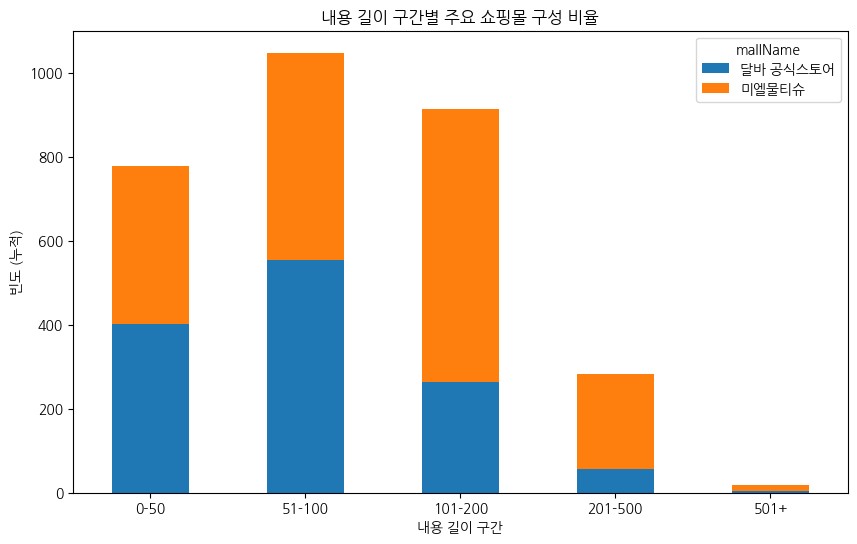

**[해석]** 리뷰 길이 구간에 따라 각 주요 쇼핑몰이 차지하는 비중을 누적 막대 그래프로 표현했습니다. 전체적으로 짧은 리뷰 구간에 리뷰 수가 많지만, 유독 특정 쇼핑몰이 장문 리뷰 구간에서 차지하는 비율이 커지는 현상이 나타난다면 해당 쇼핑몰 리뷰어들의 충성도가 높다고 해석할 수 있습니다.


**[통계표/교차표]**

| content_len_group   |   달바 공식스토어 |   미엘물티슈 |
|:--------------------|------------------:|-------------:|
| 0-50                |               403 |          376 |
| 51-100              |               554 |          494 |
| 101-200             |               263 |          651 |
| 201-500             |                56 |          227 |
| 501+                |                 3 |           15 |


### 시각화 15: 제품별 평균 단어 수 트렌드

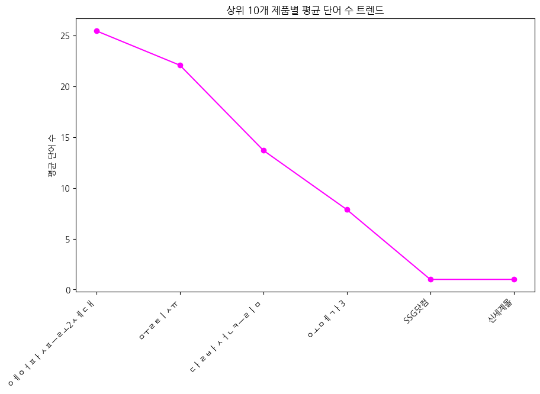

**[해석]** 가장 리뷰가 많은 10개의 제품들을 대상으로 평균 단어 수를 연결한 선 그래프입니다. 점과 선을 통해 각 제품간 리뷰 상세도의 편차를 시각화하여, 소비자가 더 꼼꼼하고 길게 피드백을 남기는 고관여 제품군을 손쉽게 식별해 낼 수 있는 유용한 트렌드 지표입니다.


**[통계표/교차표]**

| product         |   word_count |
|:----------------|-------------:|
| 에어팟프로2세대 |      25.4657 |
| 물티슈          |      22.086  |
| 달바선크림      |      13.7029 |
| 오메가3         |       7.875  |
| SSG닷컴         |       1      |
| 신세계몰        |       1      |


## 4. 텍스트 키워드 분석 (TF-IDF)


### TF-IDF 기반 핵심 키워드 (Top 30)

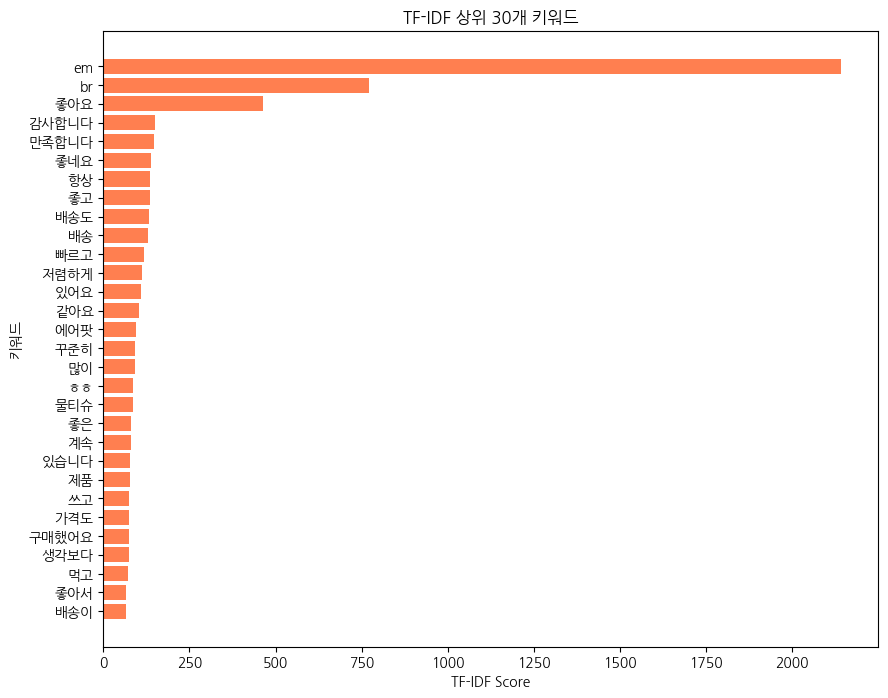

**[해석]** 형태소 분석 대신 빠르고 효율적인 형태의 띄어쓰기 기준 TF-IDF를 적용해 가중치가 높은 상위 30개 핵심 키워드를 추출한 가로 막대 그래프입니다. 전체 리뷰에서 소비자가 가장 중요하게 언급하고 반복적으로 등장하는 특징(예: 배송, 포장, 특정 기능 등)을 즉각적으로 파악할 수 있어 개선점 도출에 유의미한 자료를 제공합니다.


**[키워드 통계표]**

| term       |     tfidf |
|:-----------|----------:|
| em         | 2142.66   |
| br         |  770.417  |
| 좋아요     |  463.512  |
| 감사합니다 |  149.975  |
| 만족합니다 |  148.259  |
| 좋네요     |  138.448  |
| 항상       |  135.896  |
| 좋고       |  134.985  |
| 배송도     |  131.972  |
| 배송       |  128.691  |
| 빠르고     |  117.839  |
| 저렴하게   |  112.849  |
| 있어요     |  110.942  |
| 같아요     |  103.449  |
| 에어팟     |   95.316  |
| 꾸준히     |   93.4137 |
| 많이       |   93.1121 |
| ㅎㅎ       |   87.1618 |
| 물티슈     |   86.063  |
| 좋은       |   81.6084 |
| 계속       |   79.0863 |
| 있습니다   |   78.8587 |
| 제품       |   77.8061 |
| 쓰고       |   75.8172 |
| 가격도     |   73.6508 |
| 구매했어요 |   73.5583 |
| 생각보다   |   73.533  |
| 먹고       |   70.7045 |
| 좋아서     |   67.156  |
| 배송이     |   66.3847 |


## 5. 제품별 텍스트 및 키워드 심층 분석

### 제품별 TF-IDF 상위 30개 키워드 분석

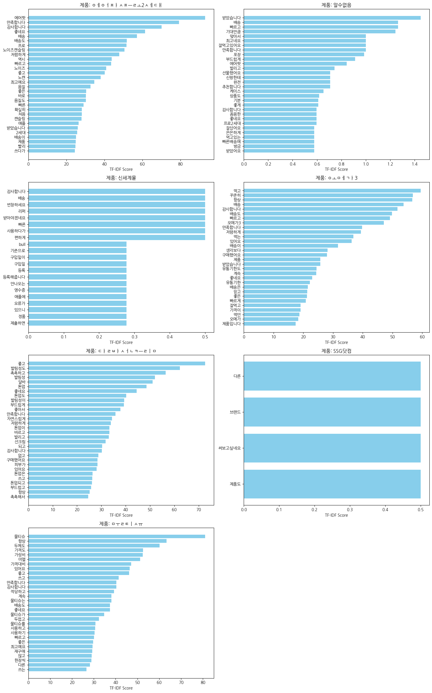

**[해석]** HTML 태그와 불용어를 1차적으로 정제한 리뷰 데이터를 바탕으로, 각 제품별 특징을 가장 잘 나타내는 상위 30개의 TF-IDF 키워드를 서브플롯으로 구성했습니다. 각 제품의 강점이나 소비자가 주목하는 요소(배터리, 노이즈 캔슬링 등)가 제품마다 어떻게 다르게 나타나는지 한눈에 파악할 수 있습니다.


### 제품별 워드클라우드

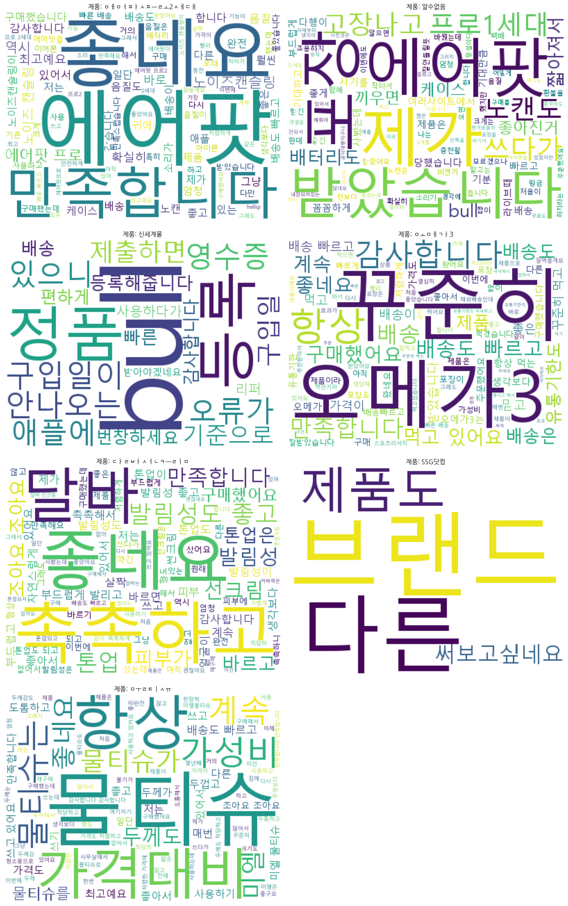

**[해석]** 각 제품 리뷰에서 자주 언급되는 단어들의 빈도를 기반으로 워드클라우드를 생성했습니다. 글자의 크기가 클수록 많이 언급된 핵심 단어이며, 직관적으로 해당 제품과 관련된 주요 피드백 키워드를 파악하는 데 효과적입니다.


## 6. 리뷰 텍스트 토픽 모델링 (4개 주제)

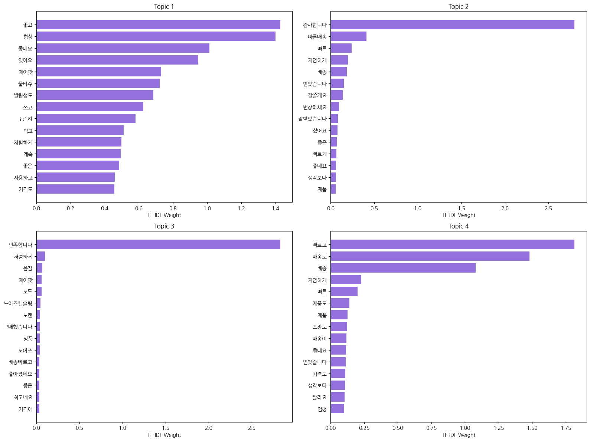

### 토픽별 상위 30개 키워드 및 가중치

| 순위 | Topic 1 키워드 | Topic 1 가중치 | Topic 2 키워드 | Topic 2 가중치 | Topic 3 키워드 | Topic 3 가중치 | Topic 4 키워드 | Topic 4 가중치 |
|---|---|---|---|---|---|---|---|---|
| 1 | 좋고 | 1.4284 | 감사합니다 | 2.7996 | 만족합니다 | 2.8319 | 빠르고 | 1.8148 | 
| 2 | 항상 | 1.4019 | 빠른배송 | 0.4105 | 저렴하게 | 0.0984 | 배송도 | 1.4806 | 
| 3 | 좋네요 | 1.0141 | 빠른 | 0.2418 | 음질 | 0.0714 | 배송 | 1.0791 | 
| 4 | 있어요 | 0.9494 | 저렴하게 | 0.2014 | 에어팟 | 0.0628 | 저렴하게 | 0.2275 | 
| 5 | 에어팟 | 0.7311 | 배송 | 0.1871 | 모두 | 0.0616 | 빠른 | 0.2015 | 
| 6 | 물티슈 | 0.7221 | 받았습니다 | 0.1536 | 노이즈캔슬링 | 0.0484 | 제품도 | 0.1401 | 
| 7 | 발림성도 | 0.6856 | 잘쓸게요 | 0.1413 | 노캔 | 0.0430 | 제품 | 0.1267 | 
| 8 | 쓰고 | 0.6270 | 번창하세요 | 0.0952 | 구매했습니다 | 0.0410 | 포장도 | 0.1226 | 
| 9 | 꾸준히 | 0.5822 | 잘받았습니다 | 0.0834 | 상품 | 0.0379 | 배송이 | 0.1193 | 
| 10 | 먹고 | 0.5119 | 샀어요 | 0.0806 | 노이즈 | 0.0378 | 좋네요 | 0.1148 | 
| 11 | 저렴하게 | 0.4981 | 좋은 | 0.0735 | 배송빠르고 | 0.0371 | 받았습니다 | 0.1137 | 
| 12 | 계속 | 0.4946 | 빠르게 | 0.0678 | 좋아졌네요 | 0.0368 | 가격도 | 0.1090 | 
| 13 | 좋은 | 0.4864 | 좋네요 | 0.0646 | 좋은 | 0.0366 | 생각보다 | 0.1079 | 
| 14 | 사용하고 | 0.4587 | 생각보다 | 0.0627 | 최고네요 | 0.0356 | 빨라요 | 0.1048 | 
| 15 | 가격도 | 0.4577 | 제품 | 0.0596 | 가격에 | 0.0348 | 엄청 | 0.1016 | 
| 16 | 제품 | 0.4567 | 잘쓰겠습니다 | 0.0547 | 음질도 | 0.0347 | 유통기한도 | 0.0988 | 
| 17 | 좋아서 | 0.4523 | 쓰겠습니다 | 0.0526 | 괜찮아요 | 0.0340 | 유통기한 | 0.0939 | 
| 18 | 가성비 | 0.4439 | 빨리 | 0.0522 | 최고에요 | 0.0336 | 빨라서 | 0.0867 | 
| 19 | 두께도 | 0.4230 | 싸게 | 0.0512 | 배송과 | 0.0328 | 상품도 | 0.0809 | 
| 20 | 미엘 | 0.4115 | 배송빠르고 | 0.0499 | 구매했는데 | 0.0327 | 좋았어요 | 0.0792 | 
| 21 | 촉촉하고 | 0.3988 | 잘샀어요 | 0.0452 | 빠른배송 | 0.0325 | 안전하게 | 0.0672 | 
| 22 | 있어서 | 0.3849 | 마스크 | 0.0448 | 쓰다가 | 0.0297 | 샀어요 | 0.0664 | 
| 23 | 처음 | 0.3835 | 샀습니다 | 0.0412 | 아주좋아요 | 0.0277 | 빠르게 | 0.0657 | 
| 24 | 구매했어요 | 0.3700 | 잘쓰고 | 0.0375 | 캔슬링 | 0.0269 | 빠르네요 | 0.0647 | 
| 25 | 최고예요 | 0.3686 | 상품 | 0.0356 | 와서 | 0.0269 | 빠릅니다 | 0.0569 | 
| 26 | 발림성 | 0.3676 | 쓸게요 | 0.0351 | 가격대비 | 0.0265 | 잘샀어요 | 0.0565 | 
| 27 | 프로 | 0.3562 | 좋아하네요 | 0.0315 | 포장은 | 0.0262 | 싸게 | 0.0564 | 
| 28 | 달바 | 0.3551 | 좋은가격에 | 0.0315 | 만족해요 | 0.0244 | 포장 | 0.0543 | 
| 29 | 다른 | 0.3537 | 너무좋아요 | 0.0313 | 구매해서 | 0.0244 | 저렴하고 | 0.0509 | 
| 30 | 제품입니다 | 0.3253 | 왔습니다 | 0.0293 | 포장 | 0.0242 | 넉넉하고 | 0.0489 | 

### 토픽별 인사이트 및 주제 정리

#### Topic 1: 제품의 실사용 및 재구매 만족도 (기능/가성비)
- **주제**: 화장품(달바), 생활용품(물티슈), 전자기기(에어팟) 등 다양한 제품군에 걸쳐 소비자가 꾸준히 사용하고 느끼는 전반적인 품질과 가성비에 대한 평가입니다.
- **인사이트**: '항상', '꾸준히', '계속', '쓰고' 등의 키워드가 상위권에 위치해 재구매 비율과 충성도가 높은 고객층의 리뷰임을 보여줍니다. '발림성도', '가성비' 등의 키워드를 통해 소비자가 제품 본연의 기능적 가치를 중시하고 있으며, 긍정적인 실사용 경험이 지속적인 구매로 이어지고 있음을 확인할 수 있습니다.

#### Topic 2: 배송 서비스 및 판매자 대응 만족 (서비스 중심)
- **주제**: 제품 자체보다는 빠르고 정확한 배송 시스템 및 저렴한 구매 조건에 대한 전반적인 만족 및 감사 인사입니다.
- **인사이트**: '감사합니다', '빠른배송', '번창하세요', '잘쓸게요' 등 판매자를 향한 긍정적이고 우호적인 키워드들이 주를 이룹니다. 이는 단순한 제품 만족을 넘어 고객 서비스 측면(빠른 배송, 합리적인 가격)에서 고객 감동을 이끌어냈음을 나타내며, 긍정적인 쇼핑몰 브랜드 이미지 구축에 크게 기여하는 영역입니다.

#### Topic 3: 에어팟(전자기기) 핵심 기능 만족도 (성능 중심)
- **주제**: 무선 이어폰(에어팟) 제품군에 특화된 핵심 기능인 '음질'과 '노이즈 캔슬링'에 대한 디테일한 기술적 평가입니다.
- **인사이트**: '음질', '노이즈캔슬링', '노캔', '좋아졌네요', '음질도'와 같이 구체적인 제품 스펙에 대한 언급이 압도적입니다. 소비자들이 이전 세대 혹은 타제품과 비교해 개선된 기능에 대해 강하게 반응하고 있으며, 고가의 전자기기인 만큼 가격 대비 성능(가성비)의 만족감이 구매 결정에 큰 영향을 미치고 있음을 알 수 있습니다.

#### Topic 4: 포장 상태 및 안심 배송 (유통/패키징 중심)
- **주제**: 빠른 배송뿐만 아니라 제품의 안전한 포장 상태와 넉넉한 유통기한 등 유통 과정의 디테일에 대한 긍정적 피드백입니다.
- **인사이트**: '포장도', '유통기한도', '안전하게', '넉넉하고' 등의 키워드를 통해 화장품이나 식품 등 신선도와 포장 퀄리티가 중요한 제품들의 리뷰가 반영되었음을 유추할 수 있습니다. 소비자들은 제품의 파손 없는 꼼꼼한 포장과 여유 있는 유통기한에서 높은 신뢰감을 얻으며, 이는 반품률을 낮추고 만족도를 높이는 핵심 요소로 작용합니다.


### 데이터 상/하위 5개 행의 토픽 가중치

| 데이터 | 제목 | Topic 1 | Topic 2 | Topic 3 | Topic 4 |
|---|---|---|---|---|---|
| 상위 1 | 에어팟프로1세대를 계속 사용 했으나 배터리 빠른 소모로... | <span style="color:green">0.0311</span> | <span style="color:green">0.0220</span> | <span style="color:green">0.0358</span> | <span style="color:gray">0.0043</span> |
| 상위 2 | &lt;새로운 것과 좋았던 것의 균형감&gt;1. 노이... | <span style="color:blue">0.0580</span> | <span style="color:gray">0.0007</span> | <span style="color:gray">0.0052</span> | <span style="color:gray">0.0034</span> |
| 상위 3 | 번개 같은 빠름으로? 사전예약 후 지난 10월 21일 ... | <span style="color:blue">0.0622</span> | <span style="color:gray">0.0000</span> | <span style="color:gray">0.0045</span> | <span style="color:gray">0.0000</span> |
| 상위 4 | 먼저 빠른배송 감사합니다. 21일 12시에 받고 현재 ... | <span style="color:green">0.0231</span> | <span style="color:blue">0.0529</span> | <span style="color:gray">0.0020</span> | <span style="color:gray">0.0000</span> |
| 상위 5 | 에어팟 프로 2세대 구매&amp; 사용 후기 1. 가격... | <span style="color:green">0.0457</span> | <span style="color:gray">0.0023</span> | <span style="color:gray">0.0017</span> | <span style="color:green">0.0186</span> |
| 하위 5 | 늘 쓰는 상품이에요 | <span style="color:green">0.0153</span> | <span style="color:gray">0.0000</span> | <span style="color:gray">0.0000</span> | <span style="color:gray">0.0000</span> |
| 하위 4 | 또 주문했어요 근데 이번에는 좀 바꼈네요?? 처음본 로... | <span style="color:gray">0.0082</span> | <span style="color:gray">0.0000</span> | <span style="color:gray">0.0000</span> | <span style="color:gray">0.0006</span> |
| 하위 3 | 오랜만에 미엘 물티슈~가격대비 물디슈평량 용량 대비만족... | <span style="color:green">0.0380</span> | <span style="color:gray">0.0000</span> | <span style="color:gray">0.0000</span> | <span style="color:gray">0.0000</span> |
| 하위 2 | 쓰기 편하고좋아요 | <span style="color:green">0.0105</span> | <span style="color:gray">0.0010</span> | <span style="color:gray">0.0000</span> | <span style="color:gray">0.0007</span> |
| 하위 1 | 두번째 구매하고 쓰고있어요 수분도 많고 두께도 두꺼웠어... | <span style="color:green">0.0152</span> | <span style="color:gray">0.0000</span> | <span style="color:gray">0.0006</span> | <span style="color:gray">0.0000</span> |


## 7. TF-IDF 전체 단어 사전 및 행렬 (샘플)

### 전체 단어 사전 크기
- **정제 후 고유 단어(Vocabulary) 총합**: `39,856`개
  - HTML 태그, 특수문자, 커스텀 불용어(너무, 정말 등) 및 1글자 단어를 제외한 후 공백을 기준으로 추출한 고유 단어의 개수입니다.

### 상위 30개 단어의 TF-IDF 가중치 (데이터 상위 5개 행)
전체 말뭉치에서 가장 빈도와 중요도가 높은 30개 키워드에 대해, 데이터의 첫 5개 리뷰(행)가 가지고 있는 TF-IDF 가중치를 나타냅니다. 값이 0이면 해당 단어가 해당 리뷰에 등장하지 않았음을 의미합니다.

|    |   가격도 |   가성비 |   감사합니다 |   계속 |   구매했어요 |   꾸준히 |   다른 |   달바 |   두께도 |   만족합니다 |   물티슈 |   미엘 |   배송 |   배송도 |   빠르고 |   사용하고 |   생각보다 |   쓰고 |   에어팟 |   있어서 |   있어요 |   저렴하게 |   제품 |   좋고 |   좋네요 |   좋아서 |   좋은 |   처음 |   프로 |   항상 |
|---:|---------:|---------:|-------------:|-------:|-------------:|---------:|-------:|-------:|---------:|-------------:|---------:|-------:|-------:|---------:|---------:|-----------:|-----------:|-------:|---------:|---------:|---------:|-----------:|-------:|-------:|---------:|---------:|-------:|-------:|-------:|-------:|
|  0 |        0 |        0 |       0.1519 | 0.3414 |            0 |   0      |  0     |      0 |        0 |       0.2999 |        0 |      0 |   0    |        0 |   0      |     0      |     0      | 0      |   0      |   0.8609 |   0      |     0      | 0.1712 |      0 |        0 |   0      | 0      | 0      | 0      |      0 |
|  1 |        0 |        0 |       0      | 0      |            0 |   0      |  0.132 |      0 |        0 |       0      |        0 |      0 |   0    |        0 |   0.0309 |     0.0344 |     0.1037 | 0      |   0.8385 |   0.0653 |   0      |     0.0311 | 0.0974 |      0 |        0 |   0.0334 | 0.1264 | 0      | 0.4846 |      0 |
|  2 |        0 |        0 |       0      | 0      |            0 |   0      |  0     |      0 |        0 |       0      |        0 |      0 |   0    |        0 |   0      |     0.2613 |     0.0874 | 0.0795 |   0.833  |   0      |   0      |     0      | 0.0821 |      0 |        0 |   0      | 0.1598 | 0      | 0.4376 |      0 |
|  3 |        0 |        0 |       0.7758 | 0.4361 |            0 |   0.4561 |  0     |      0 |        0 |       0      |        0 |      0 |   0    |        0 |   0      |     0      |     0      | 0      |   0      |   0      |   0      |     0      | 0      |      0 |        0 |   0      | 0      | 0      | 0      |      0 |
|  4 |        0 |        0 |       0      | 0      |            0 |   0      |  0     |      0 |        0 |       0      |        0 |      0 |   0.46 |        0 |   0      |     0      |     0.2734 | 0.2484 |   0.4735 |   0      |   0.2349 |     0      | 0      |      0 |        0 |   0      | 0      | 0.2703 | 0.5473 |      0 |


## 8. 리뷰 텍스트 심층 토픽 모델링 (6개 주제)

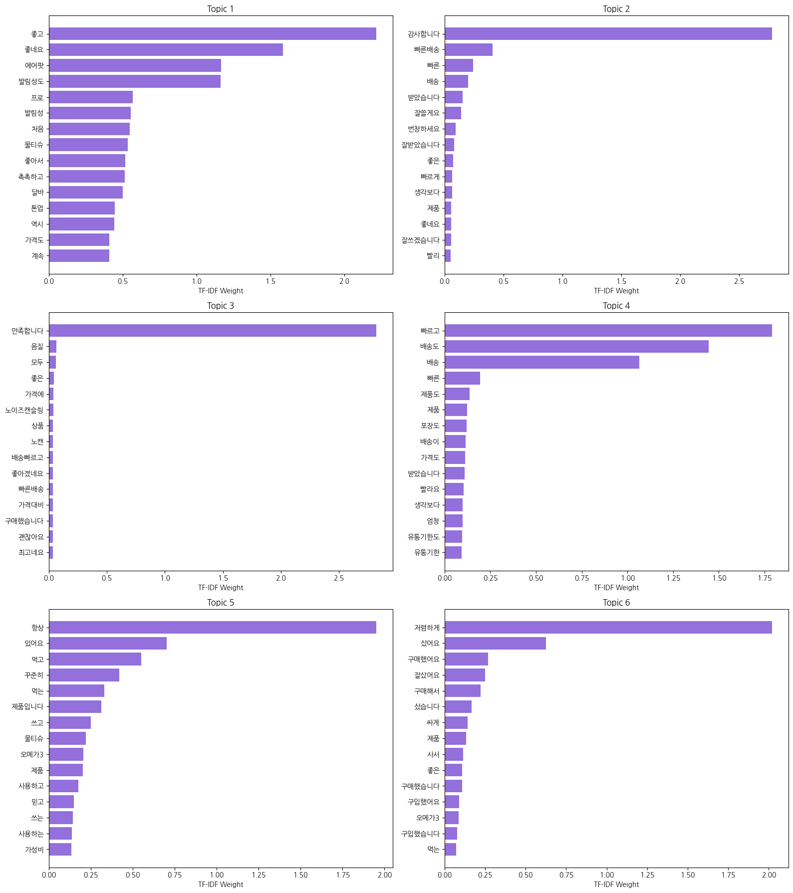

### 토픽별 상위 30개 키워드 및 가중치 (6개 주제)

| 순위 | Topic 1 키워드 | Topic 1 가중치 | Topic 2 키워드 | Topic 2 가중치 | Topic 3 키워드 | Topic 3 가중치 | Topic 4 키워드 | Topic 4 가중치 | Topic 5 키워드 | Topic 5 가중치 | Topic 6 키워드 | Topic 6 가중치 |
|---|---|---|---|---|---|---|---|---|---|---|---|---|
| 1 | 좋고 | 2.2168 | 감사합니다 | 2.7807 | 만족합니다 | 2.8226 | 빠르고 | 1.7912 | 항상 | 1.9512 | 저렴하게 | 2.0208 | 
| 2 | 좋네요 | 1.5858 | 빠른배송 | 0.4078 | 음질 | 0.0642 | 배송도 | 1.4445 | 있어요 | 0.7014 | 샀어요 | 0.6259 | 
| 3 | 에어팟 | 1.1658 | 빠른 | 0.2410 | 모두 | 0.0619 | 배송 | 1.0635 | 먹고 | 0.5512 | 구매했어요 | 0.2670 | 
| 4 | 발림성도 | 1.1627 | 배송 | 0.1984 | 좋은 | 0.0422 | 빠른 | 0.1955 | 꾸준히 | 0.4201 | 잘샀어요 | 0.2492 | 
| 5 | 프로 | 0.5671 | 받았습니다 | 0.1533 | 가격에 | 0.0397 | 제품도 | 0.1375 | 먹는 | 0.3299 | 구매해서 | 0.2233 | 
| 6 | 발림성 | 0.5534 | 잘쓸게요 | 0.1397 | 노이즈캔슬링 | 0.0379 | 제품 | 0.1226 | 제품입니다 | 0.3125 | 샀습니다 | 0.1653 | 
| 7 | 처음 | 0.5490 | 번창하세요 | 0.0954 | 상품 | 0.0363 | 포장도 | 0.1202 | 쓰고 | 0.2491 | 싸게 | 0.1429 | 
| 8 | 물티슈 | 0.5354 | 잘받았습니다 | 0.0819 | 노캔 | 0.0359 | 배송이 | 0.1152 | 물티슈 | 0.2222 | 제품 | 0.1319 | 
| 9 | 좋아서 | 0.5165 | 좋은 | 0.0723 | 배송빠르고 | 0.0359 | 가격도 | 0.1127 | 오메가3 | 0.2065 | 사서 | 0.1133 | 
| 10 | 촉촉하고 | 0.5150 | 빠르게 | 0.0638 | 좋아졌네요 | 0.0353 | 받았습니다 | 0.1106 | 제품 | 0.2038 | 좋은 | 0.1091 | 
| 11 | 달바 | 0.5001 | 생각보다 | 0.0636 | 빠른배송 | 0.0352 | 빨라요 | 0.1028 | 사용하고 | 0.1750 | 구매했습니다 | 0.1076 | 
| 12 | 톤업 | 0.4480 | 제품 | 0.0558 | 가격대비 | 0.0347 | 생각보다 | 0.0983 | 믿고 | 0.1482 | 구입했어요 | 0.0883 | 
| 13 | 역시 | 0.4424 | 좋네요 | 0.0543 | 구매했습니다 | 0.0346 | 엄청 | 0.0976 | 쓰는 | 0.1423 | 오메가3 | 0.0862 | 
| 14 | 가격도 | 0.4092 | 잘쓰겠습니다 | 0.0539 | 괜찮아요 | 0.0343 | 유통기한도 | 0.0970 | 사용하는 | 0.1370 | 구입했습니다 | 0.0778 | 
| 15 | 계속 | 0.4087 | 빨리 | 0.0529 | 최고네요 | 0.0338 | 유통기한 | 0.0922 | 가성비 | 0.1360 | 먹는 | 0.0699 | 
| 16 | 최고예요 | 0.4074 | 쓰겠습니다 | 0.0519 | 배송과 | 0.0324 | 빨라서 | 0.0843 | 제품이에요 | 0.1324 | 좋은제품 | 0.0677 | 
| 17 | 두께도 | 0.4051 | 마스크 | 0.0459 | 최고에요 | 0.0323 | 상품도 | 0.0805 | 미엘 | 0.1277 | 상품 | 0.0650 | 
| 18 | 쓰고 | 0.3997 | 배송빠르고 | 0.0457 | 구매했는데 | 0.0298 | 좋았어요 | 0.0726 | 계속 | 0.1166 | 구매했네요 | 0.0636 | 
| 19 | 있어서 | 0.3956 | 잘쓰고 | 0.0408 | 가성비 | 0.0294 | 좋네요 | 0.0698 | 잘먹고 | 0.1082 | 있어서 | 0.0634 | 
| 20 | 생각보다 | 0.3844 | 싸게 | 0.0364 | 음질도 | 0.0282 | 안전하게 | 0.0667 | 가격대비 | 0.1030 | 배송은 | 0.0578 | 
| 21 | 톤업도 | 0.3817 | 쓸게요 | 0.0343 | 아주좋아요 | 0.0276 | 빠르네요 | 0.0590 | 물티슈는 | 0.0970 | 가격도 | 0.0578 | 
| 22 | 좋은 | 0.3695 | 좋은가격에 | 0.0312 | 노이즈 | 0.0264 | 빠르게 | 0.0583 | 좋은 | 0.0931 | 다른 | 0.0489 | 
| 23 | 없고 | 0.3669 | 너무좋아요 | 0.0310 | 와서 | 0.0262 | 저렴하고 | 0.0571 | 매번 | 0.0900 | 배송도 | 0.0479 | 
| 24 | 노이즈 | 0.3642 | 상품 | 0.0303 | 쓰다가 | 0.0256 | 빠릅니다 | 0.0564 | 재구매 | 0.0878 | 굿굿 | 0.0427 | 
| 25 | 다른 | 0.3476 | 왔습니다 | 0.0296 | 포장은 | 0.0253 | 포장 | 0.0543 | 잘쓰고 | 0.0826 | 빠르게 | 0.0425 | 
| 26 | 가성비 | 0.3329 | 많이파세요 | 0.0289 | 포장 | 0.0244 | 믿고 | 0.0509 | 제품이라 | 0.0804 | 선물로 | 0.0419 | 
| 27 | 노이즈캔슬링 | 0.3315 | 가격대비 | 0.0287 | 배송이 | 0.0230 | 넉넉하고 | 0.0489 | 먹던거라 | 0.0751 | 구매 | 0.0415 | 
| 28 | 마음에 | 0.3289 | 좋아하네요 | 0.0284 | 에어팟 | 0.0227 | 빨랐고 | 0.0474 | 두께도 | 0.0726 | 만족해요 | 0.0404 | 
| 29 | 않고 | 0.3279 | 포장 | 0.0259 | 주문했는데 | 0.0223 | 빨랐어요 | 0.0458 | 가격도 | 0.0716 | 구매했는데 | 0.0401 | 
| 30 | 사용하고 | 0.3168 | 구매할게요 | 0.0258 | 쓸게요 | 0.0220 | 빨리 | 0.0454 | 가격이 | 0.0675 | 배송빠르고 | 0.0379 | 

### 6개 토픽별 인사이트 및 주제 정리

#### Topic 1: 화장품 및 뷰티 제품군 기능 만족도 (성능/사용감)
- **주제**: 달바(d'Alba) 등 화장품과 일부 생활용품에 대해 소비자가 체감하는 제품 본연의 사용감(발림성, 톤업, 촉촉함) 만족도입니다.
- **인사이트**: '발림성도', '촉촉하고', '톤업', '달바' 등의 키워드가 최상위권에 분포되어 있어, 뷰티 제품군을 구매한 고객들의 리뷰가 주를 이룹니다. 소비자들은 화장품을 선택할 때 발림성이나 보습력 같은 즉각적인 피부 체감 효과를 가장 중요하게 생각하며, 이러한 기능적 만족이 긍정적 평가('좋고', '좋네요')로 강하게 직결됨을 보여줍니다.

#### Topic 2: 판매자 응대 및 기본 배송 만족 (서비스/인사)
- **주제**: 제품 자체의 리뷰보다는 빠르고 정확한 배송 시스템을 제공한 판매자에 대한 감사의 인사가 주를 이루는 서비스 만족도입니다.
- **인사이트**: '감사합니다', '잘쓸게요', '번창하세요', '잘받았습니다'와 같은 감정적이고 긍정적인 인사말이 압도적으로 많습니다. 이는 판매자의 신속한 배송 처리('빠른배송')가 고객에게 단순한 편리를 넘어 감동과 신뢰를 주었음을 의미하며, 스토어의 긍정적인 브랜드 이미지와 단골 고객 유치에 크게 기여하는 영역입니다.

#### Topic 3: 에어팟(음향기기) 스펙 및 기술적 만족도 (IT/기능)
- **주제**: 무선 이어폰(에어팟, 프로) 라인업에 특화된 기능인 음질과 노이즈 캔슬링 등 하드웨어 스펙에 대한 평가입니다.
- **인사이트**: '음질', '노이즈캔슬링', '노캔', '좋아졌네요'와 같이 매우 구체적인 전자기기 스펙 용어들이 등장합니다. 이전 모델이나 타제품 대비 기술적으로 업그레이드된 부분(노이즈 캔슬링 등)에 소비자들이 크게 반응하며, 고가의 가격대임에도 성능이 뒷받침될 때 만족도가 매우 높음을 알 수 있습니다.

#### Topic 4: 물류 속도 및 디테일한 포장/유통 상태 (물류/패키징)
- **주제**: 단순한 배송 속도를 넘어, 제품의 파손 여부(안전한 포장)와 신선도(유통기한) 등 물류 과정 전반의 디테일에 대한 만족도입니다.
- **인사이트**: '배송도', '포장도', '유통기한도', '안전하게' 등의 키워드가 결합되어 나타납니다. 식품이나 화장품 등 유통기한과 포장 상태가 핵심인 상품군에서 고객들이 배송의 '질(Quality)'을 얼마나 깐깐하게 따지는지 보여줍니다. 꼼꼼한 포장과 여유 있는 유통기한은 반품률을 최소화하는 핵심 방어선입니다.

#### Topic 5: 건기식/생필품의 꾸준한 재구매 및 신뢰 (충성도/루틴)
- **주제**: 오메가3(건강기능식품) 및 물티슈(미엘) 등 일상적으로 소비되는 생필품에 대한 강한 신뢰와 반복 구매(루틴) 패턴입니다.
- **인사이트**: '항상', '꾸준히', '먹고', '믿고', '쓰는' 등의 단어가 돋보이며, 고객이 제품을 일회성으로 소비하지 않고 장기간 생활의 일부로 받아들였음을 의미합니다. 건기식과 생필품 시장에서는 한 번 형성된 브랜드 신뢰도('믿고')가 지속적인 재구매('항상')로 이어지는 '락인(Lock-in) 효과'가 강하게 나타납니다.

#### Topic 6: 합리적 소비와 가성비에 대한 만족 (가격 경쟁력)
- **주제**: 다양한 상품군 전반에 걸쳐 '저렴한 가격'과 '할인/가성비' 혜택을 통해 얻은 긍정적인 구매 경험입니다.
- **인사이트**: '저렴하게', '샀어요', '잘샀어요', '싸게', '사서' 등의 행동 및 비용 관련 키워드가 지배적입니다. 소비자들은 제품의 품질뿐만 아니라 타 쇼핑몰 대비 얼마나 합리적이고 저렴하게 구매했는지(가성비)에서 큰 만족감을 얻습니다. 할인 프로모션이나 쿠폰 혜택 등이 구매 전환율에 결정적인 역할을 했음을 시사합니다.
### 데이터 상/하위 5개 행의 토픽 가중치 (6개 주제)

| 데이터 | 제목 | Topic 1 | Topic 2 | Topic 3 | Topic 4 | Topic 5 | Topic 6 |
|---|---|---|---|---|---|---|---|
| 상위 1 | 에어팟프로1세대를 계속 사용 했으나 배터리 빠른 소모로... | <span style="color:green">0.0327</span> | <span style="color:green">0.0227</span> | <span style="color:green">0.0351</span> | <span style="color:gray">0.0045</span> | <span style="color:gray">0.0000</span> | <span style="color:gray">0.0034</span> |
| 상위 2 | &lt;새로운 것과 좋았던 것의 균형감&gt;1. 노이... | <span style="color:blue">0.0662</span> | <span style="color:gray">0.0002</span> | <span style="color:gray">0.0014</span> | <span style="color:gray">0.0026</span> | <span style="color:gray">0.0000</span> | <span style="color:gray">0.0080</span> |
| 상위 3 | 번개 같은 빠름으로? 사전예약 후 지난 10월 21일 ... | <span style="color:blue">0.0667</span> | <span style="color:gray">0.0002</span> | <span style="color:gray">0.0021</span> | <span style="color:gray">0.0000</span> | <span style="color:gray">0.0000</span> | <span style="color:gray">0.0000</span> |
| 상위 4 | 먼저 빠른배송 감사합니다. 21일 12시에 받고 현재 ... | <span style="color:green">0.0211</span> | <span style="color:blue">0.0538</span> | <span style="color:gray">0.0016</span> | <span style="color:gray">0.0000</span> | <span style="color:gray">0.0080</span> | <span style="color:gray">0.0000</span> |
| 상위 5 | 에어팟 프로 2세대 구매&amp; 사용 후기 1. 가격... | <span style="color:green">0.0445</span> | <span style="color:gray">0.0030</span> | <span style="color:gray">0.0007</span> | <span style="color:green">0.0195</span> | <span style="color:gray">0.0070</span> | <span style="color:gray">0.0030</span> |
| 하위 5 | 늘 쓰는 상품이에요 | <span style="color:gray">0.0056</span> | <span style="color:gray">0.0000</span> | <span style="color:gray">0.0000</span> | <span style="color:gray">0.0000</span> | <span style="color:green">0.0236</span> | <span style="color:gray">0.0019</span> |
| 하위 4 | 또 주문했어요 근데 이번에는 좀 바꼈네요?? 처음본 로... | <span style="color:gray">0.0041</span> | <span style="color:gray">0.0002</span> | <span style="color:gray">0.0000</span> | <span style="color:gray">0.0012</span> | <span style="color:green">0.0104</span> | <span style="color:gray">0.0005</span> |
| 하위 3 | 오랜만에 미엘 물티슈~가격대비 물디슈평량 용량 대비만족... | <span style="color:green">0.0216</span> | <span style="color:gray">0.0006</span> | <span style="color:gray">0.0010</span> | <span style="color:gray">0.0000</span> | <span style="color:green">0.0333</span> | <span style="color:gray">0.0000</span> |
| 하위 2 | 쓰기 편하고좋아요 | <span style="color:gray">0.0075</span> | <span style="color:gray">0.0016</span> | <span style="color:gray">0.0000</span> | <span style="color:gray">0.0016</span> | <span style="color:gray">0.0067</span> | <span style="color:gray">0.0000</span> |
| 하위 1 | 두번째 구매하고 쓰고있어요 수분도 많고 두께도 두꺼웠어... | <span style="color:green">0.0116</span> | <span style="color:gray">0.0000</span> | <span style="color:gray">0.0012</span> | <span style="color:gray">0.0002</span> | <span style="color:gray">0.0067</span> | <span style="color:gray">0.0000</span> |


