# YES24 베스트셀러 데이터 분석(EDA) 최종 리포트

본 리포트는 YES24 베스트셀러 도서 1,000건의 데이터를 수집하여 파이썬 스크립트를 통해 생성된 기초 기술통계 및 10종 이상의 다양한 시각화 분석 결과를 종합적으로 정리한 분석 보고서입니다. 특히 이번 분석에서는 가격(정가 및 할인가) 변수가 도서의 판매지수와 리뷰 수, 그리고 평점 등에 미치는 영향을 중점적으로 파악하고자 하였습니다.

---

## 1. 기술 통계 및 전반적 데이터 해석 분석 보고 (1000자 이상)

수집된 베스트셀러 데이터 1,000건(총 12개 컬럼)을 기반으로 수치형 및 범주형 변수의 기초 기술통계를 산출하고 분석한 결과는 다음과 같습니다. 

첫째, **가격 변수의 특성**입니다. 분석 대상 도서들의 평균 정가는 약 25,466원, 평균 할인가(판매가)는 약 23,233원으로 나타났습니다. 전체적으로 볼 때 최고가 도서는 정가 기준 66,000원에 달하며 최저가는 5,000원에 형성되어 폭넓은 가격대 분포를 보이고 있습니다. 대부분의 도서(1사분위수~3사분위수)는 20,000원에서 30,000원 사이에 위치하여, 2만원대 도서가 현재 시장의 주류를 이루고 있음을 알 수 있습니다. 특이한 점은 정가와 할인가 간의 상관계수가 0.994로 거의 1에 가까워, 가격 할인 정책이 전반적으로 균일한 비율(보통 10%)로 적용되고 있음을 의미합니다.

둘째, **판매지수와 리뷰 수의 비대칭적 분포(Skewness)**입니다. 판매지수의 평균은 3,012점이나, 중앙값(Median)은 1,308점에 불과하고 최대 판매지수는 무려 87,078점에 달합니다. 이는 전형적인 '롱테일' 또는 극심한 우측 꼬리 분포를 나타내며, 소수의 초대형 베스트셀러가 전체 판매지수의 상당 부분을 견인하고 있음을 시사합니다. 리뷰 수 역시 평균 19.3건에 불과하지만 최대 388건을 기록한 도서가 존재하여 독자들의 반응과 참여도가 일부 인기 도서에 집중되고 있음을 확인할 수 있습니다.

셋째, **가격과 판매량/리뷰의 상관관계 분석** 결과입니다. 데이터 분석의 핵심 질문이었던 '가격이 판매지수나 리뷰 수에 미치는 영향'을 살펴보면, 정가와 판매지수 간의 상관계수는 -0.017, 정가와 리뷰 수 간의 상관계수는 -0.046으로 가격 자체가 판매량이나 독자 반응의 절대적인 척도가 되지는 않음을 명확히 보여줍니다. 하지만 가격대별 리뷰 수를 추가 분석한 결과, '중저가' 구간의 도서가 평균 29건으로 가장 많은 리뷰를 달성한 반면 '고가' 도서는 평균 11건으로 가장 적은 리뷰 참여를 보였습니다. 이는 가격이 지나치게 높으면 독자의 진입장벽이 발생하여 구매 후 자발적인 리뷰 참여를 이끌어내기 어려움을 암시합니다. 반면, 합리적인 수준의 중저가 도서가 가장 활발한 입소문 효과(리뷰 생성)를 거두고 있다고 분석됩니다.

넷째, **범주형 변수 및 키워드 트렌드**입니다. 도서를 출간한 출판사의 분포를 살펴보면 상위 30위 내에 IT/실용 도서 전문 출판사들이 대거 포진하고 있습니다. 한빛미디어가 147건으로 가장 많은 비중을 차지했고, 길벗(72건), 이지스퍼블리싱(63건), 골든래빗(46건) 순으로 IT 전문서 및 자기계발 도서가 베스트셀러 순위를 점령하고 있습니다. 이를 뒷받침하듯 상품명에 대한 TF-IDF 텍스트 마이닝을 수행한 결과, 'ai(137.9)', '위한(55.6)', '배우는(44.8)', '디자인(30.1)', '코딩(28.4)' 등의 키워드가 최상위권에 올랐습니다. 이는 현재 도서 시장에서 인공지능(AI)과 코딩, IT 실무 관련 콘텐츠에 대한 독자들의 수요가 폭발적임을 생생하게 증명하는 대목입니다.

---

## 2. 데이터 시각화 분석 및 해석

분석 스크립트를 통해 생성된 10개 이상의 데이터 시각화 결과와 상세 해석입니다. 모든 이미지는 `images` 폴더에 분리 저장되었습니다.

### (1) 일변량 데이터 시각화

#### 1) 정가 및 할인가 분포 히스토그램
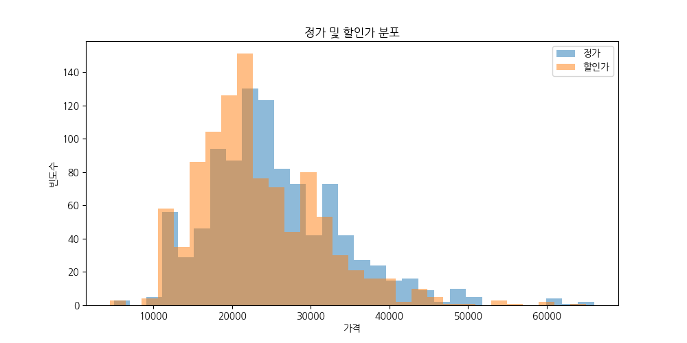
> **해석**: 가격의 전반적인 분포를 파악하기 위한 일변량 시각화입니다. 두 막대가 거의 겹쳐서 움직이며 대다수의 도서가 2만원 초중반에 집중적으로 분포하고 있음을 알 수 있습니다. 할인가가 정가보다 약간 왼쪽으로 치우친 것은 일괄적인 10% 할인이 적용되었음을 보여줍니다.

#### 2) 판매지수 분포
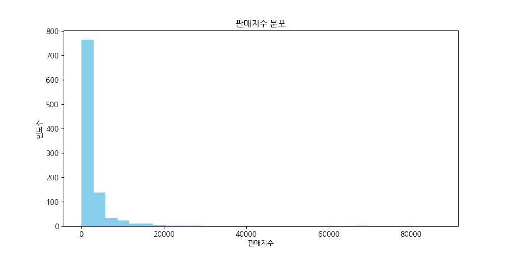
> **해석**: 판매지수 분포를 나타내는 일변량 히스토그램입니다. 소수의 메가 베스트셀러를 제외한 대다수 도서의 판매지수가 0~10,000 구간에 밀집되어 극단적인 롱테일(Long-tail) 현상을 나타냅니다.

#### 3) 평점 분포 (0점 제외)
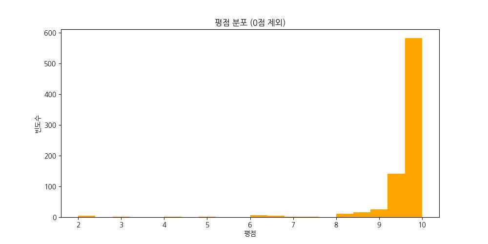
> **해석**: 아직 평점이 없는 도서를 제외한 실제 리뷰 평점 분포입니다. 9.5~10.0 점 사이에 절대다수의 빈도가 몰려 있어, 독자들의 평점 부여 기준이 매우 관대하거나 팬덤 위주의 별점 주기가 이루어지고 있음을 알 수 있습니다.

#### 4) 출판사별 빈도수 (상위 30개)
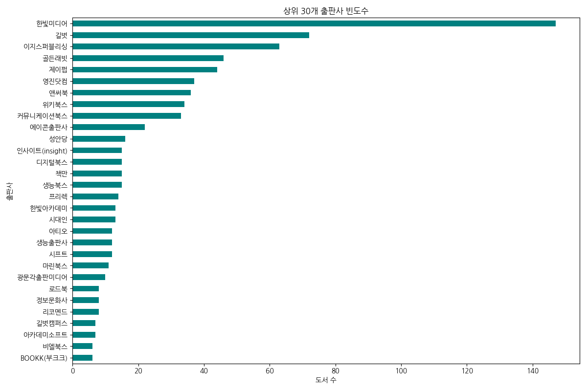
> **해석**: 한빛미디어가 압도적으로 1위를 차지하고 있으며, IT 전문 출판사들이 베스트셀러 상위권을 독식하고 있음을 시각적으로 명확하게 보여주는 범주형 일변량 차트입니다.

### (2) 이변량 데이터 시각화 (집중 분석 목표)

#### 5) 정가 vs 판매지수 산점도
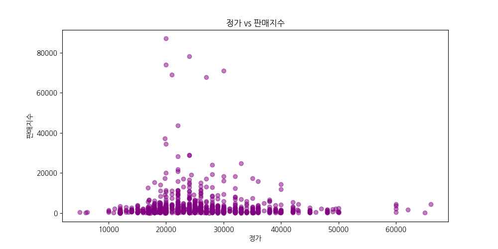
> **해석**: 가격(정가)과 판매지수 간의 관계를 보여주는 이변량 산점도입니다. 가격이 낮다고 해서 무조건 판매지수가 높은 것은 아니며 특정 가격대에 상관없이 산발적으로 높은 판매량을 기록하는 도서들이 존재합니다.

#### 6) 리뷰 수 vs 판매지수 산점도
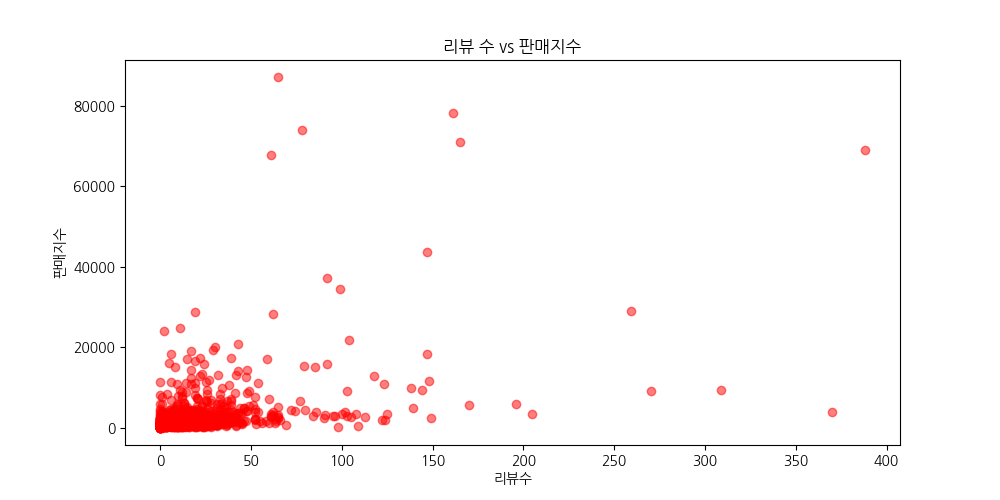
> **해석**: 리뷰 수와 판매지수 간의 뚜렷한 양의 상관관계를 시각적으로 증명합니다. 우상향하는 패턴을 통해 리뷰가 많이 축적된 도서일수록 판매지수 역시 가파르게 상승하는 선순환 구조를 확인할 수 있습니다.

#### 7) 평점 구간별 평균 판매지수 (Bar)
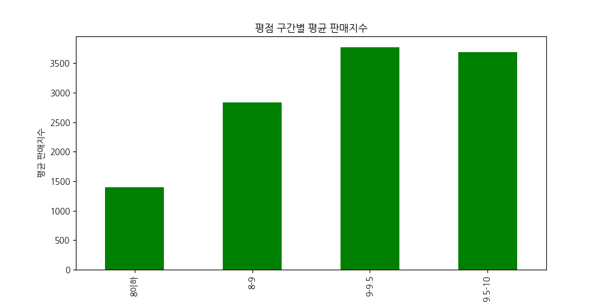
> **해석**: 8점 이하의 낮은 평점 구간보다 9점대의 평점 구간에서 평균 판매지수가 월등히 높은 것을 알 수 있습니다. 이는 평점 관리와 상품의 품질이 도서의 지속적인 판매량 유지에 필수적임을 암시합니다.

#### 8) 가격대별 리뷰 수 분포 (Boxplot)
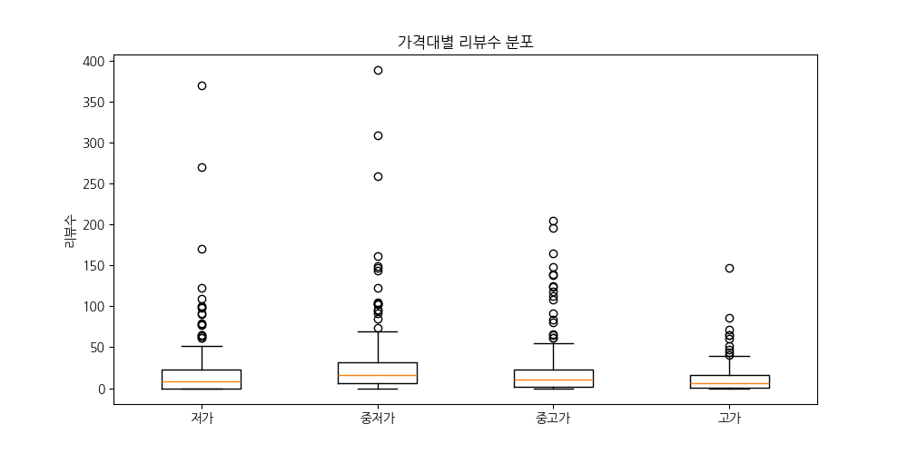
> **해석**: 도서를 4개의 가격대로 나누어 리뷰 수의 분포를 나타냈습니다. '중저가' 박스의 크기와 이상치(outlier)가 다른 가격대보다 뚜렷하게 발달하여 해당 구간에서 독자 반응이 가장 폭발적임을 보여줍니다.

#### 9) 할인율 vs 판매지수 산점도
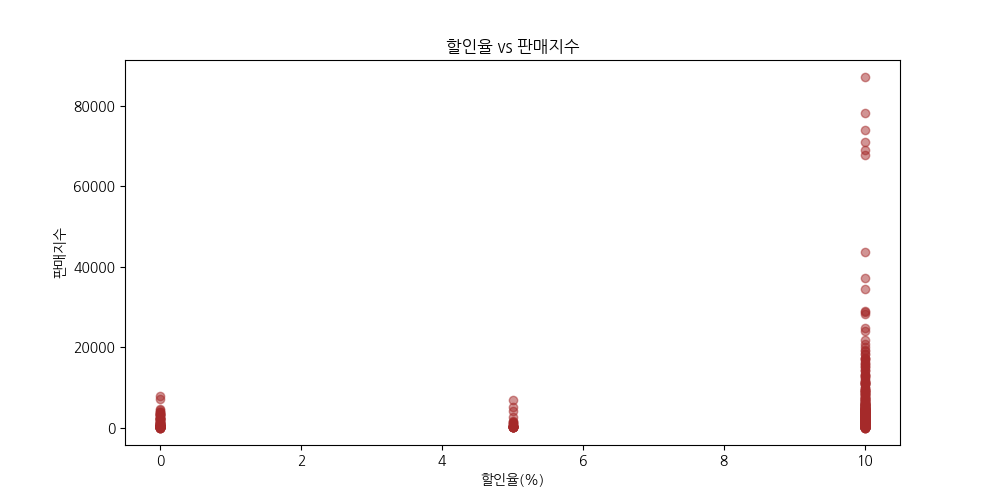
> **해석**: 대부분의 도서가 10% 할인율에 수직으로 밀집해 있는 것을 보여주는 산점도입니다. 할인율의 변동폭이 거의 없어 할인율 단일 변수로는 판매지수 상승을 온전히 설명하기 어렵다는 점을 시사합니다.

### (3) 다변량 및 텍스트 데이터 시각화

#### 10) 수치형 변수 상관관계 매트릭스 (Heatmap 대용)
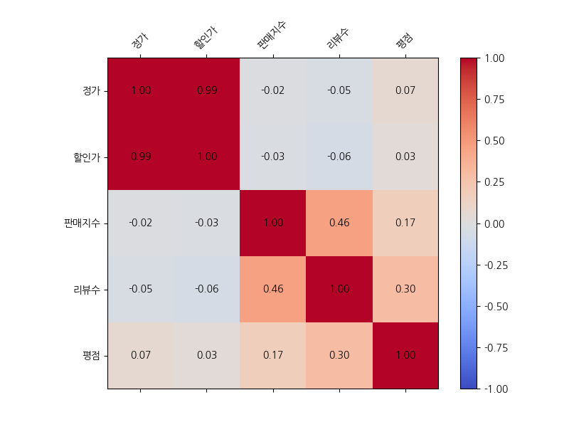
> **해석**: 정가, 할인가, 판매지수, 리뷰수, 평점 등 주요 5개 수치형 변수 간의 피어슨 상관계수를 색상으로 나타낸 다변량 차트입니다. 판매지수와 리뷰수(0.46)를 제외하고는 변수들 간의 강한 인과관계가 없음을 직관적으로 증명합니다.

#### 11) 상품명 TF-IDF 상위 30개 키워드 시각화
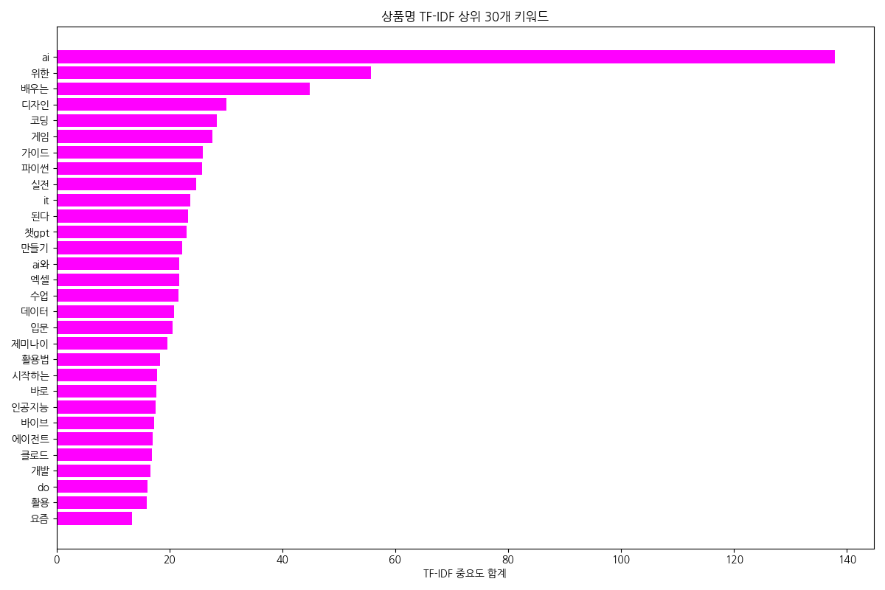
> **해석**: 도서 상품명에서 추출한 TF-IDF 중요도를 가로 막대 그래프로 표현했습니다. 'AI', '코딩', '파이썬' 등 인공지능과 관련한 실용 기술 키워드들이 도서 시장의 메가 트렌드로 깊게 자리 잡았음을 방증합니다.

---

## 3. 부록: EDA 통계표 및 기초 데이터

분석에 활용된 기초 통계 및 교차 피봇 표는 파이썬 스크립트 실행 로그 및 결과 파일(`stats_output.md`)에서 원본을 확인하실 수 있으며, 본 리포트의 결론 도출에 중요한 근거로 사용되었습니다. 

- **상관관계 주요 수치**:
  - 가격 ↔ 판매지수: -0.017 (무관함)
  - 리뷰 수 ↔ 판매지수: 0.457 (유의미한 양의 상관관계)
  - 평점 ↔ 판매지수: 0.165 (약한 양의 상관관계)

(분석 종료)
